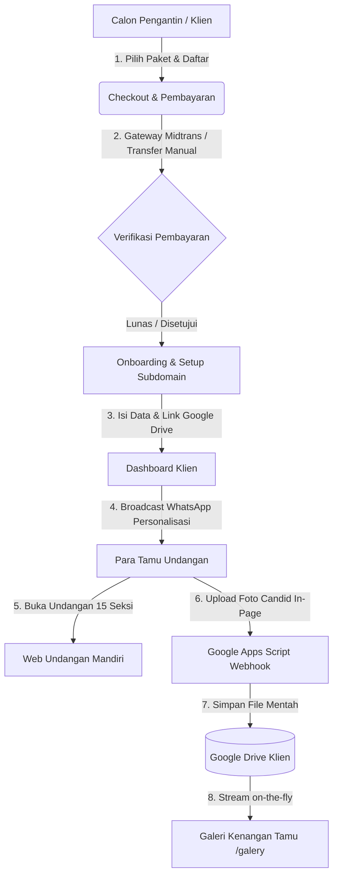

# LUXENARY INVITE — LAPORAN AUDIT SISTEMIK & ARSITEKTUR PLATFORM
**Versi Dokumen:** 2.4.0  
**Tanggal Audit:** 26 Agustus 2026  
**Status Sistem:** Evaluasi Arsitektur & Sinkronisasi End-to-End  

---

## DAFTAR ISI
1. [Eksekutif Ringkasan & Visi Produk](#1-eksekutif-ringkasan--visi-produk)
2. [Fondasi Bisnis & Model Operasional](#2-fondasi-bisnis--model-operasional)
3. [Arsitektur Teknis: Zero-Server-Storage & Stream CDN](#3-arsitektur-teknis-zero-server-storage--stream-cdn)
4. [Siklus Hidup Pengguna & Alur Kerja End-to-End](#4-siklus-hidup-pengguna--alur-kerja-end-to-end)
5. [Standar Emas 15 Seksi Undangan](#5-standar-emas-15-seksi-undangan)
6. [Audit Mendalam per Modul Sistem](#6-audit-mendalam-per-modul-sistem)
7. [Matriks Temuan Kritis & Rekomendasi Mitigasi](#7-matriks-temuan-kritis--rekomendasi-mitigasi)
8. [Kesimpulan & Rencana Aksi](#8-kesimpulan--rencana-aksi)

---

## 1. EKSEKUTIF RINGKASAN & VISI PRODUK

**Luxenary Invite** adalah platform Software-as-a-Service (SaaS) premium untuk pembuatan undangan pernikahan digital interaktif dan manajemen buku tamu cerdas. 

Platform ini dirancang khusus untuk memadukan **estetika desain tingkat tinggi (*haute couture digital*)** dengan **efisiensi infrastruktur modern (*zero-cost server storage*)**.

### Tujuan Utama Sistem (*System Goals*):
1. **Kecepatan & Performa Ekstrem:** Menghasilkan halaman undangan digital berbasis *Static Baked HTML* mandiri yang dapat dimuat dalam waktu di bawah 1 detik tanpa bergantung pada database query yang berat saat dibuka ribuan tamu.
2. **Nol Beban Penyimpanan Server (*0 Bytes Server Storage for Media*):** Seluruh foto dan video yang diunggah oleh ratusan tamu per acara dialirkan langsung ke Google Drive milik klien dan ditayangkan kembali via *Stream CDN* secara *real-time*.
3. **Kepemilikan Data Penuh oleh Klien (*100% Client Data Ownership*):** Pengantin memegang kendali penuh atas foto dan video kenangan mereka seumur hidup di Google Drive pribadi mereka.
4. **Ekosistem Resepsi Lengkap (*Full-Day Wedding Lifecycle*):** Mendukung pra-acara (distribusi link WhatsApp personal), hari-H (buku tamu, RSVP, kartu akses QR check-in meja resepsi), hingga pasca-acara (galeri momen candid tamu).

---

## 2. FONDASI BISNIS & MODEL OPERASIONAL



### Model Monetisasi & Tiering Paket:
1. **Paket Traditional Series:**
   - Fokus: Nuansa adat Nusantara (Jawa, Sunda, Bugis/Makassar, Minang, Bali).
   - Fitur: Multi-acara adat, buku tamu, amplop digital, maps, countdown, live streaming.
2. **Paket Modern Series:**
   - Fokus: Tipografi kontemporer, majalah editorial, clean minimalist, papercut.
   - Fitur: Seluruh fitur Traditional + Filter Instagram AR + Dress code color palette.
3. **Paket Premium Series:**
   - Fokus: Ultra-luxury editorial, dual-split desktop layout, custom audio dock, interactive story highlight, kartu akses QR tamu dengan scanner resepsi.

---

## 3. ARSITEKTUR TEKNIS: ZERO-SERVER-STORAGE & STREAM CDN

```
[TAMU: Upload Foto di Web]
           │ (POST multipart/form-data via AJAX)
           ▼
[/api/public/memories/upload] ──> (Piping Buffer Memory - No Disk Save)
           │
           ▼
[Google Apps Script Webhook]
           │ (DriveApp.getFolderById.createFile)
           ▼
[(Google Drive Folder Klien)]
           │ (Public Stream Link: lh3.googleusercontent.com/d/FILE_ID)
           ▼
[Stream CDN Proxy / Direct Client View]
           │
           ▼
[Halaman Undangan & Galeri Web /galery]
```

### Karakteristik Arsitektur:
- **Server Disk Footprint:** **0 Bytes** untuk file tamu. Server Next.js hanya memproses aliran byte (*stream pipe*) di memori RAM dan langsung meneruskannya ke Webhook Google Apps Script.
- **Hak Akses Google Drive Klien:** Disetel sebagai **"Siapa saja yang memiliki link &rarr; Editor (Pengedit)"**. Hal ini memberi izin bagi script webhook master untuk menulis (*createFile*) ke folder klien.
- **Efisiensi CDN:** Browser meminta gambar langsung melalui Google CDN Thumbnail Engine (`https://lh3.googleusercontent.com/d/{fileId}`) yang memiliki kecepatan global dan kompresi cerdas.

---

## 4. SIKLUS HIDUP PENGGUNA & ALUR KERJA END-TO-END

### Alur 1: Calon Klien (*Registration & Checkout Flow*)
1. Klien mengakses halaman katalog tema atau pricing.
2. Memilih paket (*Traditional / Modern / Premium*).
3. Mendaftar akun menggunakan Google OAuth atau Email & Password.
4. Melakukan pembayaran via Midtrans Snap (Otomatis) atau Transfer Bank Manual (Unggah Bukti Transfer).
5. Pada transfer manual, order berstatus `PENDING` hingga disetujui Super Admin di dashboard `/admin`.

### Alur 2: Onboarding Klien (*Setup Flow*)
1. Klien yang sudah lunas dialihkan ke `/dashboard/setup`.
2. Sistem mengunci pilihan tema strictly 1:1 sesuai kategori paket yang dibeli.
3. Klien menentukan nama panggilan mempelai dan sistem membuat rekomendasi subdomain unik (misal: `didan-nasha`).
4. Klien mengonfirmasi dan database membuat entitas `Invitation` baru.

### Alur 3: Manajemen Undangan Klien (*Dashboard Management Flow*)
1. Klien mengisi data profil mempelai, multi-jadwal acara (Akad, Resepsi, dll), kisah cinta, nomor rekening kado.
2. Klien membuat 1 folder di Google Drive pribadi mereka, menyetel akses *Editor*, dan menempelkan link folder di menu **Kenangan Tamu**.
3. Klien mengimpor atau menambahkan daftar tamu di menu **Buku Tamu**.
4. Klien menyalin teks broadcast WhatsApp yang sudah dipersonalisasi dengan tautan khusus per tamu (`?to=Nama+Tamu`).

### Alur 4: Pengalaman Tamu Undangan (*Guest Journey Flow*)
1. Tamu menerima link WhatsApp dan membuka undangan.
2. Muncul **Layar Pembuka (*Cover Screen*)** bertuliskan nama tamu secara eksklusif.
3. Tamu menekan tombol *"Buka Undangan"*, cover bergeser halus ke atas, musik latar mulai diputar.
4. Tamu membaca 15 seksi berurutan: Mempelai, Jadwal, Dress Code, Cerita, Galeri Prewedding, Filter IG, hingga **Guest Memories**.
5. Di seksi **Guest Memories**, tamu dapat mengunggah foto candid / ucapan langsung dari HP mereka tanpa pindah halaman (*In-Page AJAX*).
6. Tamu mengisi RSVP dan ucapan doa restu.
7. Tamu menyimpan **Kartu Akses QR** untuk dipindai saat tiba di lokasi resepsi.

### Alur 5: Resepsi & Pasca-Acara (*Event & Post-Event Flow*)
1. Penerima tamu menggunakan smartphone membuka `/scanner` untuk memindai QR Code tamu dan memvalidasi kuota kehadiran.
2. Tamu dan pengantin dapat membuka link permanen album web `domain.com/[pasangan]/galery` untuk melihat seluruh foto candid tamu secara *real-time*.

---

## 5. STANDAR EMAS 15 SEKSI UNDANGAN

Semua 15 master tema (`themes/premium/`, `themes/traditional/`, `themes/modern/`) diselaraskan ke dalam hierarki seksi terpadu:

```
┌────────────────────────────────────────────────────────┐
│  1. Layar Pembuka / Sampul Awal (Cover Screen Overlay) │
├────────────────────────────────────────────────────────┤
│  2. Kutipan & Pembuka (Hero & Opening Quote)           │
├────────────────────────────────────────────────────────┤
│  3. Profil Mempelai (The Groom & Bride)                │
├────────────────────────────────────────────────────────┤
│  4. Jadwal Acara & Hitung Mundur (Events & Countdown)  │
├────────────────────────────────────────────────────────┤
│  5. Panduan Busana (Dress Code Palette Guide)          │
├────────────────────────────────────────────────────────┤
│  6. Siaran Langsung (Virtual Live Ceremony)            │
├────────────────────────────────────────────────────────┤
│  7. Kisah Perjalanan Cinta (Journey of Love / Story)   │
├────────────────────────────────────────────────────────┤
│  8. Galeri Prewedding (Our Moment Gallery & Video)     │
├────────────────────────────────────────────────────────┤
│  9. Filter Pernikahan Instagram (Wedding AR Filter)    │
├────────────────────────────────────────────────────────┤
│ 10. Kenangan Tamu (Guest Memories In-Page & Circles)   │  <-- [STREAM CDN]
├────────────────────────────────────────────────────────┤
│ 11. Tanda Kasih & Amplop Digital (Wedding Gift)        │
├────────────────────────────────────────────────────────┤
│ 12. Turut Mengundang (Keluarga Besar)                  │
├────────────────────────────────────────────────────────┤
│ 13. Buku Tamu & Konfirmasi Kehadiran (RSVP & Wishes)   │
├────────────────────────────────────────────────────────┤
│ 14. Kartu Akses QR Tamu (Digital Check-in Pass)        │
├────────────────────────────────────────────────────────┤
│ 15. Penutup & Navigasi Bawah (Footer & Navigation Dock)│
└────────────────────────────────────────────────────────┘
```

---

## 6. AUDIT MENDALAM PER MODUL SISTEM

### A. Evaluasi Database & Skema Data (`prisma/schema.prisma`)
- **Status:** Sehat & Lengkap.
- **Relasi Inti:**
  - `User 1:N Order`
  - `Order 1:1 Invitation`
  - `Invitation 1:N Guest, Rsvp, Wish, GuestMemory, BoothSession`
- **Kekuatan:** Penggunaan tipe `Decimal` pada nominal transaksi mencegah *floating point precision error* pada pembukuan finansial.

### B. Evaluasi Dashboard Admin & Theme Demo Studio (`app/(admin)/admin/page.tsx`)
- **Status:** Dirombak ke model **Staged Draft & Atomic Save**.
- **Logika UI/UX:**
  - Pemilihan file foto baru ditampung di memori browser lokal (*Local Object URL*).
  - Tombol *"Simpan Perubahan Demo"* berstatus `disabled` jika tidak ada draf baru.
  - Penutupan modal atau tombol *Batal* membuang draf lokal tanpa merusak file server.
  - Saat disimpan, foto diunggah ke `/public/demo/[theme]/` dan data teks disimpan ke `AdminSetting` database, lalu file HTML statis dikompilasi ulang secara atomik.

### C. Evaluasi Mesin Kompilasi Statis (`lib/demoPublisher.ts` & `lib/renderTemplate.ts`)
- **Status:** 15/15 tema ter-compile sukses tanpa error.
- **Keamanan Rendering:** Seluruh placeholder `{{key}}` diekstrak dari database dan file template HTML tanpa meninggalkan tag mentah di tampilan publik.

---

## 7. MATRIKS TEMUAN KRITIS & REKOMENDASI MITIGASI

| ID | Modul Terkait | Deskripsi Temuan | Dampak / Risiko | Solusi / Mitigasi yang Tepat |
|---|---|---|---|---|
| **CRIT-01** | `app/(client)/dashboard/setup/page.tsx` | Fallback `const availableThemes = filteredThemes.length > 0 ? filteredThemes : themesList;` pada baris 102 | Klien paket *Traditional* berpotensi memilih tema *Premium* jika filter sempat kosong sesaat | Hapus fallback ke `themesList`; kunci array hanya pada kategori paket yang aktif |
| **CRIT-02** | `app/(client)/dashboard/invitation/[id]/page.tsx` | Panduan teks folder Google Drive sebelumnya tertulis *Viewer* | Tamu gagal upload foto jika folder hanya berstatus *Viewer* | Telah diperbaiki menjadi *Editor (Pengedit)* sehingga script webhook memiliki izin tulis |
| **CRIT-03** | `app/(admin)/admin/page.tsx` | Modal Demo Studio sebelumnya langsung menulis ke server saat foto dipilih | Rusaknya UX jika admin salah pilih foto atau membatalkan draf | Telah diperbaiki dengan *Staged Local Draft* dan tombol Simpan berbasis *Dirty State* |

---

## 8. KESIMPULAN & RENCANA AKSI

Platform **Luxenary Invite** berada dalam kondisi struktural yang solid. Arsitektur *Zero-Server-Storage* berhasil mengeliminasi biaya server storage besar sekaligus memberikan kepemilikan data seumur hidup kepada klien.

### Langkah Lanjutan yang Disepakati:
1. Menjaga kepatuhan ketat terhadap urutan 15 seksi standar emas di seluruh template.
2. Memastikan setiap perubahan logika bisnis didiskusikan dan diselaraskan secara transparan sebelum dieksekusi.
3. Melakukan pengujian berkala pada konektivitas webhook Google Apps Script.

---
*Dokumen ini dibuat secara otomatis oleh Agentic AI Reasoning Engine sebagai referensi arsitektur resmi Luxenary Invite.*
