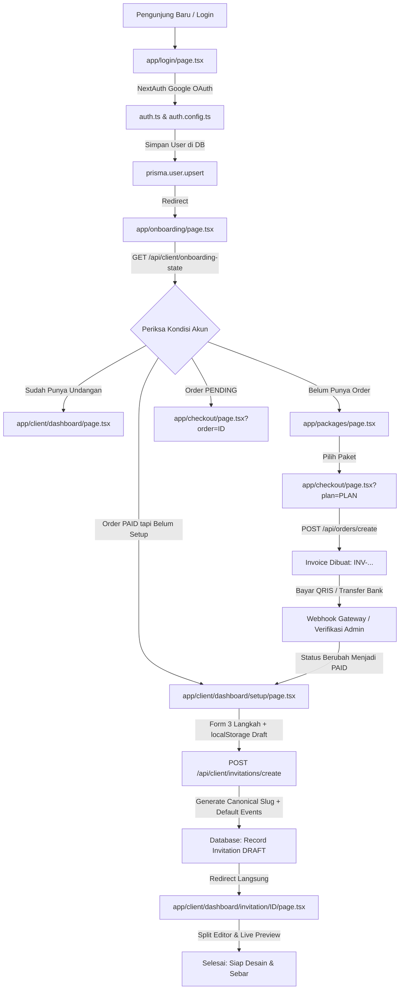

# DOKUMENTASI LENGKAP: ALUR REGISTRASI HINGGA MASUK DASHBOARD

Dokumen ini membedah arsitektur faktual dari seluruh perjalanan pengguna (User Journey) sejak pertama kali menginjakkan kaki di sistem, login via Google OAuth, pemilihan paket, checkout multi-gateway, wizard setup awal, hingga mendarat di Dashboard Klien dan Studio Editor Undangan.

---

## DAFTAR ISI
1. [Diagram Alur End-to-End](#1-diagram-alur-end-to-end)
2. [Fase 1: Autentikasi & Registrasi Otomatis (Google OAuth)](#fase-1-autentikasi--registrasi-otomatis-google-oauth)
3. [Fase 2: Dispatcher Status Klien (Onboarding Hub)](#fase-2-dispatcher-status-klien-onboarding-hub)
4. [Fase 3: Katalog & Pemilihan Paket Layanan](#fase-3-katalog--pemilihan-paket-layanan)
5. [Fase 4: Checkout & Kasir Pembayaran Multi-Gateway](#fase-4-checkout--kasir-pembayaran-multi-gateway)
6. [Fase 5: Wizard Penyiapan Undangan Awal (Setup Wizard)](#fase-5-wizard-penyiapan-undangan-awal-setup-wizard)
7. [Fase 6: Masuk ke Dashboard Utama & Studio Editor](#fase-6-masuk-ke-dashboard-utama--studio-editor)
8. [Matriks Path Kode & File Terkait](#matriks-path-kode--file-terkait)
9. [Skema Basis Data (Prisma Models)](#skema-basis-data-prisma-models)

---

## 1. Diagram Alur End-to-End



---

## Fase 1: Autentikasi & Registrasi Otomatis (Google OAuth)

### 1. Titik Masuk UI
*   **File:** [`app/login/page.tsx`](file:///Users/armansyam/Documents/Project%20AmsDev/Luxenary-Invite/app/login/page.tsx)
*   **Mekanisme:** Tidak ada form manual username/password untuk klien. Akses menggunakan tombol tunggal Google Sign-In yang memanggil fungsi bawaan NextAuth:
    ```typescript
    await signIn("google", { callbackUrl: "/onboarding" });
    ```

### 2. Penanganan Sisi Server (NextAuth v5)
*   **File:** [`auth.ts`](file:///Users/armansyam/Documents/Project%20AmsDev/Luxenary-Invite/auth.ts) & [`auth.config.ts`](file:///Users/armansyam/Documents/Project%20AmsDev/Luxenary-Invite/auth.config.ts)
*   **Logika Faktual:**
    1. Menggunakan adapter Prisma (`PrismaAdapter(prisma)`).
    2. Jika email baru pertama kali masuk, record dibuat otomatis di tabel `User` dengan default role:
       - `role: "CLIENT"`
       - `name: profile.name`
       - `email: profile.email`
       - `image: profile.picture`
    3. Token sesi di-encode sebagai JWT yang disematkan ke cookie aman peramban (`__Secure-authjs.session-token`).
    4. Setelah Google menyetujui, klien dialihkan ke URL tujuan awal: `/onboarding`.

---

## Fase 2: Dispatcher Status Klien (Onboarding Hub)

### 1. Halaman Hub
*   **File:** [`app/onboarding/page.tsx`](file:///Users/armansyam/Documents/Project%20AmsDev/Luxenary-Invite/app/onboarding/page.tsx)
*   Halaman ini adalah layar transisi (*loading spinner minimalis*) yang secara otomatis memicu pemanggilan API: `GET /api/client/onboarding-state`.

### 2. Logika Penentu Rute
*   **File:** [`app/api/client/onboarding-state/route.ts`](file:///Users/armansyam/Documents/Project%20AmsDev/Luxenary-Invite/app/api/client/onboarding-state/route.ts)
*   **Hirarki Keputusan (Decision Tree):**
    ```typescript
    // 1. Cek apakah user sudah memiliki undangan di database
    const existingInvitation = await prisma.invitation.findFirst({
      where: { userId: session.user.id },
      orderBy: { createdAt: "desc" },
    });
    if (existingInvitation) {
      return NextResponse.json({ route: "/dashboard" });
    }

    // 2. Ambil transaksi order terakhir pengguna
    const latestOrder = await prisma.order.findFirst({
      where: { userId: session.user.id },
      orderBy: { createdAt: "desc" },
    });

    // 3. Jika belum pernah order sama sekali -> kirim ke katalog paket
    if (!latestOrder) {
      return NextResponse.json({ route: "/packages" });
    }

    // 4. Jika order sudah LUNAS (PAID) tapi belum memiliki undangan -> kirim ke setup wizard
    if (latestOrder.status === "PAID") {
      return NextResponse.json({
        route: `/dashboard/setup?order=${latestOrder.id}&plan=${latestOrder.planType}`,
      });
    }

    // 5. Jika order masih PENDING (Menunggu Pembayaran) -> kirim ke kasir untuk bayar
    if (latestOrder.status === "PENDING") {
      return NextResponse.json({
        route: `/checkout?order=${latestOrder.id}`,
      });
    }

    // 6. Jika order EXPIRED atau FAILED -> arahkan checkout ulang dengan notifikasi
    return NextResponse.json({
      route: `/checkout?plan=${latestOrder.planType}&msg=order_expired`,
    });
    ```

---

## Fase 3: Katalog & Pemilihan Paket Layanan

### 1. Tampilan Katalog
*   **File:** [`app/packages/page.tsx`](file:///Users/armansyam/Documents/Project%20AmsDev/Luxenary-Invite/app/packages/page.tsx)
*   **Logika Dinamis:** Paket tidak di-hardcode. Halaman melakukan fetch ke `GET /api/public/settings` untuk mengambil konfigurasi paket dari database (`AdminSetting: platform_packages`).
*   **Tingkatan Tier Paket:**
    *   **TRADITIONAL:** Akses tema-tema bernuansa adat/tradisional nusantara (`badrika`, `candani`, `dillalucky`, `mayang`, `prameswari`).
    *   **MODERN:** Membuka tema-tema modern editorial + tema tradisional (`ameera`, `chronicle`, `lumina`, `papercut`, `solaria`, `wave`).
    *   **PREMIUM:** Membuka seluruh 15 tema termasuk seri haute-couture (`kalandra`, `valente`, `aurelia`, `artisan`), custom domain ready, galeri momen tamu tak terbatas.
*   **Aksi:** Tombol "Pilih Paket" mengarahkan pengguna ke:
    `/checkout?plan=${packageId}`

---

## Fase 4: Checkout & Kasir Pembayaran Multi-Gateway

### 1. Antarmuka Kasir
*   **File:** [`app/checkout/page.tsx`](file:///Users/armansyam/Documents/Project%20AmsDev/Luxenary-Invite/app/checkout/page.tsx)
*   **Komponen Inti:**
    *   Pembuat Order Otomatis: Memanggil `POST /api/orders/create` untuk menerbitkan ID Order unik berformat `INV-YYMMDD-XXXX`.
    *   Kalkulator Diskon & Kode Promo: Memverifikasi kode voucher via database.
    *   Pemilih Gateway: Menampilkan QRIS (Midtrans, iPaymu, Duitku, TriPay, Xendit) atau Transfer Manual (BCA, Mandiri, BRI, BNI).

### 2. Penanganan Pembayaran Real-Time
*   **File Stream SSE:** [`app/api/payments/status-stream/[id]/route.ts`](file:///Users/armansyam/Documents/Project%20AmsDev/Luxenary-Invite/app/api/payments/status-stream/%5Bid%5D/route.ts)
*   **Alur:**
    1. Klien membuka koneksi Server-Sent Events (SSE) saat kode QRIS ditampilkan di layar.
    2. Saat pembeli memindai QRIS dan membayar via GoPay/OVO/BCA/ShopeePay, gateway mengirim Webhook HTTP POST ke:
       `app/api/payments/webhook/[provider]/route.ts`.
    3. Handler webhook memvalidasi checksum/signature, lalu mengupdate database:
       ```typescript
       await prisma.order.update({
         where: { id: orderId },
         data: { status: "PAID", paidAt: new Date() },
       });
       ```
    4. Server memancarkan sinyal ke SSE emitter (`sseEmitter.emit("payment_received", ...)`).
    5. Halaman kasir di browser pembeli langsung mendeteksi status `PAID` seketika (tanpa reload manual) dan mengarahkan klien ke:
       `/dashboard/setup?order=${order.id}&plan=${order.planType}`.

---

## Fase 5: Wizard Penyiapan Undangan Awal (Setup Wizard)

### 1. Form Penyiapan 3 Langkah
*   **File:** [`app/(client)/dashboard/setup/page.tsx`](file:///Users/armansyam/Documents/Project%20AmsDev/Luxenary-Invite/app/%28client%29/dashboard/setup/page.tsx)
*   **Fitur Keamanan Draft Lokal:**
    Menggunakan `localStorage ("luxenary_setup_draft")`. Jika koneksi terputus atau halaman ter-refresh di tengah jalan, seluruh data nama dan tanggal yang sudah diketik tidak akan hilang.
*   **Tahapan Form:**
    1. **Langkah 1: Mempelai Pria & Wanita:** Input nama lengkap dan nama panggilan kedua mempelai.
    2. **Langkah 2: Hari Bahagia & Lokasi:** Input tanggal pernikahan dan kota utama acara.
    3. **Langkah 3: Pilihan Tema:** Menampilkan tema yang difilter khusus sesuai tier paket yang sudah dibayar.

### 2. Backend Pembuat Undangan
*   **File:** [`app/api/client/invitations/create/route.ts`](file:///Users/armansyam/Documents/Project%20AmsDev/Luxenary-Invite/app/api/client/invitations/create/route.ts)
*   **Operasi Kritis yang Dilakukan:**
    1. **Guard Validasi:** Memverifikasi bahwa order ID benar-benar berstatus `PAID` dan milik user yang bersangkutan.
    2. **Pembuatan Canonical Flat Slug Permanen:**
       Formula: `{groomSlug}-{brideSlug}-{DDMMYY}`
       *Contoh:* Dimas & Clarissa tanggal 12 Desember 2026 ➔ `dimas-clarissa-121226`.
       *Collision Resolver:* Jika ada pasangan dengan nama dan tanggal sama persis, sistem otomatis menambahkan nama kota: `dimas-clarissa-121226-makassar`.
    3. **Inisialisasi Rangkaian Acara Default:**
       Menyuntikkan 2 agenda standar ke kolom `eventData`:
       - Sesi 1: Akad Nikah / Pemberkatan (Pukul 08.00 - 10.00 WITA).
       - Sesi 2: Resepsi Pernikahan (Pukul 11.00 - 14.00 WITA).
    4. **Inisialisasi Fitur & Label Standar:**
       Menyimpan konfigurasi default ke `featureSettings`:
       - `colorPalette: "champagne"`
       - `weddingTagline: "THE WEDDING OF"`
       - `displayOrder: "GROOM_FIRST"`
       - `showMusic: true`, `showRsvp: true`, `showQrCheckin: true`, `showGift: true`.
    5. **Penerbitan ID:** Record dibuat dengan status `DRAFT`.
    6. **Pembersihan Draft:** `localStorage.removeItem("luxenary_setup_draft")`.
    7. **Pengalihan Otomatis:** API mengembalikan ID baru, dan klien langsung diantar masuk ke Studio Editor:
       `/dashboard/invitation/${invitation.id}`.

---

## Fase 6: Masuk ke Dashboard Utama & Studio Editor

### 1. Middleware Edge Guard
*   **File:** [`middleware.ts`](file:///Users/armansyam/Documents/Project%20AmsDev/Luxenary-Invite/middleware.ts)
*   **Aturan Akses:**
    *   Jika user mencoba mengakses rute `/dashboard/*` tanpa cookie sesi login ➔ dialihkan paksa ke `/login`.
    *   Jika user dengan role `ADMIN` login ➔ otomatis dialihkan ke `/admin`.
    *   Jika user dengan role `CLIENT` login ➔ memiliki akses penuh ke seluruh workspace `/dashboard`.

### 2. Workspace Client Dashboard
Klien kini memiliki akses ke 4 modul utama:
1.  **Ringkasan Undangan (`/dashboard`):** Menampilkan status undangan (`DRAFT` / `PUBLISHED`), total kuota tamu, daftar konfirmasi RSVP masuk, dan pintasan cepat.
2.  **Studio Editor Undangan ([`app/(client)/dashboard/invitation/[id]/page.tsx`](file:///Users/armansyam/Documents/Project%20AmsDev/Luxenary-Invite/app/%28client%29/dashboard/invitation/%5Bid%5D/page.tsx)):**
    *   Split-screen visual: Form kontrol di sebelah kiri dan Live Preview iframe di sebelah kanan.
    *   Arsitektur Piring (*Draft Plate*): File draft fisik berada di `data/drafts/${id}.html`.
    *   Sinkronisasi realtime menggunakan event bus `BroadcastChannel("lux_preview_sync")`.
3.  **Buku Tamu & Pengiriman Undangan WhatsApp ([`app/(client)/dashboard/guests/page.tsx`](file:///Users/armansyam/Documents/Project%20AmsDev/Luxenary-Invite/app/%28client%29/dashboard/guests/page.tsx)):**
    *   Kelola daftar tamu, kategori undangan, dan sesi acara.
    *   Tombol **"Kirim WA"** (Tautan langsung `https://wa.me/628...?text=...`) yang otomatis mengisi pesan undangan personal beserta tautan nama tamu tanpa perlu mengetik manual.
    *   Tiket QR Check-in per tamu untuk penerimaan di meja resepsionis pada hari H.
4.  **Pengaturan, Domain & Terbit ([`app/(client)/dashboard/settings/page.tsx`](file:///Users/armansyam/Documents/Project%20AmsDev/Luxenary-Invite/app/%28client%29/dashboard/settings/page.tsx)):**
    *   Live checker ketersediaan subdomain (misal: `dimas-clarissa.luxenary.id`).
    *   Konfigurasi PIN 4-digit panitia resepsionis (dienkripsi AES-256).
    *   Validasi kelayakan penerbitan (`isPublishable`).
    *   Tombol Publikasikan yang memicu baking file HTML statis mandiri via [`lib/staticPublisher.ts`](file:///Users/armansyam/Documents/Project%20AmsDev/Luxenary-Invite/lib/staticPublisher.ts).

---

## Matriks Path Kode & File Terkait

| Tahapan | Tipe File | Path File Lengkap | Fungsi Utama |
| :--- | :--- | :--- | :--- |
| **Login** | UI | `app/login/page.tsx` | Tombol Sign-In Google dengan callback `/onboarding` |
| **Auth** | Config | `auth.ts` & `auth.config.ts` | Konfigurasi NextAuth v5 & PrismaAdapter |
| **Onboarding** | UI Hub | `app/onboarding/page.tsx` | Layar transisi dan traffic dispatcher |
| **Onboarding** | API Engine | `app/api/client/onboarding-state/route.ts` | Decision tree penentu rute berdasarkan status order |
| **Katalog** | UI | `app/packages/page.tsx` | Grid pemilihan paket (Traditional, Modern, Premium) |
| **Checkout** | UI | `app/checkout/page.tsx` | Kasir pembayaran, countdown QRIS, & upload bukti transfer |
| **Order** | API | `app/api/orders/create/route.ts` | Penerbitan nomor invoice unik transaksi |
| **Payment** | API SSE | `app/api/payments/status-stream/[id]/route.ts` | Realtime listener status pembayaran lunas |
| **Webhook** | API | `app/api/payments/webhook/[provider]/route.ts` | Penerima notifikasi pembayaran dari payment gateway |
| **Setup** | UI | `app/(client)/dashboard/setup/page.tsx` | Wizard 3 langkah profil pasangan & pilihan tema |
| **Setup** | API | `app/api/client/invitations/create/route.ts` | Inisialisasi record invitation, slug, dan default events |
| **Dashboard** | UI | `app/(client)/dashboard/page.tsx` | Dashboard utama ringkasan performa undangan |
| **Editor** | UI | `app/(client)/dashboard/invitation/[id]/page.tsx` | Studio Live Editor dengan split iframe preview |
| **Tamu** | UI | `app/(client)/dashboard/guests/page.tsx` | Manajemen tamu, direct WA link, & token QR |
| **Settings** | UI | `app/(client)/dashboard/settings/page.tsx` | Validasi publish, pemilihan subdomain, & PIN panitia |
| **Publisher** | Core Lib | `lib/staticPublisher.ts` | Kompilasi standalone HTML ke `public/published/` |
| **Routing** | Middleware | `middleware.ts` | Rewrite subdomain, canonical flat slug, & proteksi rute |

---

## Skema Basis Data (Prisma Models)

Berikut adalah entitas inti yang saling berelasi dalam siklus hidup pendaftaran hingga dashboard:

```prisma
// 1. Entitas Pengguna
model User {
  id            String       @id @default(uuid())
  name          String?
  email         String?      @unique
  image         String?
  role          UserRole     @default(CLIENT)
  orders        Order[]
  invitations   Invitation[]
  createdAt     DateTime     @default(now())
}

// 2. Entitas Transaksi Kasir
model Order {
  id            String       @id @default(uuid())
  userId        String
  planType      PlanType     // TRADITIONAL | MODERN | PREMIUM
  amount        Int
  status        OrderStatus  @default(PENDING) // PENDING | PAID | FAILED | EXPIRED
  paymentMethod String?      // QRIS | MANUAL_TRANSFER
  proofImage    String?      // Untuk transfer manual
  paidAt        DateTime?
  user          User         @relation(fields: [userId], references: [id])
  invitation    Invitation?
  createdAt     DateTime     @default(now())
}

// 3. Entitas Undangan Pernikahan
model Invitation {
  id                  String       @id @default(uuid())
  userId              String
  orderId             String?      @unique
  themeId             String?      // kalandra, wave, prameswari, dll.
  invitationSlug      String       @unique // canonical flat slug: dimas-clarissa-121226
  subdomain           String?      @unique // dimas-clarissa
  status              InvitationStatus @default(DRAFT) // DRAFT | PUBLISHED | EVENT_FINISHED | ARCHIVED
  groomName           String?
  brideName           String?
  groomNickname       String?
  brideNickname       String?
  eventData           String?      // JSON string array rangkaian acara
  featureSettings     String?      // JSON string konfigurasi fitur
  staffPin            String?      // Terenkripsi AES-256
  user                User         @relation(fields: [userId], references: [id])
  order               Order?       @relation(fields: [orderId], references: [id])
  guests              Guest[]
  media               InvitationMedia[]
  createdAt           DateTime     @default(now())
}
```

---

## 10. Daftar Template Sistem

### A. Template Pesan Undangan WhatsApp Klien
Diatur pada halaman [`app/(client)/dashboard/guests/page.tsx`](file:///Users/armansyam/Documents/Project%20AmsDev/Luxenary-Invite/app/%28client%29/dashboard/guests/page.tsx). Calon pengantin dapat memilih preset atau mengedit teks sendiri:

#### 1. Preset Formal & Sakral (Default)
```text
Kepada Yth.
Bapak/Ibu/Saudara/i {nama_tamu}

Tanpa mengurangi rasa hormat, perkenankan kami mengundang Bapak/Ibu/Saudara/i untuk menghadiri acara pernikahan kami:

{link_undangan}

Merupakan suatu kehormatan dan kebahagiaan bagi kami apabila Bapak/Ibu/Saudara/i berkenan hadir dan memberikan doa restu.

Terima kasih.

Salam hangat,
{nama_mempelai}
```

#### 2. Preset Islami Penuh Berkah
```text
Assalamu'alaikum Warahmatullahi Wabarakatuh

Kepada Yth.
Bapak/Ibu/Saudara/i {nama_tamu}

Dengan memohon rahmat dan ridho Allah SWT, kami bermaksud menyelenggarakan perayaan pernikahan kami:

{link_undangan}

Kehadiran dan doa restu Bapak/Ibu/Saudara/i merupakan kehormatan serta kebahagiaan bagi kami.

Wassalamu'alaikum Warahmatullahi Wabarakatuh.

Salam hormat,
{nama_mempelai}
```

#### 3. Preset Modern & Santai (Teman / Sahabat)
```text
Halo {nama_tamu}!

Kami mengundang kamu untuk hadir dan merayakan momen bahagia pernikahan kami:

{link_undangan}

Info Kehadiran: {kuota_tamu} ({sesi_acara})

Buka tautan di atas untuk melihat detail acara, lokasi maps, dan konfirmasi kehadiran (RSVP).

Can't wait to celebrate with you!

Salam hangat,
{nama_mempelai}
```

#### 4. Preset Singkat & Elegan
```text
Kepada Yth. {nama_tamu},

Kami mengundang Anda untuk hadir di hari bahagia pernikahan kami:

{link_undangan}

Mohon doa restu untuk perjalanan baru kami.

Salam bahagia,
{nama_mempelai}
```

#### Variabel Placeholder Otomatis:
*   `{nama_tamu}`: Otomatis digantikan dengan nama tamu dari database.
*   `{link_undangan}`: Otomatis digantikan dengan URL lengkap undangan tamu (contoh: `https://dimas-clarissa.luxenary.id?to=Budi+Santoso`).
*   `{nama_mempelai}`: Otomatis diisi nama kedua pengantin.
*   `{kuota_tamu}`: Jumlah alokasi pax kehadiran tamu (contoh: "2 Pax").
*   `{sesi_acara}`: Sesi acara yang ditentukan untuk tamu tersebut (contoh: "Sesi 1 (Akad & Resepsi)").

---

### B. Katalog Tema Undangan Website (`themes/`)
Master file HTML fisik yang menjadi basis kompilasi undangan:

| ID Tema | Nama Tema | Kategori / Seri | Path File Template | Karakter Visual |
| :--- | :--- | :--- | :--- | :--- |
| `kalandra` | Kalandra | Premium | `themes/premium/kalandra.html` | Modern, Elegan & Minimalis Editorial |
| `valente` | Valente | Premium | `themes/premium/valente.html` | High-Fashion, Editorial & Mewah |
| `aurelia` | Aurelia | Premium | `themes/premium/aurelia.html` | Romantis, Sinematik & Anggun |
| `artisan` | Artisan | Premium | `themes/premium/artisan.html` | Artistik, Hangat & Vintage |
| `badrika` | Badrika | Traditional | `themes/traditional/badrika.html` | Walimatul 'Urs & Saoraja Royal |
| `candani` | Candani | Traditional | `themes/traditional/candani.html` | Pesona Nusantara Floral |
| `dillalucky` | Dilla Lucky | Traditional | `themes/traditional/dillalucky.html` | Islami Sakral — Batik Ornament |
| `mayang` | Mayang | Traditional | `themes/traditional/mayang.html` | Nuansa Adat Bugis/Makassar Anggun |
| `prameswari` | Prameswari | Traditional | `themes/traditional/prameswari.html` | Sakral, Megah & Royal Keraton Jawa |
| `ameera` | Ameera | Modern | `themes/modern/ameera.html` | Heritage Modern — Elegan Dark |
| `chronicle` | Chronicle | Modern | `themes/modern/chronicle.html` | High-Fashion Vogue Editorial |
| `lumina` | Lumina | Modern | `themes/modern/lumina.html` | Minimalist Glass & Cinema |
| `papercut` | Papercut | Modern | `themes/modern/papercut.html` | Moody Papercut — Kraft Paper Aesthetic |
| `solaria` | Solaria | Modern | `themes/modern/solaria.html` | Romantic Sunset Glow |
| `wave` | Wave | Modern | `themes/modern/wave.html` | Dark, Moody & Dramatic Gelombang |
| `blueprint` | Starter Blueprint | Core | `themes/starter-blueprint.html` | Standar acuan struktur template baku |

---
*Dokumentasi ini disusun secara faktual berdasarkan kode sumber yang aktif di dalam repositori Luxenary-Invite.*
