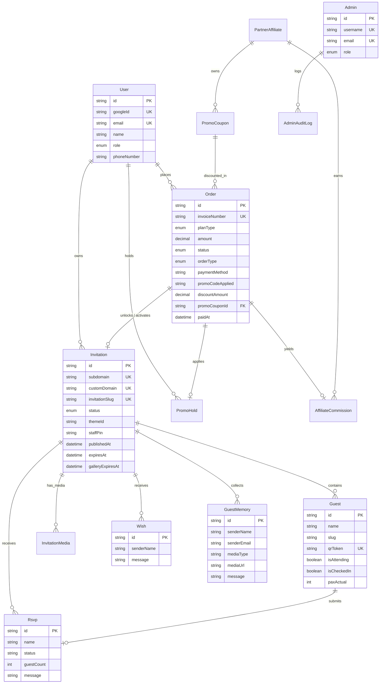
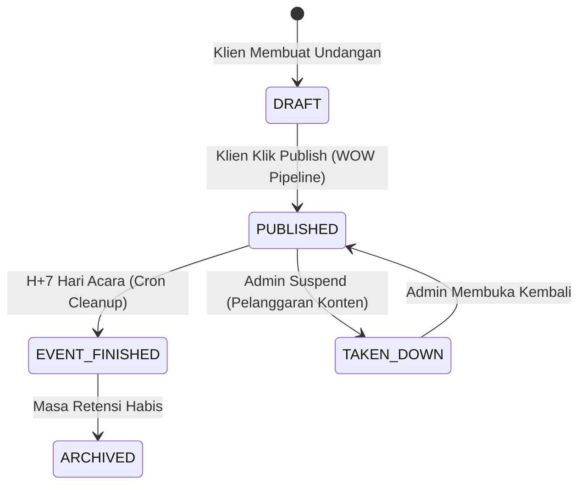
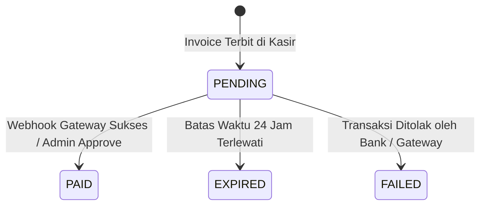

# DOKUMENTASI RESMI: SKEMA DATABASE & KAMUS DATA
**Luxenary Invite Platform — PostgreSQL Schema, Entity Relations, & Lifecycle State Machines**

Dokumen ini membedah arsitektur basis data relasional PostgreSQL pada platform Luxenary Invite yang dikelola melalui ORM Prisma (`prisma/schema.prisma`).

---

## 1. Diagram Relasi Antar-Entitas (Entity Relationship Diagram)

---

## 2. Kamus Data Lengkap (Data Dictionary)

### A. Entitas Pengguna & Akses (`users`, `admins`, `admin_audit_logs`)

#### 1. Tabel `users`
Menyimpan akun klien / calon pengantin:
- `id` (UUID, Primary Key): Identitas unik user.
- `googleId` (String, Unique, Nullable): ID pengguna dari Google OAuth.
- `email` (String, Unique): Alamat email resmi untuk login dan notifikasi invoice.
- `name` (String): Nama lengkap pemilik akun.
- `role` (Enum `UserRole`): `CLIENT` (default) atau `ADMIN`.
- `phoneNumber` (String, Nullable): Nomor kontak WhatsApp klien.
- `avatarUrl` (String, Nullable): URL foto profil klien dari Google.

#### 2. Tabel `admins`
Menyimpan kredensial tim pengelola platform:
- `id` (UUID, Primary Key): Identitas unik admin.
- `username` (String, Unique): Username login dashboard admin.
- `email` (String, Unique): Email pemulihan dan verifikasi.
- `passwordHash` (String, Nullable): Hash password terenkripsi (Argon2 / BCrypt).
- `role` (Enum `AdminRole`):
  - `SUPER_ADMIN`: Hak akses mutlak (konfigurasi sistem, database, tim).
  - `FINANCE`: Khusus rekonsiliasi invoice, refund, dan laporan omset.
  - `SUPPORT`: Khusus bantuan pelanggan dan pengelolaan tema.

#### 3. Tabel `admin_audit_logs`
Mencatat seluruh aksi operasional administrator untuk kepatuhan audit keamanan (*Security & Compliance*):
- `action` (String): Nama aksi (contoh: `APPROVE_ORDER`, `SUSPEND_INVITATION`, `RESTORE_DB`).
- `details` (String, Nullable): Rincian perubahan data (JSON).
- `ipAddress` (String, Nullable): Alamat IP asal request.

---

### B. Entitas Transaksi & Billing (`orders`, `webhook_logs`)

#### 1. Tabel `orders`
Menyimpan lembar penagihan dan riwayat transaksi:
- `invoiceNumber` (String, Unique): Nomor tagihan format `INV-YYYYMMDD-XXXX`.
- `planType` (Enum `PlanType`): Paket langganan (`TRADITIONAL`, `MODERN`, `PREMIUM`).
- `amount` (Decimal): Total nominal yang harus dibayar.
- `status` (Enum `OrderStatus`):
  - `PENDING`: Menunggu pembayaran.
  - `PAID`: Lunas, fitur otomatis aktif seketika.
  - `EXPIRED`: Kadaluarsa (lewat batas waktu 24 jam).
  - `FAILED`: Gagal bayar.
- `orderType` (Enum `OrderType`):
  - `NEW`: Pembuatan undangan pertama kali.
  - `UPGRADE`: Upgrade ke paket lebih tinggi.
  - `GALLERY_EXTENSION`: Add-on perpanjangan galeri foto tamu (+30 hari).
  - `CUSTOM_DOMAIN_ADDON`: Pembelian lisensi custom domain.
- `paymentMethod` (String): Kanal pembayaran (`GATEWAY` atau `MANUAL_TRANSFER`).
- `proofImageUrl` (String, Nullable): URL slip transfer jika menggunakan transfer manual.
- `promoCodeApplied` (String, Nullable): Kode kupon diskon yang diaplikasikan saat checkout.
- `discountAmount` (Decimal, Nullable): Nominal potongan harga dari kupon promo.
- `promoCouponId` (UUID, Foreign Key, Nullable): Referensi ke kupon yang digunakan.
- `checkoutConfirmedAt` (DateTime, Nullable): Waktu penguncian pesanan dan reservasi diskon promo hold.

#### 2. Tabel `webhook_logs`
Menyimpan riwayat callback / IPN dari payment gateway untuk idempotency dan debugging:
- `source` (String): Nama provider (`duitku`, `midtrans`, `ipaymu`, `tripay`, `xendit`).
- `event` (String): Tipe event (contoh: `payment.success`).
- `payload` (JSON): Payload biner lengkap dari gateway.
- `status` (String): `received` atau `processed`.

---

### C. Entitas Undangan & Media (`invitations`, `media`)

#### 1. Tabel `invitations`
Entitas pusat platform yang menyimpan konfigurasi undangan:
- `id` (UUID, Primary Key): Identitas unik undangan.
- `userId` (UUID, Foreign Key): Pemilik undangan (`onDelete: Cascade`).
- `themeId` (String): ID template tema (contoh: `kalandra`, `badrika`, `wave`).
- `subdomain` (String, Unique, Nullable): Subdomain unik platform (contoh: `yoga-nisa`).
- `customDomain` (String, Unique, Nullable): Domain pribadi klien (contoh: `yoganisa.com`).
- `invitationSlug` (String, Unique): Slug publik cadangan (contoh: `yoga-dan-nisa`).
- `status` (Enum `InvitationStatus`):
  - `DRAFT`: Dalam tahap perancangan di Studio Editor.
  - `PUBLISHED`: Undangan aktif dan dapat diakses tamu publik.
  - `EVENT_FINISHED`: Acara selesai, dialihkan menjadi galeri kenangan.
  - `TAKEN_DOWN`: Di-takedown manual oleh admin karena pelanggaran.
  - `ARCHIVED`: Diarsipkan permanen.
- `staffPin` (String, Nullable): 4-digit PIN terenkripsi untuk panitia buku tamu.
- `memoriesUploadLocked` (Boolean): Flag penutup fitur upload foto tamu.
- `eventData` (JSON String): Detail tanggal, jam, zona waktu, nama venue akad/resepsi.
- `bankAccounts` (JSON String): Daftar nomor rekening dan e-wallet tanda kasih.
- `featureSettings` (JSON String): Pengaturan aktif/nonaktif seksi undangan, konfigurasi kamera momen (`memoriesOpeningLayout`, `memoriesCardInstruction`, `memoriesFilter`, `memoriesDateStamp`, `memoriesSessions` dengan alokasi kuota), alamat kado fisik (`shippingAddress`), dan URL gambar QRIS (`qrisImageUrl`).

#### 2. Tabel `media` (Model `InvitationMedia`)
Menyimpan daftar aset visual mempelai:
- `mediaSlot` (Enum `MediaSlot` — 9 Nilai Resmi):
  - `LANDING_COVER`: Banner sampul depan undangan (mobile/default).
  - `LANDING_COVER_DESKTOP`: Banner sampul depan layar desktop layar lebar.
  - `HOME_PHOTO`: Foto hero pembuka di awal undangan.
  - `DESKTOP_SIDEBAR`: Foto/video panel sisi kiri layar desktop.
  - `GLOBAL_FIXED_BG`: Foto latar belakang tetap (*fixed background*).
  - `GROOM_PHOTO`: Foto potret mempelai pria.
  - `BRIDE_PHOTO`: Foto potret mempelai wanita.
  - `GALLERY`: Foto-foto album pre-wedding / galeri momen.
  - `CLOSING_COVER`: Banner visual penutup di akhir undangan.
- `localPath` (String): URL file di Cloudflare R2 CDN atau path storage lokal.

> **Media Khusus Non-Enum (`app/api/client/upload/route.ts`):**
> Media berikut dikelola secara langsung melalui penamaan file deterministik:
> - `QRIS`: Disimpan di `public/uploads/invitations/[id]/qris.webp` (WebP 800×800 px).
> - `MEMORIES_COVER`: Disimpan di `public/uploads/invitations/[id]/memories-cover.webp`.
> - `MUSIC`: Disimpan di `public/uploads/invitations/[id]/wedding-song.mp3` (Maks 20MB).

---

### D. Entitas Tamu, Interaksi & Galeri (`guests`, `rsvps`, `wishes`, `guest_memories`)

#### 1. Tabel `guests`
Buku tamu undangan klien:
- `name` (String): Nama tamu undangan (contoh: "Bapak H. Syamsuddin & Keluarga").
- `slug` (String): Slug nama untuk parameter `?to=...`.
- `phoneNumber` (String, Nullable): Nomor kontak WhatsApp tamu untuk broadcast undangan.
- `tableNumber` (String, Nullable): Alokasi nomor / nama meja VIP tamu di venue.
- `qrToken` (String, Unique): Token acak terenkripsi untuk verifikasi check-in QR di resepsionis.
- `paxAllocated` (Int): Kuota porsi katering yang dialokasikan.
- `isCheckedIn` (Boolean): Status kehadiran fisik di venue.
- `checkInTime` (DateTime, Nullable): Waktu pemindaian barcode check-in.
- `souvenirTaken` (Boolean): Pencatatan pengambilan souvenir fisik di meja penerima tamu.

#### 2. Tabel `rsvps`
Konfirmasi kehadiran tamu:
- `status` (String): Konfirmasi hadir (`HADIR`, `TIDAK_HADIR`, `RAGU`).
- `guestCount` (Int): Jumlah orang yang akan hadir.

#### 3. Tabel `wishes`
Buku tamu doa dan ucapan selamat dari tamu undangan.

#### 4. Tabel `guest_memories`
Album foto momen candid yang diunggah oleh tamu di hari pernikahan:
- `senderName` (String): Nama tamu pengunggah.
- `senderPhone` (String, Nullable): Nomor telepon tamu pengunggah.
- `mediaType` (String): Nilai tetap `PHOTO` / `IMAGE`.
- `mediaUrl` (String): Tautan file foto terkompresi di Cloudflare R2.
- `message` (String, Nullable): Caption ucapan momen.
- `story` (String, Nullable): Cerita atau ucapan doa panjang dari tamu.

---

### E. Entitas Pemasaran, Kupon Promo & Afiliasi (`promo_coupons`, `partner_affiliates`, `affiliate_commissions`, `promo_holds`)

#### 1. Tabel `promo_coupons`
Katalog kupon diskon dan voucher promo promosi:
- `code` (String, Unique): Kode kupon unik (contoh: `DISCOUNT50`, `WO-SEJAHTERA`).
- `discountType` (Enum `DiscountType`): `PERCENT` atau `NOMINAL`.
- `discountValue` (Decimal): Besaran diskon (persen atau rupiah).
- `minOrderAmount` (Decimal): Batas minimum nominal pesanan.
- `maxDiscountAmount` (Decimal, Nullable): Plafon batas diskon maksimal untuk tipe persen.
- `quotaLimit` (Int, Nullable): Kuota total pemakaian kupon.
- `usageCount` (Int): Jumlah pemakaian kupon yang berhasil dibayar.
- `isSingleUse` (Boolean): Flag sekali pakai langsung hangus.
- `perUserLimit` (Int): Batas klaim per akun user.
- `applicablePlans` (Array `PlanType`): Daftar paket yang memenuhi syarat.
- `validFrom` & `validUntil` (DateTime, Nullable): Periode masa berlaku kupon.
- `partnerId` (UUID, Foreign Key, Nullable): Relasi ke mitra afiliasi pemilik kupon.

#### 2. Tabel `partner_affiliates`
Data mitra referral (Wedding Organizer, Venue, Vendor MUA):
- `name` (String): Nama mitra atau agensi rekanan.
- `commissionType` (Enum `CommissionType`): `PERCENT` atau `FLAT`.
- `commissionValue` (Decimal): Besaran bagi hasil komisi per transaksi lunas.
- `pendingBalance` (Decimal): Akumulasi saldo komisi yang belum dicairkan.
- `totalPaidOut` (Decimal): Total riwayat komisi yang telah ditransfer ke mitra.
- `bankName`, `accountNumber`, `accountName` (String, Nullable): Rekening pencairan komisi.

#### 3. Tabel `affiliate_commissions`
Catatan komisi per transaksi pesanan klien:
- `orderId` (UUID, Unique, Foreign Key): Transaksi pesanan sumber komisi.
- `partnerId` (UUID, Foreign Key): Mitra yang berhak menerima komisi.
- `orderAmount` (Decimal): Nilai nominal pesanan.
- `commissionAmount` (Decimal): Nominal hak bagi hasil mitra.
- `status` (Enum `CommissionStatus`): `PENDING` atau `PAID`.
- `paidAt` (DateTime, Nullable): Tanggal pencairan dana.

#### 4. Tabel `promo_holds`
Mekanisme penguncian kupon 15 menit (*Anti-Race Condition & Anti-Double Claim*):
- `promoCode` (String): Kode kupon yang dikunci.
- `orderId` (UUID, Unique, Foreign Key): ID pesanan kasir yang mengunci kupon.
- `userId` (UUID, Foreign Key): User yang sedang melakukan reservasi diskon.
- `status` (Enum `HoldStatus`): `HELD` (sedang dikunci), `CONSUMED` (lunas), `RELEASED` (batal).
- `expiresAt` (DateTime): Waktu kedaluwarsa reservasi kunci (15 menit).

---

### F. Entitas Keuangan & Pembukuan Kas (`expenses`, `recurring_expenses`, `financial_closings`)

#### 1. Tabel `expenses`
Buku kas pengeluaran operasional (*OPEX*) dan pencairan komisi mitra:
- `title` (String): Judul pengeluaran.
- `category` (Enum `ExpenseCategory`): `SERVER`, `MARKETING`, `SALARY`, `LEGAL`, `OFFICE`, `MISC`.
- `amount` (Decimal): Nominal uang keluar.
- `expenseDate` (DateTime): Tanggal realisasi pembayaran.
- `receiptUrl` (String, Nullable): URL bukti bayar / struk transfer di R2.

#### 2. Tabel `recurring_expenses`
Jadwal tagihan rutin berkala (sewa server VPS, domain, lisensi software):
- `billingCycle` (Enum `BillingCycle`): `MONTHLY` atau `YEARLY`.
- `dueDate` (Int): Tanggal jatuh tempo kalender.

#### 3. Tabel `financial_closings`
Laporan audit tutup buku keuangan bulanan yang terkunci (*immutable snapshot*):
- `period` (String, Unique): Periode format `YYYY-MM`.
- `grossRevenue` (Decimal): Total pendapatan kotor lunas.
- `totalExpenses` (Decimal): Total beban operasional.
- `netProfit` (Decimal): Laba bersih operasional.
- `taxAmount` (Decimal): Kewajiban PPh Final UMKM 0,5% (PP 55/2022).
- `closedAt` (DateTime): Waktu penguncian pembukuan oleh Administrator.

---

## 3. Mesin Siklus Hidup Status (*Lifecycle State Machines*)

### A. State Machine: Status Undangan (`InvitationStatus`)

### B. State Machine: Status Pembayaran (`OrderStatus`)

