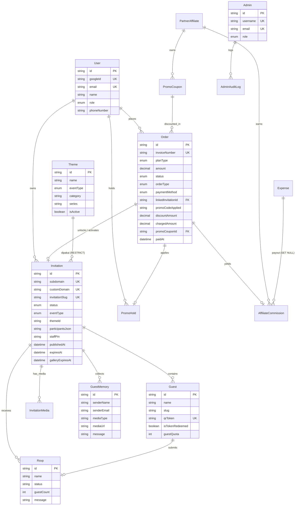
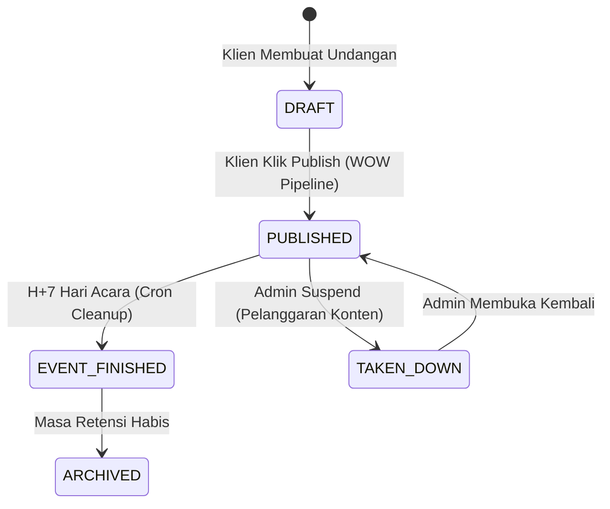
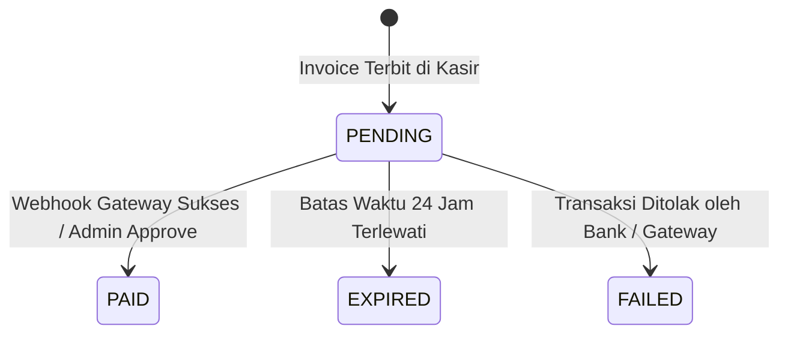

# DOKUMENTASI RESMI: SKEMA DATABASE & KAMUS DATA
**Luxenary Invite Platform — PostgreSQL Schema, Entity Relations, & Lifecycle State Machines**

Dokumen ini membedah arsitektur basis data relasional PostgreSQL pada platform Luxenary Invite yang dikelola melalui ORM Prisma (`prisma/schema.prisma`).

---

## 1. Diagram Relasi Antar-Entitas (Entity Relationship Diagram)

```mermaid
erDiagram
    User ||--o{ Order : "places"
    User ||--o{ Invitation : "owns"
    User ||--o{ PromoHold : "holds"
    Order ||--o| Invitation : "unlocks / activates"
    Order ||--o| PromoHold : "applies"
    Order ||--o| AffiliateCommission : "yields"
    PartnerAffiliate ||--o{ PromoCoupon : "owns"
    PartnerAffiliate ||--o{ AffiliateCommission : "earns"
    PromoCoupon ||--o{ Order : "discounted_in"
    Invitation ||--o{ Guest : "contains"
    Invitation ||--o{ InvitationMedia : "has_media"
    Invitation ||--o{ Rsvp : "receives"
    Invitation ||--o{ GuestMemory : "collects"
    Theme ||--o{ Invitation : "dipakai (RESTRICT)"
    Expense ||--o{ AffiliateCommission : "payout (SET NULL)"
    Guest ||--o| Rsvp : "submits"
    Admin ||--o{ AdminAuditLog : "logs"

    User {
        string id PK
        string googleId UK
        string email UK
        string name
        enum role
        string phoneNumber
    }

    Order {
        string id PK
        string invoiceNumber UK
        enum planType
        decimal amount
        enum status
        enum orderType
        enum paymentMethod
        string linkedInvitationId FK
        string promoCodeApplied
        decimal discountAmount
        decimal chargedAmount
        string promoCouponId FK
        datetime paidAt
    }

    Invitation {
        string id PK
        string subdomain UK
        string customDomain UK
        string invitationSlug UK
        enum status
        enum eventType
        string themeId
        string participantsJson
        string staffPin
        datetime publishedAt
        datetime expiresAt
        datetime galleryExpiresAt
    }

    Theme {
        string id PK
        string name
        enum eventType
        string category
        string series
        boolean isActive
    }

    Guest {
        string id PK
        string name
        string slug
        string qrToken UK
        boolean isTokenRedeemed
        int guestQuota
    }

    Rsvp {
        string id PK
        string name
        string status
        int guestCount
        string message
    }

    GuestMemory {
        string id PK
        string senderName
        string senderEmail
        string mediaType
        string mediaUrl
        string message
    }

    Admin {
        string id PK
        string username UK
        string email UK
        enum role
    }
```

---

## 2. Kamus Data Lengkap (Data Dictionary)

### A. Entitas Pengguna & Akses (`users`, `admins`, `admin_audit_logs`)

#### 1. Tabel `users`
Menyimpan akun klien / calon pengantin:
- `id` (UUID, Primary Key): Identitas unik user.
- `googleId` (String, Unique, Nullable): ID pengguna dari Google OAuth.
- `email` (String, Unique): Alamat email resmi untuk login dan notifikasi invoice.
- `name` (String): Nama lengkap pemilik akun.
- `role` (Enum `UserRole`): `CLIENT` (default) atau `ADMIN`.
- `phoneNumber` (String, Nullable): Nomor kontak WhatsApp klien.
- `avatarUrl` (String, Nullable): URL foto profil klien dari Google.

#### 2. Tabel `admins`
Menyimpan kredensial tim pengelola platform:
- `id` (UUID, Primary Key): Identitas unik admin.
- `username` (String, Unique): Username login dashboard admin.
- `email` (String, Unique): Email pemulihan dan verifikasi.
- `passwordHash` (String, Nullable): Hash password terenkripsi (Argon2 / BCrypt).
- `role` (Enum `AdminRole`):
  - `SUPER_ADMIN`: Hak akses mutlak (seluruh 13 modul sistem, konfigurasi platform, database, tim).
  - `ADMIN`: Template operasional harian (undangan, klien, tema, portofolio, custom domain, transaksi).
  - `FINANCE`: Template staf keuangan (arus kas, transaksi, verifikasi manual, omzet).
  - `SUPPORT`: Template customer service (asistensi klien, proyek undangan, custom domain).
- `permissions` (`String[]`, Default `[]`): Array daftar ID modul dinamis yang diizinkan untuk staf. Jika kosong, sistem otomatis fallback ke default template role masing-masing (backward compatible). Modul sensitif (`settings`, `database`, `team`) terlindungi mutlak hanya untuk `SUPER_ADMIN`.

#### 3. Tabel `admin_audit_logs`
Mencatat seluruh aksi operasional administrator untuk kepatuhan audit keamanan (*Security & Compliance*):
- `action` (String): Nama aksi (contoh: `APPROVE_ORDER`, `SUSPEND_INVITATION`, `RESTORE_DB`).
- `details` (String, Nullable): Rincian perubahan data (JSON).
- `ipAddress` (String, Nullable): Alamat IP asal request.

---

### B. Entitas Transaksi & Billing (`orders`, `webhook_logs`)

#### 1. Tabel `orders`
Menyimpan lembar penagihan dan riwayat transaksi:
- `invoiceNumber` (String, Unique): Nomor tagihan format `INV-YYYYMMDD-XXXX`.
- `planType` (Enum `PlanType`): Paket langganan (`TIER_1`, `TIER_2`, `TIER_3`).
- `amount` (Decimal 12,2): Total nominal yang harus dibayar (sebelumnya `numeric(65,30)`, disamakan dengan kolom uang lain lewat migrasi `20261001150000`).
- `status` (Enum `OrderStatus`):
  - `PENDING`: Menunggu pembayaran.
  - `PAID`: Lunas, fitur otomatis aktif seketika.
  - `EXPIRED`: Kadaluarsa (lewat batas waktu 24 jam).
  - `FAILED`: Gagal bayar.
- `orderType` (Enum `OrderType`):
  - `NEW`: Pembuatan undangan pertama kali.
  - `UPGRADE`: Upgrade ke paket lebih tinggi.
  - `GALLERY_EXTENSION`: Add-on perpanjangan masa aktif galeri foto tamu.
  - `MEMORIES_TOPUP`: Add-on kuota tambahan foto kenangan tamu.
- `paymentMethod` (Enum `PaymentMethod`, Nullable, bawaan `GATEWAY`): Kanal pembayaran (`GATEWAY` atau `MANUAL_TRANSFER`).
- `linkedInvitationId` (UUID, Nullable, FK `invitations.id`, `ON DELETE SET NULL`, terindeks): Undangan yang menjadi sasaran order `UPGRADE`, `GALLERY_EXTENSION`, atau `MEMORIES_TOPUP`. Menggantikan `linkedOrderId` yang berisi ID Order atau ID Invitation. Order dasar (`orderType = NEW`) dikenali lewat `orderType`, bukan lewat tautan kosong.
- `proofImageUrl` (String, Nullable): URL slip transfer jika menggunakan transfer manual.
- `promoCodeApplied` (String, Nullable): Kode kupon diskon yang diaplikasikan saat checkout.
- `discountAmount` (Decimal, Nullable): Nominal potongan harga dari kupon promo.
- `chargedAmount` (Decimal 12,2, Nullable): Nominal yang benar-benar dikirim ke gateway saat `init` (termasuk biaya layanan mode `BUYER`). Diisi oleh `/api/payments/checkout` dan `/api/payments/qris/regenerate`; dipakai webhook untuk memvalidasi nominal yang dibayar.
- `promoCouponId` (UUID, Foreign Key, Nullable): Referensi ke kupon yang digunakan.
- `checkoutConfirmedAt` (DateTime, Nullable): Waktu penguncian pesanan dan reservasi diskon promo hold.

#### 2. Tabel `webhook_logs`
Menyimpan riwayat callback / IPN dari payment gateway untuk idempotency dan debugging:
- `source` (String): Nama provider (`midtrans` atau `xendit`).
- `event` (String): Tipe event (contoh: `payment.success`).
- `payload` (JSON): Payload biner lengkap dari gateway.
- `status` (String): `received`, `processed`, atau `amount_mismatch` (nominal webhook tidak cocok dengan `Order.chargedAmount`, order tidak dilunasi).

---

### C. Entitas Undangan & Media (`invitations`, `media`)

#### 1. Tabel `invitations`
Entitas pusat platform yang menyimpan konfigurasi undangan:
- **Invarian Relasi Kritis (*Hard Payment Barrier*):** Record `invitations` hanya dapat dibuat jika `userId` pemilik memiliki pesanan terkait di tabel `orders` yang berstatus `PAID`. Klien tanpa order `PAID` dilarang membuat draf (HTTP 403 Forbidden) dan dilarang mengakses Dashboard.
- `id` (UUID, Primary Key): Identitas unik undangan.
- `userId` (UUID, Foreign Key): Pemilik undangan (`onDelete: Cascade`).
- `orderId` (UUID, Foreign Key, Nullable): Relasi ke invoice pembelian paket berstatus `PAID`.
- `eventType` (Enum `EventType` — 6 Nilai Resmi):
  - `WEDDING`: Pernikahan sakral tradisional & modern (default).
  - `BIRTHDAY`: Perayaan ulang tahun anak & dewasa.
  - `KHITAN`: Tasyakuran walimatul khitan.
  - `AQIQAH`: Syukuran aqiqah buah hati.
  - `WISUDA`: Perayaan kelulusan sarjana & wisudawan.
  - `GATHERING`: Acara komunitas, reuni, & family gathering.
- `themeId` (String, FK `themes.id`, `ON DELETE RESTRICT`): ID template tema (contoh: `kalandra`, `bugis`, `festivo`, `al-fariz`). Tema yang dipakai undangan tidak dapat dihapus.
- `participantsJson` (JSON String, Nullable): Data spesifik celebrant/partisipan (nama anak/bayi/wisudawan, usia, universitas, orang tua).
- `subdomain` (String, Unique, Nullable): Subdomain unik platform (contoh: `yoga-nisa`).
- `customDomain` (String, Unique, Nullable): Domain pribadi klien (contoh: `yoganisa.com`).
- `invitationSlug` (String, Unique): Slug publik cadangan (contoh: `yoga-dan-nisa`).
- `status` (Enum `InvitationStatus`):
  - `DRAFT`: Dalam tahap perancangan di Studio Editor.
  - `PUBLISHED`: Undangan aktif dan dapat diakses tamu publik.
  - `EVENT_FINISHED`: Acara selesai, dialihkan menjadi galeri kenangan.
  - `TAKEN_DOWN`: Di-takedown manual oleh admin karena pelanggaran.
  - `ARCHIVED`: Diarsipkan permanen.
- `staffPin` (String, Nullable): 4-digit PIN terenkripsi (AES-256-GCM) untuk panitia buku tamu.
- `memoriesUploadLocked` (Boolean): Flag penutup fitur upload foto tamu.
- `eventData` (JSON String): Detail tanggal, jam, zona waktu, nama venue akad/resepsi atau acara utama.
- `bankAccounts` (JSON String): Daftar nomor rekening dan e-wallet tanda kasih.
- `featureSettings` (JSON String): Pengaturan aktif/nonaktif seksi undangan, konfigurasi kamera momen (`memoriesOpeningLayout`, `memoriesCardInstruction`, `memoriesFilter`, `memoriesDateStamp`, `memoriesSessions` dengan alokasi kuota), alamat kado fisik (`shippingAddress`), dan URL gambar QRIS (`qrisImageUrl`).

#### 2. Tabel `media` (Model `InvitationMedia`)
Menyimpan daftar aset visual mempelai:
- `mediaSlot` (Enum `MediaSlot` — 9 Nilai Resmi):
  - `LANDING_COVER`: Banner sampul depan undangan (mobile/default).
  - `LANDING_COVER_DESKTOP`: Banner sampul depan layar desktop layar lebar.
  - `HOME_PHOTO`: Foto hero pembuka di awal undangan.
  - `DESKTOP_SIDEBAR`: Foto/video panel sisi kiri layar desktop.
  - `GLOBAL_FIXED_BG`: Foto latar belakang tetap (*fixed background*).
  - `GROOM_PHOTO`: Foto potret mempelai pria (atau foto utama celebrant non-wedding).
  - `BRIDE_PHOTO`: Foto potret mempelai wanita.
  - `GALLERY`: Foto-foto album pre-wedding / galeri momen.
  - `CLOSING_COVER`: Banner visual penutup di akhir undangan.
- `localPath` (String): URL file di Cloudflare R2 CDN atau path storage lokal.

#### 3. Tabel `themes` (Model `Theme`)
Master katalog tema fisik resmi di sistem (39 tema terdaftar):
- `id` (String, Primary Key): Identifier unik tema (contoh: `kalandra`, `artisan`, `festivo`).
- `name` (String): Nama komersial tema.
- `eventType` (Enum `EventType`): Afiliasi tipe acara (`WEDDING`, `BIRTHDAY`, `KHITAN`, `AQIQAH`, `WISUDA`, `GATHERING`).
- `category` (String): Kategori gaya desain (`minimalist`, `modern`, `traditional`).
- `series` (String, Nullable): Lini koleksi tema.
- `previewUrl` (String, Nullable): Rute demo publik (contoh: `/demo/kalandra`).
- `isActive` (Boolean): Flag status aktif di katalog showroom & kasir.
- `sortOrder` (Int): Urutan penampilan di galeri.
- `defaultMusicUrl` (String, Nullable): Lagu latar bawaan tema.

Tema tidak memiliki harga atau label premium: kolom `isPremium` dan `price` dihapus (migrasi `20261001120000_drop_theme_price_and_premium`) karena paket dibedakan oleh kapabilitas fitur, bukan oleh tema, dan semua tema terbuka untuk semua paket. Kolom `isFeatured` juga dihapus (migrasi `20261001150000_db_integrity_theme_fk_amount_precision`) karena tidak dibaca dan tidak ditulis kode mana pun; `isFeatured` yang dipakai halaman harga adalah properti paket di `admin_settings`, bukan tema.

> **Media Khusus Non-Enum (`app/api/client/upload/route.ts`):**
> Media berikut dikelola secara langsung melalui penamaan file deterministik:
> - `QRIS`: Disimpan di `public/uploads/invitations/[id]/qris.webp` (WebP 800×800 px).
> - `MEMORIES_COVER`: Disimpan di `public/uploads/invitations/[id]/memories-cover.webp`.
> - `MUSIC`: Disimpan di `public/uploads/invitations/[id]/wedding-song.mp3` (Maks 20MB).

---

### D. Entitas Tamu, Interaksi & Galeri (`guests`, `rsvps`, `guest_memories`)

#### 1. Tabel `guests`
Buku tamu undangan klien:
- `name` (String): Nama tamu undangan (contoh: "Bapak H. Syamsuddin & Keluarga").
- `slug` (String): Slug nama untuk parameter `?to=...`.
- `category` (String, Nullable): Kategori tamu (mis. VIP, Keluarga).
- `phone` (String, Nullable): Nomor kontak WhatsApp tamu untuk broadcast undangan.
- `waStatus` (enum `WaStatus`, bawaan `PENDING`) dan `waSentAt` (DateTime, Nullable): Status dan waktu pengiriman pesan WhatsApp.
- `sessionInfo` (String, Nullable): Penanda sesi kehadiran tamu.
- `tableNumber` (String, Nullable): Alokasi nomor / nama meja VIP tamu di venue.
- `qrToken` (String, Nullable, Unique): Token acak (UUID untuk tamu tunggal, 16 heksadesimal untuk impor massal, `OTS-<invitationId>-<waktu>` untuk tamu langsung di tempat) yang dipakai saat sinkronisasi check-in.
- `guestQuota` (Int, bawaan 1): Jumlah orang maksimal yang boleh dibawa tamu; juga menjadi batas pax pada RSVP.
- `isTokenRedeemed` (Boolean, bawaan false): Penanda satu arah bahwa tamu sudah check-in di venue. Tidak ada kolom waktu check-in, penanda `isCheckedIn`, alokasi katering, maupun pencatatan souvenir di skema.

#### 2. Tabel `rsvps`
Konfirmasi kehadiran tamu:
- `status` (Enum `RsvpStatus`): Konfirmasi kehadiran `hadir`, `tidak`, atau `ragu`. Ragam kiriman tema (`HADIR`, `TIDAK_HADIR`, `RAGU`) dinormalkan oleh `lib/rsvpStatus.ts` sebelum disimpan; migrasi `20261001160000` menormalkan baris lama dan menolak nilai tak dikenal.
- `guestCount` (Int): Jumlah orang yang akan hadir.

#### 3. Tabel `guest_memories`
Album foto momen candid yang diunggah oleh tamu di hari pernikahan:
- `senderName` (String): Nama tamu pengunggah.
- `senderEmail` (String): Email tamu pengunggah (wajib).
- `mediaType` (String, bawaan `PHOTO`): Jenis media. Belum enum karena nilainya tidak konsisten: jalur unggah publik menulis `IMAGE`, sedangkan bawaan dan form menulis `PHOTO`, dan tidak ada kode yang membacanya dengan pembanding.
- `mediaUrl` (String): Tautan file foto terkompresi di penyimpanan aktif (Cloudflare R2 atau lokal).
- `thumbnailUrl` (String, Nullable): Tautan gambar mini.
- `message` (String, Nullable): Caption ucapan momen.

---

### E. Entitas Pemasaran, Kupon Promo & Afiliasi (`promo_coupons`, `partner_affiliates`, `affiliate_commissions`, `promo_holds`)

#### 1. Tabel `promo_coupons`
Katalog kupon diskon dan voucher promo promosi:
- `code` (String, Unique): Kode kupon unik (contoh: `DISCOUNT50`, `WO-SEJAHTERA`).
- `discountType` (Enum `DiscountType`): `PERCENT` atau `NOMINAL`.
- `discountValue` (Decimal): Besaran diskon (persen atau rupiah).
- `minOrderAmount` (Decimal): Batas minimum nominal pesanan.
- `maxDiscountAmount` (Decimal, Nullable): Plafon batas diskon maksimal untuk tipe persen.
- `quotaLimit` (Int, Nullable): Kuota total pemakaian kupon.
- `usageCount` (Int): Jumlah pemakaian kupon yang berhasil dibayar.
- `isSingleUse` (Boolean): Flag sekali pakai langsung hangus.
- `perUserLimit` (Int): Batas klaim per akun user.
- `applicablePlans` (Array `PlanType`): Daftar paket yang memenuhi syarat.
- `validFrom` & `validUntil` (DateTime, Nullable): Periode masa berlaku kupon.
- `partnerId` (UUID, Foreign Key, Nullable): Relasi ke mitra afiliasi pemilik kupon.

#### 2. Tabel `partner_affiliates`
Data mitra referral (Wedding Organizer, Venue, Vendor MUA):
- `name` (String): Nama mitra atau agensi rekanan.
- `commissionType` (Enum `CommissionType`): `PERCENT` atau `FLAT`.
- `commissionValue` (Decimal): Besaran bagi hasil komisi per transaksi lunas.
- `pendingBalance` (Decimal): Akumulasi saldo komisi yang belum dicairkan.
- `totalPaidOut` (Decimal): Total riwayat komisi yang telah ditransfer ke mitra.
- `bankName`, `accountNumber`, `accountName` (String, Nullable): Rekening pencairan komisi.

#### 3. Tabel `affiliate_commissions`
Catatan komisi per transaksi pesanan klien:
- `orderId` (UUID, Unique, Foreign Key): Transaksi pesanan sumber komisi.
- `partnerId` (UUID, Foreign Key): Mitra yang berhak menerima komisi.
- `orderAmount` (Decimal): Nilai nominal pesanan.
- `commissionAmount` (Decimal): Nominal hak bagi hasil mitra.
- `status` (Enum `CommissionStatus`): `PENDING` atau `PAID`.
- `paidAt` (DateTime, Nullable): Tanggal pencairan dana.
- `payoutExpenseId` (UUID, Nullable, Foreign Key `expenses.id`, `ON DELETE SET NULL`, terindeks): Pengeluaran kas yang dibuat saat pencairan.

#### 4. Tabel `promo_holds`
Mekanisme penguncian kupon 15 menit (*Anti-Race Condition & Anti-Double Claim*):
- `promoCode` (String): Kode kupon yang dikunci.
- `orderId` (UUID, Unique, Foreign Key): ID pesanan kasir yang mengunci kupon.
- `userId` (UUID, Foreign Key): User yang sedang melakukan reservasi diskon.
- `status` (Enum `HoldStatus`): `HELD` (sedang dikunci), `CONSUMED` (lunas), `RELEASED` (batal).
- `expiresAt` (DateTime): Waktu kedaluwarsa reservasi kunci (15 menit).

---

### F. Entitas Keuangan & Pembukuan Kas (`expenses`, `recurring_expenses`, `financial_closings`)

#### 1. Tabel `expenses`
Buku kas pengeluaran operasional (*OPEX*) dan pencairan komisi mitra:
- `title` (String): Judul pengeluaran.
- `category` (Enum `ExpenseCategory`): `INFRASTRUCTURE`, `UTILITIES`, `MARKETING`, `SOFTWARE_LICENSES`, `OPERATIONAL`, `OTHER` (default `OTHER`).
- `amount` (Decimal 12,2): Nominal uang keluar.
- `expenseDate` (DateTime): Tanggal realisasi pembayaran.
- `paymentSource` (String, Nullable): Sumber dana (default `TRANSFER_BANK`).
- `referenceNumber` (String, Nullable): Nomor referensi transaksi.
- `receiptUrl` (String, Nullable): URL bukti bayar / struk transfer di R2.
- `notes` (String, Nullable): Catatan tambahan.
- `createdById` (String, Nullable): ID admin pencatat.
- `isLocked` (Boolean): `true` jika periode sudah ditutup buku dan pengeluaran tidak boleh diubah.

#### 2. Tabel `recurring_expenses`
Jadwal tagihan rutin berkala (sewa server VPS, domain, lisensi software):
- `name` (String): Nama tagihan.
- `category` (Enum `ExpenseCategory`): Kategori beban (default `UTILITIES`).
- `estimatedAmount` (Decimal 12,2): Estimasi nominal per bulan.
- `dueDayOfMonth` (Int): Tanggal jatuh tempo setiap bulan.
- `vendorName` (String, Nullable): Nama vendor penagih.
- `paymentSource` (String, Nullable): Sumber dana (default `TRANSFER_BANK`).
- `isActive` (Boolean): Status tagihan aktif.

#### 3. Tabel `financial_closings`
Laporan audit tutup buku keuangan bulanan yang terkunci:
- `periodMonth` + `periodYear` (Int, Unique bersama): Periode tutup buku.
- `grossRevenue` (Decimal 12,2): Total pendapatan kotor lunas.
- `totalExpenses` (Decimal 12,2): Total beban operasional.
- `netProfit` (Decimal 12,2): Laba bersih operasional.
- `taxAmount` (Decimal 12,2): Kewajiban pajak hasil kalkulasi.
- `taxPaid` (Boolean) dan `taxPaidAt` (DateTime, Nullable): Status dan waktu pelunasan pajak.
- `closedById` (String): ID admin yang menutup buku.
- `closedAt` (DateTime): Waktu penguncian pembukuan.
- `notes` (String, Nullable): Catatan penutupan.

---

### G. Entitas Konfigurasi & Infrastruktur (`admin_settings`, `music_presets`, `rate_limit_counters`)

#### 1. Tabel `admin_settings`
Penyimpanan pasangan kunci-nilai untuk seluruh konfigurasi dinamis dari Admin Portal (brand, kontak, kredensial gateway, SMTP, tarif, gateway aktif `active_payment_gateway`, dan `theme_demo_*`):
- `key` (String, Unique): Kunci pengaturan.
- `value` (String): Nilai pengaturan.
- `label` (String, Nullable): Label tampilan di Admin Portal.
- `group` (String): Kelompok pengaturan (default `general`).
- `updatedAt` (DateTime): Waktu perubahan terakhir.

#### 2. Tabel `music_presets`
Pustaka musik latar bawaan yang dipilih klien pada studio:
- `title` (String), `composer` (String, Nullable), `genre` (String, Nullable): Metadata lagu.
- `url` (String, Unique): URL berkas audio.
- `durationSec` (Int, Nullable): Durasi dalam detik.
- `isActive` (Boolean) dan `sortOrder` (Int): Status tampil dan urutan.

#### 3. Tabel `rate_limit_counters`
Penghitung pembatasan laju permintaan Tier 2 (PostgreSQL atomic UPSERT) ketika Redis Upstash tidak dikonfigurasi:
- `key` (String, Primary Key): Kunci pembatasan yang dibentuk oleh pemanggil `rateLimitDb` (`lib/rateLimit.ts`).
- `count` (Int): Jumlah permintaan pada jendela aktif.
- `expiresAt` (DateTime): Waktu jendela berakhir, terindeks untuk pembersihan.

---

## 3. Mesin Siklus Hidup Status (*Lifecycle State Machines*)

### A. State Machine: Status Undangan (`InvitationStatus`)

```mermaid
stateDiagram-v2
    [*] --> DRAFT : Klien Membuat Undangan
    DRAFT --> PUBLISHED : Klien Klik Publish (WOW Pipeline)
    PUBLISHED --> EVENT_FINISHED : H+7 Hari Acara (Cron Cleanup)
    EVENT_FINISHED --> ARCHIVED : Masa Retensi Habis
    PUBLISHED --> TAKEN_DOWN : Admin Suspend (Pelanggaran Konten)
    TAKEN_DOWN --> PUBLISHED : Admin Membuka Kembali
```

### B. State Machine: Status Pembayaran (`OrderStatus`)

```mermaid
stateDiagram-v2
    [*] --> PENDING : Invoice Terbit di Kasir
    PENDING --> PAID : Webhook Gateway Sukses / Admin Approve
    PENDING --> EXPIRED : Batas Waktu 24 Jam Terlewati
    PENDING --> FAILED : Transaksi Ditolak oleh Bank / Gateway
```
