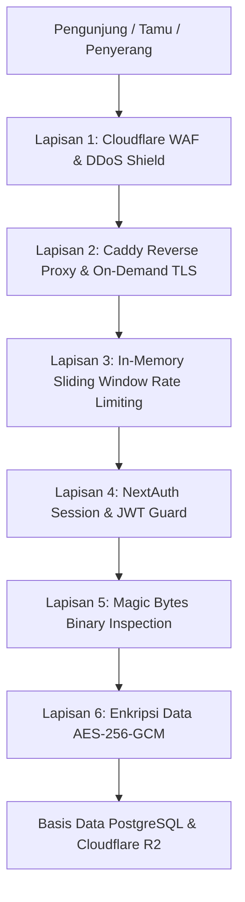

# DOKUMENTASI RESMI: KEAMANAN SISTEM & PROTEKSI DATA (SECURITY ARCHITECTURE)
**Luxenary Invite Platform — Multi-Layer Defense, Kriptografi AES-256-GCM, & Anti-Abuse Protection**

Dokumen ini membedah arsitektur keamanan (*Security Blueprint*) yang melindungi platform Luxenary Invite dari potensi eksploitasi, kebocoran data, serangan brute-force, dan manipulasi transaksi.

---

## 1. Arsitektur Pertahanan Berlapis (Defense-in-Depth)

---

## 2. Lapisan 1 & 2: Tameng Jaringan & TLS (Cloudflare & Caddy)

1. **Cloudflare Proxy & WAF (Awan Oranye):**
   - Menyaring serangan layer 3/4/7 DDoS sebelum mencapai server VPS.
   - Menyembunyikan alamat IP asli server VPS (`origin IP`) dari publik.
2. **Caddy On-Demand TLS:**
   - Penerbitan sertifikat SSL otomatis hanya dilakukan jika domain target diverifikasi lolos pengecekan endpoint `/api/public/resolve-custom-domain`.
   - Mencegah eksploitasi *SSL Exhaustion Attack* dari domain asing yang sengaja diarahkan ke server tanpa izin.

---

## 3. Lapisan 3: Anti-Spam & Rate Limiting (`lib/rateLimit.ts`)

Mencegah serangan brute-force, spamming RSVP ucapan, dan pembebanan server berlebihan:
- **Mekanisme:** *In-Memory Sliding Window Rate Limiter* berkinerja tinggi (< 0.1 ms).
- **Aturan Batasan:**
  - Endpoint RSVP Tamu (`/api/public/rsvp`): Maksimal **15 request per menit** per IP.
  - Endpoint Upload Foto Tamu (`/api/public/memories/upload`): Maksimal **15 request per menit** per IP.
  - Endpoint Scanner Resepsionis (`/api/receptionist/scan`): Maksimal **30 request per menit** per IP.
- **Proteksi Kebocoran Memori (Anti-OOM):**
  Jika jumlah entri IP di dalam memori melebihi 10.000 IP, sistem melakukan pembersihan malas (*lazy garbage collection*) secara otomatis untuk membuang entri yang sudah kadaluarsa.

---

## 4. Lapisan 4: Enkripsi Kriptografi Dua Arah (`lib/pinEncryption.ts`)

PIN 4-digit panitia resepsionis (`staffPin`) disimpan menggunakan standar enkripsi militer:
- **Algoritma:** `AES-256-GCM` (Galois/Counter Mode) terautentikasi.
- **Vektor Inisialisasi (IV):** 16-byte cryptographically secure random bytes untuk setiap kali PIN disimpan.
- **Authentication Tag:** 16-byte auth tag untuk mendeteksi apakah ciphertext di database pernah dimanipulasi atau di-tamper.
- **Kunci Rahasia:** `PIN_ENCRYPTION_KEY` (64 karakter hex) yang disimpan di file `.env` server dan tidak pernah di-commit ke Git.
- **Manfaat:** Jika terjadi kebocoran dump database (`.sql`), penyerang tidak akan bisa membaca PIN buku tamu pengantin.

---

## 5. Lapisan 5: Validasi Magic Bytes File Unggahan

Server tidak pernah mempercayai ekstensi file (`.jpg`, `.png`) maupun header `Content-Type` yang dikirim dari browser tamu:
- Server membaca **4 hingga 12 byte biner pertama** (*magic numbers*) dari file buffer:
  - JPEG: Memeriksa header biner `FF D8 FF`.
  - PNG: Memeriksa header biner `89 50 4E 47 0D 0A 1A 0A`.
  - WebP: Memeriksa struktur biner `RIFF....WEBP`.
  - GIF: Memeriksa header biner `GIF87a` / `GIF89a`.
- File executable (`.exe`, `.sh`, `.php`), script berbahaya, atau file video yang disamarkan dengan ekstensi `.jpg` akan **langsung ditolak dengan status HTTP 400**.

---

## 6. Lapisan 6: Integritas Transaksi & Validasi Webhook

1. **Verifikasi Tanda Tangan Kriptografi (Signature Validation):**
   Setiap notifikasi webhook pembayaran dari Midtrans, iPaymu, Duitku, TriPay, dan Xendit divalidasi menggunakan hash kriptografi (HMAC-SHA256 atau SHA512) dengan secret key masing-masing gateway.
2. **Idempotency Protection:**
   Setiap webhook yang masuk dicatat di tabel `webhook_logs`. Jika notifikasi yang sama dikirim berulang kali oleh gateway (*retry mechanism*), sistem menjamin status transaksi tidak diproses dobel (*idempotent execution*).
3. **Pemberian Hak Akses (Role-Based Access Control):**
   - Seluruh rute `/api/admin/*` diproteksi guard ganda: autentikasi sesi JWT dan pengecekan role `ADMIN` atau `SUPER_ADMIN`.
   - Modul kendali jarak jauh (*Remote Session*) mencatat log audit lengkap ke tabel `admin_audit_logs`.
