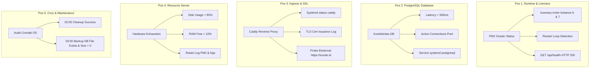

# SPESIFIKASI OPERASIONAL: AGENT HERMES (VPS SENTINEL & WATCHDOG)
**Luxenary Invite Platform — Autonomous Server Monitoring & Reliability Guardian**

Dokumen ini memuat mandat, cakupan pengawasan, ambang batas peringatan (*alert thresholds*), serta skrip audit faktual yang dirancang khusus untuk **Agent Hermes** agar dapat memantau dan menjaga keandalan server VPS produksi secara mandiri.

---

## 1. Profil & Mandat Agent Hermes

| Parameter | Detail Operasional |
| :--- | :--- |
| **Identitas Agen** | **Agent Hermes** (Autonomous Sentinel & Reliability Watchdog) |
| **Server Target** | VPS Ubuntu Linux `103.150.92.238` (User: `amsdev`) |
| **Domain Produksi** | `https://luxvite.id` |
| **Aplikasi Inti** | `luxenary-invite` (Next.js 16.3.7 Turbopack, PM2 Cluster Port 3001) |
| **Database** | PostgreSQL 16 (`luxenary_db` di `localhost:5432`) |
| **Web Server / Ingress** | Caddy v2 (On-Demand TLS, Reverse Proxy) di belakang Cloudflare |
| **Layanan Berdampingan**| `pick-your-photo`, `wisuda-api`, `wisuda-cron`, `pm2-logrotate` |
| **Tujuan Utama** | Mencegah *downtime*, mendeteksi kebocoran memori/disk sebelum sistem macet, dan memverifikasi siklus pemeliharaan harian berjalan sukses. |

---

## 2. Lima Pos Pengawasan Kritis (The 5 Sentinel Checkpoints)



---

### Pos 1: Process & Application Liveness (Kesehatan PM2 Cluster)

Hermes wajib memantau kestabilan runtime Next.js pada port lokal 3001:

1. **Pemeriksaan Status PM2:**
   - **Perintah Audit:**
     ```bash
     pm2 jlist | jq '.[] | select(.name=="luxenary-invite") | {id, name, status: .pm2_env.status, restarts: .pm2_env.restart_time, memory: .monit.memory, cpu: .monit.cpu}'
     ```
   - **Kondisi Normal:**
     - `status` bernilai `"online"`.
     - Jumlah instance aktif sesuai konfigurasi: 1 (fork mode) bila `NODE_BIN_DIR` diisi di `.env` (produksi saat ini), atau 2 (cluster mode) di Node sistem.
     - Memori per instance di bawah $450\text{ MB}$.
   - **Kondisi Bahaya (Trigger Critical Alert):**
     - Status salah satu atau kedua instance bernilai `"errored"`, `"stopped"`, atau `"launching"`.
     - Angka `restart_time` bertambah $> 3$ kali dalam kurun waktu 10 menit (indikasi *crash loop* atau *Out of Memory*).

2. **Pemeriksaan Endpoint Kesehatan Internal:**
   - **Perintah Audit:**
     ```bash
     curl -s -f http://localhost:3001/api/health
     ```
   - **Kondisi Normal:** Mengembalikan respons JSON dengan `"status": "healthy"`.

---

### Pos 2: Integritas Basis Data & Connection Pool (PostgreSQL)

Database adalah jantung operasional undangan, transaksi, dan RSVP:

1. **Status Service PostgreSQL:**
   - **Perintah Audit:**
     ```bash
     systemctl is-active postgresql
     ```
   - **Kondisi Normal:** Output berupa string `active`.

2. **Latensi Kueri & Antrean Koneksi:**
   - **Perintah Audit (Metrik Terintegrasi):**
     ```bash
     # Detail (database, memori) hanya untuk pemegang CRON_SECRET; tanpa header, respons publik hanya {status, timestamp}.
     curl -s -H "Authorization: Bearer $CRON_SECRET" http://localhost:3001/api/health | jq '.database'
     ```
   - **Kondisi Normal:**
     - `"status": "connected"`
     - `"latencyMs"` berkisar antara $2\text{ms} - 50\text{ms}$.
   - **Kondisi Bahaya:**
     - Latensi konsisten $> 500\text{ms}$ (indikasi *pool starvation* atau kueri berat yang mengunci tabel).

3. **Jumlah Koneksi Aktif:**
   - **Perintah Audit:**
     ```bash
     sudo -u postgres psql -d luxenary_db -t -c "SELECT count(*) FROM pg_stat_activity WHERE datname='luxenary_db';"
     ```
   - **Batas Peringatan:** Peringatan jika koneksi aktif $> 70$ (mendekati default `max_connections = 100`).

---

### Pos 3: Reverse Proxy, SSL & Edge Gateway (Caddy & Cloudflare)

Menjamin lalu lintas publik dari internet dapat menjangkau aplikasi tanpa hambatan:

1. **Status Service Caddy:**
   - **Perintah Audit:**
     ```bash
     systemctl is-active caddy
     ```
   - **Kondisi Normal:** Output `active`.

2. **Probe Akses Eksternal HTTPS:**
   - **Perintah Audit:**
     ```bash
     curl -s -o /dev/null -w "%{http_code}" https://luxvite.id/
     ```
   - **Kondisi Normal:** Mengembalikan HTTP Code `200`.
   - **Kondisi Bahaya:**
     - HTTP `502` (Bad Gateway): Caddy aktif tapi aplikasi Node.js mati di port 3001.
     - HTTP `521` / `522` / `524`: Cloudflare tidak dapat menghubungi IP VPS atau timeout.
     - HTTP `500`: Internal Server Error pada aplikasi.

3. **Audit Log Caddy (On-Demand TLS):**
   - **Perintah Audit:**
     ```bash
     journalctl -u caddy --since "1 hour ago" | grep -E "error|failed|rate limit" || true
     ```
   - Memastikan tidak ada penolakan penerbitan sertifikat SSL untuk domain utama maupun custom domain klien.

---

### Pos 4: Resource Server & Anti-Leak (Disk, RAM, & Logs)

Mencegah server hang akibat kepenuhan penyimpanan atau kehabisan memori:

1. **Ruang Penyimpanan Disk (`Disk Space`):**
   - **Perintah Audit:**
     ```bash
     df -h / | awk 'NR==2 {print $5}' | tr -d '%'
     ```
   - **Ambang Batas (Thresholds):**
     - $< 75\%$: **Hijau (Aman)**.
     - $75\% - 85\%$: **Kuning (Waspada)** $\rightarrow$ Jadwalkan pembersihan cache build Next.js.
     - $> 85\%$: **Merah (Kritis)** $\rightarrow$ Segera kirim notifikasi darurat.

2. **Pemeriksaan Titik Penumpukan Sampah:**
   - Cache build Next.js: `/home/amsdev/luxenary-invite/.next/cache/`
   - Berkas cadangan DB: `/home/amsdev/luxenary-invite/backups/`
   - Log PM2: `/home/amsdev/.pm2/logs/` (wajib terkompresi oleh `pm2-logrotate`).

3. **Penggunaan RAM & Swap:**
   - **Perintah Audit:**
     ```bash
     free -m | awk 'NR==2 {printf "%.1f", ($3/$2)*100}'
     ```
   - **Kondisi Bahaya:** RAM terpakai $> 85\%$ dan Swap terpakai $> 70\%$ (berisiko memicu *Linux Out-Of-Memory Killer*).

---

### Pos 5: Audit Eksekusi Crontab Otomatis (Maintenance & Backup)

Sistem memiliki jadwal otomatis yang tersinkronisasi di crontab Linux:
```
0 2 * * * -> /api/cron/cleanup (Pembersihan draf usang & daur ulang subdomain)
0 3 * * * -> /api/cron/backup  (Pencadangan snapshot PostgreSQL)
* * * * * -> scripts/health-watch.sh (restart luxenary-invite bila /api/health tidak merespons 3 menit berturut-turut; jejak di logs/health-watch.log)
```

Baris `logs/health-watch.log` yang berisi "pm2 restart luxenary-invite" berarti aplikasi sempat macet dan dipulihkan otomatis; laporkan sebagai insiden meski layanan sudah pulih.

Hermes wajib memverifikasi hasil eksekusinya setiap pagi:

1. **Verifikasi Keberadaan Berkas Backup Harian:**
   - **Perintah Audit:**
     ```bash
     # Cari berkas backup yang dibuat dalam 18 jam terakhir
     find /home/amsdev/luxenary-invite/backups -name "*.sql.gz" -mtime -1 -size +1k
     ```
   - **Kondisi Sukses:** Ditemukan minimal 1 berkas `.sql.gz` dengan ukuran $> 100\text{ KB}$.
   - **Kondisi Gagal:** Berkas tidak ditemukan atau berukuran 0 byte $\rightarrow$ **Kirim Alert Kritis**.

2. **Pengecekan Log Eksekusi Cleanup:**
   - Memastikan tidak ada *error* pada file log cleanup di `/home/amsdev/luxenary-invite/logs/`.

---

## 3. Matriks Skrip Inspeksi Cepat (Hermes Shell Tooling)

Agent Hermes dapat menjalankan skrip satu baris (*one-liner audit*) berikut untuk mendapatkan laporan diagnostik lengkap dalam $< 3$ detik:

```bash
#!/bin/bash
# HERMES HEALTH AUDIT ONE-LINER
echo "=== [1/5] PM2 APP STATUS ==="
pm2 jlist | jq -r '.[] | select(.name=="luxenary-invite") | "Instance: \(.pm2_env.pm_id) | Status: \(.pm2_env.status) | Restarts: \(.pm2_env.restart_time) | Mem: \((.monit.memory / 1048576) | round)MB"'

echo -e "\n=== [2/5] INTERNAL HEALTH CHECK ==="
curl -s -H "Authorization: Bearer $CRON_SECRET" http://localhost:3001/api/health | jq '{status, uptimeSeconds, database, memory: .memory.heapUsedMb}'

echo -e "\n=== [3/5] HARDWARE UTILIZATION ==="
echo "Disk Usage: $(df -h / | awk 'NR==2 {print $5}')"
echo "RAM Usage : $(free -h | awk 'NR==2 {print $3 "/" $2}')"
echo "Swap Usage: $(free -h | awk 'NR==3 {print $3 "/" $2}')"

echo -e "\n=== [4/5] SYSTEM SERVICES ==="
echo "PostgreSQL: $(systemctl is-active postgresql)"
echo "Caddy Web : $(systemctl is-active caddy)"

echo -e "\n=== [5/5] DAILY BACKUP INTEGRITY ==="
LATEST_BACKUP=$(ls -lh /home/amsdev/luxenary-invite/backups/*.sql.gz 2>/dev/null | tail -n 1)
echo "Latest Backup: ${LATEST_BACKUP:-TIDAK DITEMUKAN}"
```

---

## 4. Protokol Notifikasi & Eskalasi (Alerting Protocol)

Agar pemilik platform mendapatkan informasi yang relevan tanpa terganggu notifikasi berlebihan (*alert fatigue*), Hermes menerapkan pembagian 3 tingkatan pesan:

### 🔴 Tingkat 1: CRITICAL ALERT (Kirim Seketika Tanpa Jeda)
Pemicu:
- Instance `luxenary-invite` mati (`errored` / `stopped`).
- Health check `/api/health` merespons HTTP selain 200 atau gagal konek.
- Service `postgresql` atau `caddy` mati.
- Sisa ruang disk $< 15\%$.
- Backup harian pukul 03:00 gagal terbentuk.

**Format Pesan:**
```
🚨 [HERMES CRITICAL ALERT] VPS LUXENARY ISSUE DETECTED!
━━━━━━━━━━━━━━━━━━━━━━━━━━━━━━━━━━━━━━━━
• Insiden   : {Nama Masalah, misal: Next.js PM2 Instance Down}
• Waktu     : {Timestamp WIB}
• Dampak    : {Layanan tidak dapat diakses / Pembayaran terhenti}
• Diagnostik: {Output error ringkas}
• Tindakan  : {Tindakan darurat yang sedang/perlu dilakukan, misal: pm2 restart}
━━━━━━━━━━━━━━━━━━━━━━━━━━━━━━━━━━━━━━━━
```

---

### 🟡 Tingkat 2: WARNING ALERT (Kirim jika berlanjut > 15 Menit)
Pemicu:
- Latensi kueri database konsisten $> 500\text{ms}$.
- Ruang disk berada di antara $75\% - 85\%$.
- Penggunaan RAM fisik $> 85\%$.
- Terdeteksi lonjakan error 4xx pada endpoint rate limit.

**Format Pesan:**
```
⚠️ [HERMES WARNING] Gejala Beban Server Terdeteksi
━━━━━━━━━━━━━━━━━━━━━━━━━━━━━━━━━━━━━━━━
• Metrik : {Disk / RAM / Latensi DB}
• Nilai  : {Nilai saat ini, misal: Disk 81%}
• Anjuran: {Saran pembersihan, misal: bersihkan .next/cache}
━━━━━━━━━━━━━━━━━━━━━━━━━━━━━━━━━━━━━━━━
```

---

### 🟢 Tingkat 3: DAILY DIGEST (Kirim 1x Sehari — Pukul 07:00 WIB)
Pemicu: Laporan rutin status operasional 24 jam terakhir.

**Format Pesan:**
```
🛡️ [HERMES DAILY REPORT] Status Server VPS Prima
━━━━━━━━━━━━━━━━━━━━━━━━━━━━━━━━━━━━━━━━
• Tanggal     : {DD Bulan YYYY}
• Status App  : PM2 Cluster Online (2/2 Node) | 0 Unhandled Crashes
• Database    : PostgreSQL Terhubung (Latensi rata-rata: 5ms)
• Storage     : Disk terpakai {X}% | RAM terpakai {Y}%
• Backup Harian: SUKSES (Ukuran: {Z} MB di /backups)
• Cleanup Draf: SUKSES (Draf kedaluwarsa dibersihkan)
• Katalog Tema: 39 Tema Aktif Terdaftar
━━━━━━━━━━━━━━━━━━━━━━━━━━━━━━━━━━━━━━━━
Semua sistem beroperasi normal dan siap melayani klien.
```
