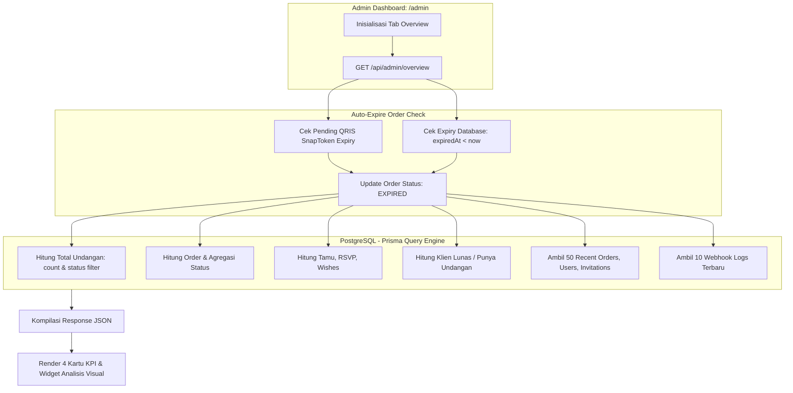

# DOKUMENTASI RESMI: DASHBOARD OVERVIEW & STATISTIK ADMIN
**Luxenary Invite Platform — Pemantauan Metrik Bisnis, Distribusi Paket, & Aktivitas Terkini**

Dokumen ini membedah arsitektur teknis dan fungsi visual modul **Overview & Analytics** pada panel administrator (`/admin` tab Overview), pusat komando untuk memantau performa operasional, keuangan, dan aktivitas platform secara menyeluruh.

---

## 1. Arsitektur Aggregator Data Overview

Data statistik pada tab Overview dikompilasi secara terpusat melalui API Route `GET /api/admin/overview`:

---

## 2. Metrik Utama (Key Performance Indicators)

Panel Overview menyajikan 4 kartu ringkasan KPI bisnis utama:

1. **Pendapatan Bersih (PAID):**
   - Menghitung total nominal rupiah dari seluruh transaksi berstatus `PAID`.
   - Menampilkan jumlah transaksi berhasil dan persentase konversi (*conversion rate*) dari total transaksi yang tercipta.
2. **Menunggu Pembayaran (PENDING):**
   - Menghitung akumulasi nominal tagihan dari invoice berstatus `PENDING`.
   - Menampilkan jumlah invoice checkout aktif yang sedang menunggu penyelesaian pembayaran oleh calon pengantin.
3. **Undangan Mempelai (Invitation Projects):**
   - Menampilkan total seluruh proyek undangan yang dibuat di sistem.
   - Menampilkan pemisahan status: jumlah undangan **Online Aktif** (`PUBLISHED`) dan jumlah undangan yang masih dalam tahap **Draf** (`DRAFT`).
4. **Tamu & Interaksi (Guest Engagement):**
   - Menampilkan total tamu yang diinputkan oleh seluruh klien.
   - Menampilkan rincian konfirmasi RSVP serta total akun klien resmi yang sudah memiliki pesanan lunas atau undangan aktif.

---

## 3. Visualisasi Analisis Distribusi & Ranking Tema

Tab Overview menyajikan 2 modul analitik bisnis:

1. **Distribusi Penjualan per Kategori Paket:**
   - Memetakan perolehan omset dan volume pesanan lunas ke dalam 3 tier paket:
     - `Traditional` (Tema Standar / Adat)
     - `Modern` (Tema Kontemporer / Editorial)
     - `Premium` (Tema Haute Couture / Split Desktop)
   - Disajikan dengan bilah persentase proporsi (*progress bar*) dinamis berdasarkan kontribusi terhadap total volume penjualan lunas.
2. **Popularitas Tema Pilihan Mempelai:**
   - Menghitung frekuensi tema yang dipilih oleh seluruh pasangan pengantin di sistem.
   - Menyajikan ranking 4 tema teratas (*Top 4 Most Popular Themes*) lengkap dengan kategori seri, jumlah undangan, dan persentase pangsa pasar tema tersebut.

---

## 4. Feed Aktivitas Real-time & Pintasan Sistem

Panel Overview menyajikan 2 feed aktivitas mutakhir untuk pengawasan instan:

1. **Undangan Mempelai Terkini:**
   - Menampilkan 5 proyek undangan terbaru lengkap dengan nama panggilan mempelai, slug URL, ID tema aktif, status publikasi, dan tombol pratinjau langsung ke halaman undangan.
2. **Aktivitas Transaksi Pembayaran Terkini:**
   - Menampilkan 5 transaksi mutakhir lengkap dengan kode unik invoice, identitas nama/email klien pemesan, nominal pembayaran (Rupiah), dan badge status transaksi (`PAID`, `PENDING`, `FAILED`, `EXPIRED`).
3. **Pintasan Cepat Operasional (Quick Shortcuts):**
   - **Database & Snapshot:** Menampilkan jumlah file snapshot database yang tersimpan di server dengan tombol langsung ke tab Database.
   - **Monitoring Webhook:** Menampilkan jumlah webhook log gateway yang tercatat dengan tautan langsung ke tab Monitoring.
   - **Koleksi Desain Tema:** Menampilkan jumlah tema aktif siap pakai dengan tombol kelola katalog.

---

## 5. Batasan Teknis Faktual & Rencana Pengembangan

1. **Limitasi Query (`take: 50`):**
   - Endpoint `GET /api/admin/overview` mengambil maksimal 50 transaksi, 50 klien, dan 50 undangan terbaru untuk menjaga performa rendering dashboard.
   - *Roadmap*: Diperlukan implementasi endpoint paginasi dan pencarian server-side terdedikasi (`/api/admin/orders`, `/api/admin/users`, `/api/admin/invitations`) agar data historis di atas 50 item dapat dicari dan difilter secara komprehensif.
2. **Filter Rentang Waktu Omset:**
   - Saat ini omset dihitung kumulatif dari seluruh transaksi lunas di memori.
   - *Roadmap*: Penambahan date range picker (Hari Ini, Minggu Ini, Bulan Ini, Kustom) dan grafik kurva deret waktu (*time-series chart*).
