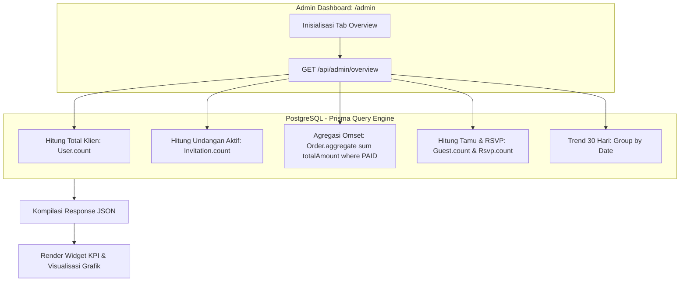

# DOKUMENTASI RESMI: DASHBOARD OVERVIEW & STATISTIK ADMIN
**Luxenary Invite Platform — Pemantauan Metrik Bisnis, Pertumbuhan Klien, & Analisis Omset**

Dokumen ini membedah arsitektur teknis dan fungsi visual modul **Overview & Analytics** pada panel administrator (`/admin` tab Overview), pusat komando untuk memantau performa operasional, keuangan, dan kesehatan platform secara menyeluruh.

---

## 1. Arsitektur Aggregator Data Overview

Data statistik pada tab Overview dikompilasi secara real-time melalui Server Component & API Route terpusat:

---

## 2. Metrik Utama (Key Performance Indicators)

Panel Overview menyajikan 6 kartu ringkasan KPI bisnis utama:

1. **Total Klien Terdaftar (Registered Clients):**
   Jumlah akun calon pengantin yang terdaftar di platform (baik melalui registrasi email manual maupun Google OAuth).
2. **Total Undangan Aktif (Active Invitations):**
   Jumlah undangan digital yang berstatus `PUBLISHED` dan sedang dalam masa aktif (tidak berstatus draft atau kadaluarsa).
3. **Total Omset Bruto (Gross Revenue / GMV):**
   Akumulasi nominal rupiah dari seluruh transaksi pesanan paket, add-on perpanjangan galeri, dan pembelian custom domain yang telah berhasil (`PAID`).
4. **Transaksi Sukses (Paid Orders):**
   Total lembar invoice yang telah terlunasi secara otomatis via payment gateway maupun melalui persetujuan manual administrator.
5. **Total Tamu Terdata (Total Managed Guests):**
   Akumulasi seluruh tamu yang diinputkan oleh seluruh klien ke dalam buku tamu digital platform.
6. **Total Konfirmasi RSVP (Total RSVP Responses):**
   Tingkat partisipasi tamu undangan dalam mengisi kehadiran melalui platform.

---

## 3. Visualisasi Grafik & Tren Pertumbuhan

1. **Grafik Pertumbuhan Pendapatan (Revenue Chart):**
   - Menampilkan kurva pendapatan harian dalam rentang 30 hari terakhir.
   - Berguna untuk mengidentifikasi lonjakan transaksi pada musim pernikahan (*wedding season*).
2. **Grafik Registrasi Klien Baru:**
   - Membandingkan rasio pendaftaran pengguna baru terhadap konversi menjadi pesanan berbayar (*conversion rate*).
3. **Distribusi Pemilihan Paket:**
   - Diagram proporsi penjualan paket layanan: `TRADITIONAL`, `MODERN`, vs `PREMIUM`.

---

## 4. Log Aktivitas Terbaru & Health Status Server

Di bagian bawah panel Overview, disediakan feed aktivitas real-time yang mencatat peristiwa penting:
- Notifikasi pembayaran baru yang berhasil diverifikasi.
- Undangan baru yang dipublikasikan oleh klien.
- Registrasi domain kustom baru yang memerlukan propagasi DNS.
- Indikator latensi database PostgreSQL dan ketersediaan Cloudflare R2 storage.
