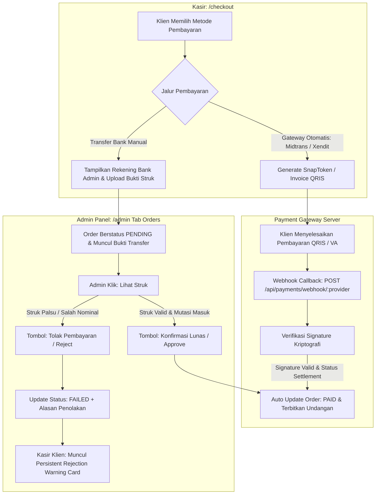

# DOKUMENTASI RESMI: MANAJEMEN TRANSAKSI & PAYMENT GATEWAY
**Luxenary Invite Platform — Pemantauan Invoice, Rekonsiliasi Transfer Manual, & Konfigurasi Multi-Gateway**

Dokumen ini membedah arsitektur pemrosesan transaksi keuangan, alur rekonsiliasi manual, serta tata kelola kredensial payment gateway pada panel administrator (`/admin` tab Orders & Settings).

---

## 1. Arsitektur Pemrosesan Transaksi Keuangan

Platform mendukung dua jalur transaksi terintegrasi: pembayaran otomatis (melalui Payment Gateway) dan pembayaran konfirmasi manual (transfer rekening bank langsung ke admin):

---

## 2. Modul Pemantauan Order (`Tab: orders`)

Menampilkan catatan seluruh lembar penagihan (*invoice*) yang tercipta di sistem dengan 4 sub-tab filter:

### Sub-Tab Navigasi:
1. **Menunggu Pembayaran (`PENDING`):** Memantau pesanan yang sedang menunggu pembayaran klien atau menunggu verifikasi bukti transfer.
2. **Sukses / Lunas (`PAID`):** Menampilkan seluruh invoice yang telah lunas.
3. **Gagal / Dibatalkan (`FAILED`):** Menampilkan transaksi yang gagal, ditolak admin, atau kadaluarsa (`EXPIRED`) lengkap dengan badge penolakan dan alasan penolakan pada kolom aksi.
4. **Semua Transaksi (`SEMUA`):** Rekapitulasi menyeluruh seluruh transaksi tanpa filter status.

### Kolom Data pada Tabel Transaksi:
- **Invoice:** Nomor faktur unik sistem (contoh: `INV-20260904-XXXX`).
- **Klien:** Nama akun dan email klien pemesan.
- **Paket:** Tier paket yang dibeli (`TRADITIONAL`, `MODERN`, `PREMIUM`) atau add-on.
- **Metode:** Indikator badge metode pembayaran:
  - `Transfer Bank` (Manual Transfer)
  - `QRIS / Otomatis` (Midtrans / Xendit)
  - `Belum Dipilih` (Checkout belum memilih metode)
- **Jumlah:** Total tagihan nominal rupiah resmi.
- **Bukti Transfer:** Tombol interaktif **"Lihat Struk"** untuk memeriksa foto slip transfer yang diunggah klien.
- **Status:** Status kontekstual realtime (`Menunggu Bukti`, `Menunggu Verifikasi`, `Menunggu Pembayaran`, `Lunas`, `Ditolak / Expired`).
- **Tanggal:** Timestamp waktu pembuatan pesanan.
- **Aksi:** Tombol verifikasi manual persetujuan atau penolakan transaksi.

### Prosedur Verifikasi Transfer Manual (Manual Approval & Rejection):
1. **Persetujuan (Approve):**
   - Admin menekan tombol *"Konfirmasi Lunas"* di modal struk.
   - Status order berubah menjadi `PAID`, timestamp `paidAt` tercatat.
   - Hak akses paket aktif seketika dan proyek undangan langsung dipublikasikan (`PUBLISHED`).
2. **Penolakan (Reject):**
   - Admin menekan tombol *"Tolak"* dan memasukkan alasan penolakan secara spesifik (misal: *Nominal tidak sesuai* atau *Mutasi belum masuk*).
   - Status invoice berubah menjadi `FAILED`, alasan penolakan tersimpan di kolom `rejectReason`.
   - Di halaman kasir klien, sistem memunculkan kartu peringatan permanen (*Persistent Rejection Warning Card*) yang memandu klien untuk mengunggah ulang bukti yang valid.

---

## 3. Konfigurasi Payment Gateway (`Tab: settings` -> Subtab `Gateway QRIS` & `Pembayaran`)

Sistem mengadopsi pergantian gateway instan 1-klik (*Hot-Switching*) langsung dari database `AdminSetting`:

### Provider Gateway yang Didukung:
1. **Midtrans:**
   - Mendukung integrasi Midtrans Snap API (QRIS GoPay, ShopeePay, Virtual Account Bank).
   - Parameter: `midtrans_server_key` dan `midtrans_client_key`.
2. **Xendit:**
   - Mendukung integrasi Xendit Invoice & QRIS.
   - Parameter: `xendit_api_key` dan `xendit_webhook_token`.
3. **Transfer Bank Manual:**
   - Pengaturan rekening penerima: Nama Bank, Nomor Rekening, Nama Pemilik Rekening, dan Catatan Instruksi Pembayaran.

### Pengaturan Mode Pembayaran Global (`payment_mode`):
- `both`: Mengaktifkan pembayaran QRIS otomatis dan transfer bank manual secara bersamaan.
- `gateway`: Hanya mengizinkan pembayaran otomatis via gateway.
- `manual`: Hanya mengizinkan pembayaran transfer bank manual ke rekening admin.

### Gateway Aktif (`active_payment_gateway`):
- Pilihan radio button: `midtrans` atau `xendit`.
- Pergantian vendor berlangsung instan pada sesi checkout klien tanpa perlu restart server.

---

## 4. Batasan Teknis Faktual & Roadmap Pengembangan

1. **Volume Data Terbatas (`take: 50`):**
   - Daftar pesanan saat ini dimuat dari query agregasi overview dengan batasan 50 transaksi mutakhir.
   - *Roadmap*: Pembuatan endpoint terpisah `GET /api/admin/orders` dengan pagination server-side, search berdasarkan nomor invoice/nama klien, dan filter rentang tanggal.
2. **Ekspor Laporan Finansial:**
   - *Roadmap*: Penambahan tombol *"Ekspor CSV/Excel"* untuk mempermudah audit akuntansi dan rekonsiliasi kas admin.
3. **Cetak Invoice PDF:**
   - *Roadmap*: Pembuatan template cetak invoice resmi berformat PDF.
