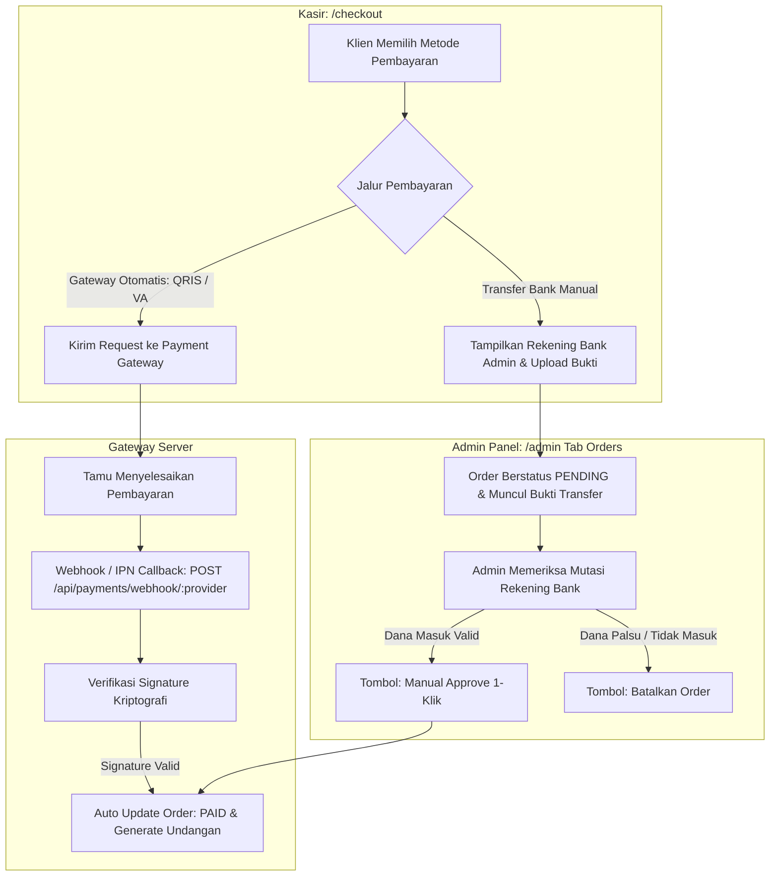

# DOKUMENTASI RESMI: MANAJEMEN TRANSAKSI & PAYMENT GATEWAY
**Luxenary Invite Platform — Pemantauan Invoice, Konfirmasi Manual, & Konfigurasi Multi-Gateway**

Dokumen ini membedah arsitektur pemrosesan transaksi keuangan, alur rekonsiliasi manual, serta tata kelola kredensial multi-payment gateway pada panel administrator (`/admin` tab Orders & Settings).

---

## 1. Arsitektur Pemrosesan Transaksi Keuangan

Platform mendukung transaksi otomatis (via payment gateway) dan transaksi konfirmasi manual (transfer langsung ke rekening admin):

---

## 2. Modul Pemantauan Order (`Tab: orders`)

Menampilkan catatan seluruh lembar penagihan (invoice) yang tercipta di sistem:

### Informasi pada Tabel Transaksi:
- **Nomor Invoice:** Kode unik penagihan (contoh: `INV-20260904-XXXX`).
- **Klien Pemesan:** Nama akun dan alamat email pembeli.
- **Item Pembelian:** Paket Utama (`TRADITIONAL`, `MODERN`, `PREMIUM`), Add-on Perpanjangan Galeri, atau Domain Kustom.
- **Nominal Transaksi:** Total tagihan termasuk kode unik jika menggunakan transfer manual.
- **Kanal Pembayaran:** Provider gateway yang digunakan (iPaymu, Midtrans, Duitku, TriPay, Xendit, atau Manual Transfer).
- **Status Invoice:**
  - `PENDING`: Menunggu pembayaran klien.
  - `PAID`: Pembayaran berhasil diverifikasi; lisensi/fitur aktif seketika.
  - `EXPIRED`: Batas waktu pembayaran habis (otomatis 24 jam).
  - `CANCELLED`: Dibatalkan oleh klien atau ditolak oleh admin.

### Fitur Persetujuan Pembayaran Manual (Manual Approval):
1. Jika klien memilih transfer bank manual dan mengunggah slip bukti transfer, muncul tombol aksi **"Lihat Bukti & Approve"**.
2. Modal pratinjau menampilkan gambar struk transfer, bank asal, dan nominal transfer.
3. Saat admin menekan tombol **"Setujui Pembayaran (Approve)"**:
   - Status invoice langsung berganti menjadi `PAID`.
   - Sistem secara otomatis memicu generator undangan atau meningkatkan hak akses akun klien.
   - Klien menerima notifikasi email / WhatsApp bahwa pesanan telah aktif dan siap digunakan.

---

## 3. Konfigurasi Multi-Payment Gateway (`Tab: settings`)

Platform dilengkapi mesin *Payment Gateway Switcher* modular yang memungkinkan pemilik bisnis berganti provider pembayaran tanpa mengubah kode aplikasi:

### Provider yang Didukung:
1. **iPaymu:** QRIS instan, Virtual Account, & gerai minimarket.
2. **Midtrans:** Snap API (GoPay, ShopeePay, VA BCA, Mandiri Bill).
3. **Duitku:** Solusi payment gateway lokal dengan biaya rendah.
4. **TriPay:** Virtual Account dan gerai Alfamart/Indomaret.
5. **Xendit:** Transfer bank internasional, e-wallet, dan kartu kredit.

### Tata Kelola Parameter Kredensial:
Admin dapat mengatur nilai berikut langsung dari UI admin:
- **Environment Mode:** Toggle antara `SANDBOX` (Uji coba tanpa uang sungguhan) dan `PRODUCTION` (Live transaksi riil).
- **Kredensial Gateway:**
  - `Merchant ID` / `Client Key`
  - `API Key` / `Secret Key`
  - `Callback / Webhook Verification Token`
- **Pengaturan Rekening Manual Admin:**
  - Nama Bank (BCA, Mandiri, BRI, BNI, BSI).
  - Nomor Rekening Resmi.
  - Nama Pemilik Rekening (Atas Nama).
