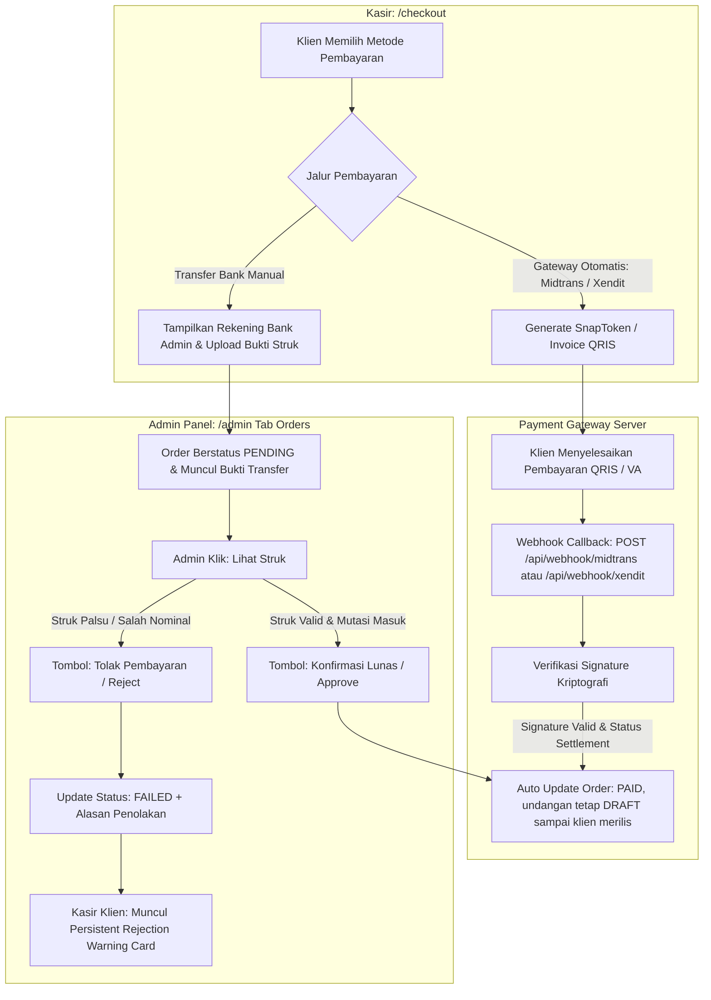

# DOKUMENTASI RESMI: MANAJEMEN TRANSAKSI & PAYMENT GATEWAY
**Luxenary Invite Platform — Pemantauan Invoice, Rekonsiliasi Transfer Manual, & Konfigurasi Multi-Gateway**

Dokumen ini membedah arsitektur pemrosesan transaksi keuangan, alur rekonsiliasi manual, serta tata kelola kredensial payment gateway pada panel administrator (`/admin` tab Orders & Settings).

---

## 1. Arsitektur Pemrosesan Transaksi Keuangan

Platform mendukung dua jalur transaksi terintegrasi: pembayaran otomatis (melalui Payment Gateway) dan pembayaran konfirmasi manual (transfer rekening bank langsung ke admin):

```mermaid
flowchart TD
    subgraph KasirCheckout [Kasir: /checkout]
        A[Klien Memilih Metode Pembayaran] --> B{Jalur Pembayaran}
        B -->|Gateway Otomatis: Midtrans / Xendit| C[Generate SnapToken / Invoice QRIS]
        B -->|Transfer Bank Manual| D[Tampilkan Rekening Bank Admin & Upload Bukti Struk]
    end
    
    subgraph GatewayOtomatis [Payment Gateway Server]
        C --> E[Klien Menyelesaikan Pembayaran QRIS / VA]
        E --> F[Webhook Callback: POST /api/webhook/midtrans atau /api/webhook/xendit]
        F --> G[Verifikasi Signature Kriptografi]
        G -->|Signature Valid & Status Settlement| H[Auto Update Order: PAID, undangan tetap DRAFT sampai klien merilis]
    end
    
    subgraph AdminConsole [Admin Panel: /admin Tab Orders]
        D --> I[Order Berstatus PENDING & Muncul Bukti Transfer]
        I --> J[Admin Klik: Lihat Struk]
        J -->|Struk Valid & Mutasi Masuk| K[Tombol: Konfirmasi Lunas / Approve]
        K --> H
        J -->|Struk Palsu / Salah Nominal| L[Tombol: Tolak Pembayaran / Reject]
        L --> M[Update Status: FAILED + Alasan Penolakan]
        M --> N[Kasir Klien: Muncul Persistent Rejection Warning Card]
    end
```

---

## 2. Modul Pemantauan Order (`Tab: orders`)

Menampilkan catatan seluruh lembar penagihan (*invoice*) yang tercipta di sistem dengan 4 sub-tab filter:

### Sub-Tab Navigasi:
1. **Menunggu Pembayaran (`PENDING`):** Memantau pesanan yang sedang menunggu pembayaran klien atau menunggu verifikasi bukti transfer.
2. **Sukses / Lunas (`PAID`):** Menampilkan seluruh invoice yang telah lunas.
3. **Gagal / Dibatalkan (`FAILED`):** Menampilkan transaksi yang gagal, ditolak admin, atau kadaluarsa (`EXPIRED`) lengkap dengan badge penolakan dan alasan penolakan pada kolom aksi.
4. **Semua Transaksi (`SEMUA`):** Rekapitulasi menyeluruh seluruh transaksi tanpa filter status.

### Kolom Data pada Tabel Transaksi:
- **Invoice:** Nomor faktur unik sistem (contoh: `INV-20260904-XXXX`).
- **Klien:** Nama akun dan email klien pemesan.
- **Paket:** Tier paket yang dibeli (`TIER_1`, `TIER_2`, `TIER_3`) atau add-on.
- **Metode:** Indikator badge metode pembayaran:
  - `Transfer Bank` (Manual Transfer)
  - `QRIS / Otomatis` (Midtrans / Xendit)
  - `Belum Dipilih` (Checkout belum memilih metode)
- **Jumlah:** Total tagihan nominal rupiah resmi.
- **Bukti Transfer:** Tombol interaktif **"Lihat Struk"** untuk memeriksa foto slip transfer yang diunggah klien.
- **Status:** Status kontekstual realtime (`Menunggu Bukti`, `Menunggu Verifikasi`, `Menunggu Pembayaran`, `Lunas`, `Ditolak / Expired`).
- **Tanggal:** Timestamp waktu pembuatan pesanan.
- **Aksi:** Tombol verifikasi manual persetujuan atau penolakan transaksi.

### Prosedur Verifikasi Transfer Manual (Manual Approval & Rejection):
1. **Persetujuan (Approve):**
   - Admin menekan tombol *"Konfirmasi Lunas"* di modal struk.
   - Status order berubah menjadi `PAID`, timestamp `paidAt` tercatat.
   - Hak akses paket aktif seketika. Persetujuan hanya menandai order `PAID` (beserta konsumsi kode promo dan komisi mitra dalam satu transaksi); undangan tidak dipublikasikan otomatis. Status `PUBLISHED` hanya diberikan saat klien menekan "Rilis Undangan Resmi" di halaman pengaturan dasbornya.
   - Persetujuan hanya berlaku untuk order `PENDING` yang sudah memiliki bukti transfer; order lain dijawab HTTP 400, dan persetujuan ganda bersamaan dijawab HTTP 409 (satu pemenang).
2. **Penolakan (Reject):**
   - Admin menekan tombol *"Tolak"* dan memasukkan alasan penolakan secara spesifik (misal: *Nominal tidak sesuai* atau *Mutasi belum masuk*).
   - Status invoice berubah menjadi `FAILED`, alasan penolakan tersimpan di kolom `rejectReason`.
   - Di halaman kasir klien, sistem memunculkan kartu peringatan permanen (*Persistent Rejection Warning Card*) yang memandu klien untuk mengunggah ulang bukti yang valid.

---

## 3. Konfigurasi Payment Gateway (`Tab: settings` -> Subtab `Gateway QRIS` & `Pembayaran`)

Sistem mengadopsi pergantian gateway instan 1-klik (*Hot-Switching*) langsung dari database `AdminSetting`:

### Provider Gateway yang Didukung:
1. **Midtrans:**
   - Mendukung integrasi Midtrans Snap API (QRIS GoPay, ShopeePay, Virtual Account Bank).
   - Parameter: `midtrans_server_key` dan `midtrans_client_key`.
2. **Xendit:**
   - Mendukung integrasi Xendit Invoice & QRIS.
   - Parameter: `xendit_api_key` dan `xendit_webhook_token`.
3. **Transfer Bank Manual:**
   - Pengaturan rekening penerima: Nama Bank, Nomor Rekening, Nama Pemilik Rekening, dan Catatan Instruksi Pembayaran.

### Pengaturan Mode Pembayaran Global (`payment_mode`):
- `GATEWAY` (nilai bawaan seed): Pembayaran otomatis via gateway (Midtrans / Xendit). Konfirmasi lunas masuk lewat webhook dua arah, dan route status order juga merekonsiliasi lewat `verify` gateway.
- `MANUAL`: Pembayaran transfer bank manual ke rekening admin. Klien mengunggah bukti, lalu admin menyetujui atau menolak lewat `/api/admin/orders/{orderId}/approve` atau `reject`; tidak ada konfirmasi otomatis.
- **Durasi tagihan gateway:** `payment_expiry_minutes` (5 sampai 1440 menit) dikirim ke gateway sebagai masa berlaku QR dan menjadi umur order. Saat habis, webhook `expire` dari gateway menjadikan order `EXPIRED` dan klien membuat order baru dari halaman paket. Webhook `cancel`/`expire`/`deny` dari transaksi yang bukan sesi aktif (misalnya transaksi lama yang dibatalkan aplikasi saat klien mengubah kupon) diabaikan dan dicatat `stale_session` di `webhook_logs`.
- **Alamat notifikasi:** isi di dashboard Midtrans (sandbox dan produksi terpisah) dengan `https://<domain>/api/webhook/midtrans`; Xendit memakai `/api/webhook/xendit` dengan `x-callback-token`. Webhook tidak bisa menjangkau `localhost`; di dev, pelunasan tetap terdeteksi saat halaman memuat ulang status order (rekonsiliasi `verify`).
- Hanya dua mode ini yang berlaku (nilai lama `BOTH` sudah dihapus; kode selalu memperlakukannya sebagai `GATEWAY`). Penegakan di server: `POST /api/payments/checkout` menolak (409) bila mode `MANUAL` atau order sudah memakai transfer manual, dan `POST /api/client/orders/{id}/upload-proof` menolak (409) bila mode `GATEWAY` dan order bukan transfer manual.
- Nilai ditulis huruf besar. Pengaturan `payment_gateway_mode` ikut ditanam oleh seed tetapi tidak dibaca kode mana pun; yang berlaku adalah `payment_mode` dan `active_payment_gateway`.
- **Status Gateway Dinamis:** Indikator status gateway pada dashboard dan kartu pengaturan bersifat 100% dinamis mengikuti nilai `payment_mode` dan kredensial aktif dari basis data, tanpa hardcode statis label status.

### Gateway Aktif (`active_payment_gateway`):
- Pilihan: `midtrans` atau `xendit`.
- Pergantian vendor berlangsung instan pada sesi checkout klien tanpa perlu restart server.

---

## 4. Batasan Teknis Faktual & Roadmap Pengembangan

1. **Daftar Pesanan (sudah berpaginasi):**
   - Tab Orders memakai `GET /api/admin/orders` dengan parameter `page`, `limit` (bawaan 20, maksimum 100), `search` (nomor invoice, nama, email, telepon), `status`, `startDate`/`endDate`, dan `export=csv`. Semua menuntut sesi admin (tanpa sesi: HTTP 401, diuji).
   - Query agregasi overview (`GET /api/admin/overview`) masih memakai `take: 50` untuk ringkasan dasbor.
2. **Ekspor Laporan Finansial:**
   - Ekspor CSV sudah tersedia (tombol "Ekspor CSV" di tab Orders, `export=csv`). Ekspor Excel belum ada.
3. **Cetak Invoice PDF:**
   - *Roadmap*: Pembuatan template cetak invoice resmi berformat PDF.
