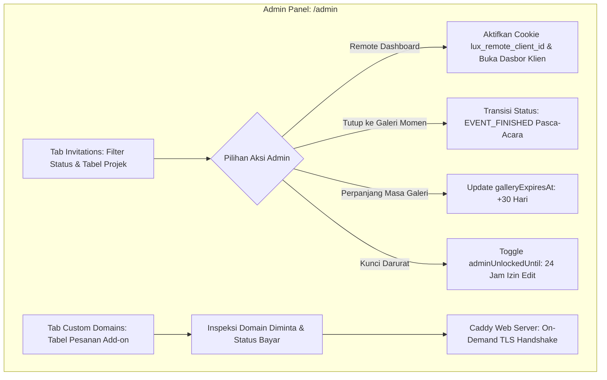

# DOKUMENTASI RESMI: MANAJEMEN UNDANGAN & CUSTOM DOMAIN ADMIN
**Luxenary Invite Platform — Tata Kelola Undangan Klien, Status Siklus Hidup, & Integrasi Domain Kustom**

Dokumen ini membedah arsitektur dan SOP administratif untuk mengelola seluruh proyek undangan pernikahan klien dan pemantauan domain kustom pada panel administrator (`/admin` tab Invitations & Custom Domains).

---

## 1. Arsitektur Siklus Hidup Undangan & Domain

---

## 2. Modul Manajemen Undangan (`Tab: invitations`)

Tab ini memantau seluruh proyek undangan digital calon pengantin yang terdaftar di platform:

### 5 Filter Status Projek (Quick Filter Tabs):
1. **Semua:** Menampilkan total seluruh proyek undangan.
2. **Draft:** Undangan dalam tahap perancangan awal oleh klien (belum diterbitkan).
3. **Undangan Tayang (`PUBLISHED`):** Undangan aktif yang sedang tayang pada masa pra-acara dan hari H pernikahan.
4. **Galeri Momen Tamu (`EVENT_FINISHED`):** Undangan pasca-acara yang bertransformasi menjadi portal galeri foto dan video kenangan tamu (`/memories`).
5. **Selesai / Arsip (`ARCHIVED` / `TAKEN_DOWN`):** Undangan yang masa tayangnya telah selesai dan dialihkan ke portofolio atau dinonaktifkan.

### Kolom Data pada Tabel Undangan:
- **Klien & Pasangan:** Nama panggilan mempelai (First & Second Nickname), nama pemilik akun, dan email terdaftar.
- **Domain & Tema:** Tautan subdomain aktif (`subdomain.rootdomain`) atau indikator `[URL Belum Setup]`, disertai nama tema fisik yang dipilih.
- **Status Projek:** Indikator dot warna minimalis bebas emoji (kuning untuk Draft, hijau pulse untuk Tayang, ungu untuk Galeri Momen, abu-abu untuk Arsip) dan status proteksi kunci darurat jika aktif.
- **Masa Tayang & Expired:** Informasi tanggal acara utama akad/resepsi dan batas waktu retensi galeri tamu.
- **Aksi Administratif:**
  1. **Remote Dashboard (Impersonate):** Masuk langsung ke ruang kerja klien tanpa meminta password (menggunakan *Session Override Cookie*).
  2. **Tutup ke Galeri Momen:** Menutup masa sebar undangan dan mengalihkan status ke `EVENT_FINISHED` agar tamu fokus mengunggah foto momen.
  3. **Perpanjang Masa Galeri (+30 Hari):** Menambahkan durasi retensi media foto kenangan tamu pada kolom `galleryExpiresAt`.
  4. **Buka Kunci Darurat (Emergency Unlock 24 Jam):** Memberikan izin edit darurat selama 24 jam (`adminUnlockedUntil`) bagi undangan yang sudah terbit tanpa perlu membatalkan status tayang.

---

## 3. Modul Custom Domain (`Tab: custom_domains`)

Memfasilitasi pemantauan pesanan layanan add-on domain pribadi klien (contoh: `andi-siti.com`):

### Kolom Pemantauan Pesanan Domain:
- **Klien:** Nama dan email klien pemesan add-on custom domain.
- **Undangan (Asli):** URL canonical subdomain undangan asal.
- **Domain Diminta:** Nama domain pribadi yang diinginkan klien lengkap dengan tombol 1-klik salin (*Copy Domain*).
- **Pembayaran:** Status transaksi invoice add-on (`PAID` atau `PENDING`).
- **Status Terhubung:** Mengevaluasi apakah kolom `customDomain` pada undangan sudah identik dengan `requestedDomain` (`Terhubung` vs `Belum Terhubung`).
- **Aksi (Admin):** Status instruksi pemrosesan DNS dan aktivasi.

### Arsitektur Otomatisasi Caddy On-Demand TLS:
Platform mengandalkan web server **Caddy** pada lingkungan produksi VPS:
1. Klien mengatur DNS record domain mereka:
   - **Record A** mengarah ke IP Publik VPS (`server_public_ip`).
   - **CNAME** `www` mengarah ke host target (`cname_target`).
2. Saat domain klien diakses untuk pertama kali, Caddy memanggil webhook verifikasi internal:
   `GET /api/public/resolve-custom-domain?domain=[domain_klien]`
3. Jika domain terdaftar aktif di database pada proyek undangan, API merespon HTTP `200 OK`.
4. Caddy secara otomatis menerbitkan dan memperbarui sertifikat HTTPS Let's Encrypt / ZeroSSL tanpa perlu konfigurasi Nginx manual atau reload web server.

---

## 4. Batasan Teknis Faktual & Roadmap Pengembangan

1. **Volume Data Overview (`take: 50`):**
   - Tabel undangan saat ini memuat maksimal 50 projek mutakhir dari API overview.
   - *Roadmap*: Implementasi paginasi server-side dan search bar (mencari berdasarkan nama mempelai, subdomain, atau slug).
2. **Pengecekan DNS Resolver Otomatis:**
   - *Roadmap*: Menambahkan tombol *"Verifikasi DNS"* berbasis `dns.resolveCname` / `dns.resolve4` di tabel Custom Domain untuk menguji apakah domain klien sudah benar mengarah ke IP VPS secara instan dari UI admin.
3. **Tombol 1-Klik Hubungkan Domain:**
   - *Roadmap*: Menambahkan tombol aksi langsung untuk menyinkronkan `requestedDomain` ke `invitation.customDomain` setelah pembayaran lunas dan DNS terkonfirmasi.
