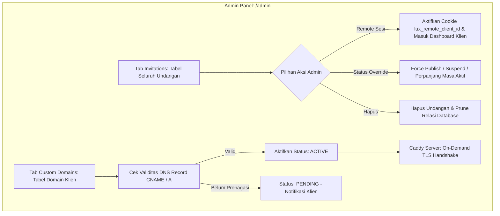

# DOKUMENTASI RESMI: MANAJEMEN UNDANGAN & CUSTOM DOMAIN ADMIN
**Luxenary Invite Platform — Tata Kelola Undangan Klien, Resolusi Subdomain, & On-Demand TLS**

Dokumen ini membedah arsitektur dan SOP administratif untuk mengelola seluruh undangan pernikahan pengguna dan konfigurasi domain kustom pada panel administrator (`/admin` tab Invitations & Custom Domains).

---

## 1. Arsitektur Tata Kelola Undangan & Domain

---

## 2. Modul Manajemen Undangan (`Tab: invitations`)

Tab ini menampilkan seluruh undangan yang dibuat di platform oleh semua pengguna, dengan kapabilitas filter dan pencarian komprehensif:

### Kolom Data pada Tabel:
- **Judul & Pasangan:** Nama mempelai (contoh: *Andi & Siti*).
- **Pemilik (Klien):** Nama akun klien dan email terdaftar.
- **Identitas URL:** Subdomain (`andi-siti`) dan Path Slug.
- **Desain Tema:** Tema fisik yang dipilih beserta palet warna aktif.
- **Tier Paket:** TRADITIONAL, MODERN, atau PREMIUM.
- **Status Publikasi:** `PUBLISHED` (Aktif tayang), `DRAFT` (Belum dipublikasikan), atau `SUSPENDED` (Dibekukan oleh admin).
- **Masa Berlaku:** Tanggal kadaluarsa undangan & penyimpanan media.

### Aksi Administratif Khusus:
1. **Remote Dashboard Klien (1-Klik Impersonasi):**
   - Admin dapat langsung melompat ke dashboard klien bersangkutan untuk membantu menyusun konten tanpa menanyakan password.
   - Menggunakan mekanisme aman *Cookie-Based Workspace Override* (lihat `REMOTE_DAN_MANAJEMEN_KLIEN.md`).
2. **Force Status Override:**
   - Mengubah status undangan menjadi `PUBLISHED` secara paksa (misal jika ada klien darurat acara segera dimulai).
   - Membekukan (`SUSPEND`) undangan yang melanggar ketentuan layanan platform.
3. **Perpanjang Masa Aktif Manual:**
   - Admin dapat menambah durasi masa aktif undangan (30 hari, 6 bulan, 1 tahun) secara manual sebagai bentuk kompensasi atau layanan VIP.
4. **Penghapusan Undangan Permanen:**
   - Menghapus record undangan beserta seluruh relasi data (Tamu, RSVP, Ucapan, Jadwal Acara) secara berurutan sesuai aturan integritas referensial Prisma.

---

## 3. Modul Custom Domain (`Tab: custom_domains`)

Memfasilitasi klien yang ingin menggunakan nama domain pribadi (contoh: `wedding-andisiti.id`):

### Alur Verifikasi DNS:
1. Klien memasukkan domain di dashboard mereka dan membuat CNAME mengarah ke host platform.
2. Admin membuka tab **Custom Domains** untuk melihat antrean domain baru.
3. Admin menekan tombol **"Verifikasi DNS"**:
   - Backend melakukan pengecekan resolver DNS (`dns.resolveCname` atau `dns.resolve4`).
   - Jika CNAME telah mengarah ke platform, status otomatis berubah menjadi **ACTIVE (Hijau)**.
   - Jika belum mengarah, muncul rincian diagnostik DNS yang dapat diinformasikan ke klien.

### Integrasi Otomatis Caddy On-Demand TLS:
Platform tidak memerlukan instalasi sertifikat SSL manual:
- Caddy memanggil endpoint internal `/api/public/resolve-custom-domain?domain=[domain_klien]` saat ada request masuk pertama kali.
- Jika database mengonfirmasi domain berstatus `ACTIVE`, endpoint merespon HTTP `200 OK`.
- Caddy seketika menerbitkan sertifikat HTTPS gratis dari Let's Encrypt / ZeroSSL secara transparan (*zero downtime*).
