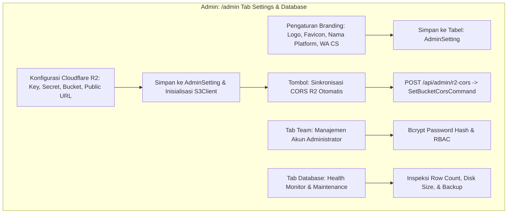

# DOKUMENTASI RESMI: PENGATURAN SISTEM, BRANDING & DATABASE ADMIN
**Luxenary Invite Platform — White-label Branding, Cloudflare R2 Storage, CORS, & Manajemen Database**

Dokumen ini membedah arsitektur pengaturan global, integrasi media storage berbasis Cloudflare R2, sinkronisasi CORS, tata kelola akun administrator, serta pemeliharaan database PostgreSQL pada panel admin (`/admin` tab Settings, Database, & Team).

---

## 1. Arsitektur Pengaturan Global & Integrasi Layanan



---

## 2. Branding & White-Label Global (`Tab: settings`)

Platform dirancang modular sehingga dapat di-rebrand secara instan tanpa perlu mengubah file kode:

### Atribut Identitas Platform:
- **Nama Platform (`platformName`):** Mengganti nama brand di seluruh header, footer, email notifikasi, dan title tag browser.
- **Tagline & Deskripsi SEO:** Menentukan metadata Open Graph default (`og:title`, `og:description`) untuk sharing link portal.
- **Logo Brand & Favicon:** Upload gambar vektor SVG atau WebP transparan untuk logo website dan ikon tab browser.
- **Nomor Kontak WhatsApp Customer Service:** Nomor pusat bantuan yang muncul di floating button dashboard klien dan kasir checkout.
- **Halaman Legal:** Editor teks untuk Kebijakan Privasi (*Privacy Policy*), Syarat & Ketentuan (*Terms of Service*), dan Kebijakan Pengembalian Dana (*Refund Policy*).

---

## 3. Integrasi Cloudflare R2 Media Storage & Auto CORS

Seluruh media berat (foto prewedding, video teaser, berkas audio MP3, struk transfer, avatar) dialihkan ke **Cloudflare R2 Object Storage** yang kompatibel dengan protokol AWS S3:

### Kredensial R2 yang Dikonfigurasi:
- `R2_ACCOUNT_ID` — ID akun Cloudflare pemilik bucket.
- `R2_ACCESS_KEY_ID` — Kunci akses S3 API R2.
- `R2_SECRET_ACCESS_KEY` — Kunci rahasia S3 API R2.
- `R2_BUCKET_NAME` — Nama bucket penyimpanan (contoh: `luxenary-media`).
- `R2_PUBLIC_URL` — Domain publik atau Cloudflare Custom Domain untuk akses cepat CDN (contoh: `https://pub-r2.luxenary.com`).

### Mekanisme Sinkronisasi CORS Otomatis (`/api/admin/r2-cors`):
Browser memblokir upload langsung (*direct client-to-storage upload*) jika header CORS bucket belum diizinkan. Administrator cukup menekan tombol **"Sinkronisasi CORS R2"**:
- Endpoint server mengeksekusi perintah `SetBucketCorsCommand` melalui `@aws-sdk/client-s3`.
- Mengizinkan HTTP Method: `GET`, `PUT`, `POST`, `HEAD`, `DELETE`.
- Mengizinkan Origin: `*` (atau domain spesifik platform).
- Mengizinkan Header: `*` dengan `MaxAgeSeconds: 3600`.
- Hasil: Klien dapat mengunggah file foto/video berukuran besar langsung ke R2 tanpa membebani memori server Next.js.

---

## 4. Tata Kelola Akun Administrator (`Tab: team`)

Mengatur akses keamanan internal pengelola sistem:
- **Daftar Akun Admin:** Menampilkan username, role akses, dan tanggal pembuatan akun.
- **Tambah Admin Baru:** Form pembuatan akun dengan enkripsi password menggunakan algoritma `bcryptjs` (salt rounds: 10).
- **Reset Password Admin:** Kemampuan memperbarui kata sandi admin yang lupa atau kadaluarsa.
- **Proteksi Akun Root:** Sistem melarang penghapusan terhadap akun Super Admin utama untuk mencegah penguncian sistem (*lockout*).

---

## 5. Pemeliharaan & Monitoring Database (`Tab: database`)

Menyediakan visibilitas operasional terhadap database PostgreSQL:
- **Tabel Metrik Baris (Row Count Monitor):**
  Memantau pertumbuhan data pada masing-masing tabel: `User`, `Invitation`, `Guest`, `Order`, `Rsvp`, `Wish`, `Theme`, `AdminSetting`.
- **Ukuran Disk Database:**
  Menampilkan total konsumsi ruang penyimpanan pada database server.
- **Prosedur Backup Mandiri:**
  Panduan dump berkala menggunakan perintah:
  ```bash
  pg_dump -U postgres -d luxenary_db -F c -b -v -f /backup/luxenary_$(date +%Y%m%d).dump
  ```
- **Prosedur Restore:**
  ```bash
  pg_restore -U postgres -d luxenary_db -v /backup/luxenary_20260904.dump
  ```

---

## 6. Manajemen Harga Paket & Layanan Tambahan (Add-Ons) (`Tab: Paket & Harga`)

Mengatur struktur biaya dinamis platform yang langsung tersinkronisasi dua arah ke dashboard klien:
- **Paket Undangan Utama:** Traditional, Modern, Premium.
- **Layanan Tambahan (Add-Ons) & Perpanjangan:**
  1. **Jasa Custom Domain & Perpanjangan URL Undangan (1 Tahun) (`addon_custom_domain_price`):**
     - Mengatur tarif jasa integrasi domain pribadi milik klien (DNS & auto SSL Caddy) serta perpanjangan masa aktif penayangan hosting/URL undangan selama 1 tahun penuh.
     - Terhubung langsung secara real-time ke halaman Pengaturan Klien tanpa ada selisih angka.
  2. **Perpanjangan Galeri Kenangan Tamu (Bulanan) (`gallery_extension_price_per_month`):**
     - Nominal tagihan QRIS dinamis per 30 hari untuk mempertahankan file foto tamu di server Cloudflare R2 setelah masa aktif standar habis.
  3. **Add-on Bundling (Custom Domain + Galeri 1 Tahun) (`addon_subdomain_gallery_bundle_price`):**
     - Paket bundling lengkap: integrasi domain kustom + galeri kenangan tamu selama 1 tahun penuh.
