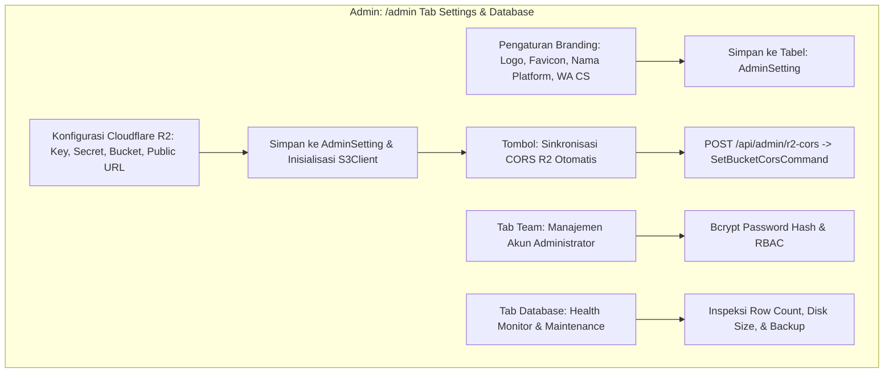

# DOKUMENTASI RESMI: PENGATURAN SISTEM, BRANDING & DATABASE ADMIN
**Luxenary Invite Platform — White-label Branding, Cloudflare R2 Storage, CORS, & Manajemen Database**

Dokumen ini membedah arsitektur pengaturan global, integrasi media storage berbasis Cloudflare R2, sinkronisasi CORS, tata kelola akun administrator, serta pemeliharaan database PostgreSQL pada panel admin (`/admin` tab Settings, Database, & Team).

---

## 1. Arsitektur Pengaturan Global & Integrasi Layanan

---

## 2. Branding & White-Label Global (`Tab: settings`)

Platform dirancang modular sehingga dapat di-rebrand secara instan tanpa perlu mengubah file kode:

### Atribut Identitas Platform:
- **Nama Platform (`platformName`):** Mengganti nama brand di seluruh header, footer, email notifikasi, dan title tag browser.
- **Tagline & Deskripsi SEO:** Menentukan metadata Open Graph default (`og:title`, `og:description`) untuk sharing link portal.
- **Logo Brand & Favicon:** Upload gambar vektor SVG atau WebP transparan untuk logo website dan ikon tab browser.
- **Nomor Kontak WhatsApp Customer Service:** Nomor pusat bantuan yang muncul di floating button dashboard klien dan kasir checkout.
- **Halaman Legal:** Editor teks untuk Kebijakan Privasi (*Privacy Policy*), Syarat & Ketentuan (*Terms of Service*), dan Kebijakan Pengembalian Dana (*Refund Policy*).

---

## 3. Integrasi Cloudflare R2 Media Storage & Auto CORS

Seluruh media berat (foto prewedding, video teaser, berkas audio MP3, struk transfer, avatar) dialihkan ke **Cloudflare R2 Object Storage** yang kompatibel dengan protokol AWS S3:

### Kredensial R2 yang Dikonfigurasi:
- `R2_ACCOUNT_ID` — ID akun Cloudflare pemilik bucket.
- `R2_ACCESS_KEY_ID` — Kunci akses S3 API R2.
- `R2_SECRET_ACCESS_KEY` — Kunci rahasia S3 API R2.
- `R2_BUCKET_NAME` — Nama bucket penyimpanan (contoh: `luxenary-media`).
- `R2_PUBLIC_URL` — Domain publik atau Cloudflare Custom Domain untuk akses cepat CDN (contoh: `https://pub-r2.luxenary.com`).

### Mekanisme Sinkronisasi CORS Otomatis (`/api/admin/r2-cors`):
Browser memblokir upload langsung (*direct client-to-storage upload*) jika header CORS bucket belum diizinkan. Administrator cukup menekan tombol **"Sinkronisasi CORS R2"**:
- Endpoint server mengeksekusi perintah `SetBucketCorsCommand` melalui `@aws-sdk/client-s3`.
- Mengizinkan HTTP Method: `GET`, `PUT`, `POST`, `HEAD`, `DELETE`.
- Mengizinkan Origin: `*` (atau domain spesifik platform).
- Mengizinkan Header: `*` dengan `MaxAgeSeconds: 3600`.
- Hasil: Klien dapat mengunggah file foto/video berukuran besar langsung ke R2 tanpa membebani memori server Next.js.

---

## 4. Tata Kelola Akun Administrator (`Tab: team`)

Mengatur akses keamanan internal pengelola sistem:
- **Daftar Akun Admin:** Menampilkan username, role akses, dan tanggal pembuatan akun.
- **Tambah Admin Baru:** Form pembuatan akun dengan enkripsi password menggunakan algoritma `bcryptjs` (salt rounds: 10).
- **Reset Password Admin:** Kemampuan memperbarui kata sandi admin yang lupa atau kadaluarsa.
- **Proteksi Akun Root:** Sistem melarang penghapusan terhadap akun Super Admin utama untuk mencegah penguncian sistem (*lockout*).

---

## 5. Pemeliharaan & Manajemen Snapshot Database (`Tab: database`)

Menyediakan antarmuka Disaster Recovery mandiri untuk database PostgreSQL:
- **Kartu Status Mesin Database:**
  - Menampilkan mesin aktif: `PostgreSQL (pg_dump)` dengan indikator status koneksi (*Connected & Running*).
  - Total file snapshot yang tersedia di direktori penyimpanan lokal server.
  - Direktori path penyimpanan backup (default: `/data/backups` atau sesuai nilai `backup_path`).
- **Pembuatan Snapshot Mandiri 1-Klik:**
  - Tombol *"Buat Snapshot Sekarang"* (`POST /api/admin/database/backup`) yang memicu eksekusi utilitas `pg_dump` secara asynchronous tanpa menghentikan lalu lintas web.
- **Upload & Restore Snapshot Eksternal:**
  - Mengizinkan administrator mengunggah file cadangan berformat `.sql` atau `.backup`.
  - **Proteksi Safety Backup Otomatis:** Sistem selalu membuat snapshot darurat dari data yang sedang berjalan sebelum file baru ditimpa (*restore*).
- **Tabel Tata Kelola Snapshot:**
  - Menampilkan riwayat snapshot lengkap dengan timestamp, ukuran file, tombol Unduh (*Download*) ke komputer lokal, tombol Pulihkan (*Restore*), dan tombol Hapus (*Delete*).
- **Roadmap Peningkatan:**
  - Penambahan visualisasi live jumlah baris (*row counts*) per tabel Prisma dan pemantauan ukuran disk database PostgreSQL realtime.

---

## 6. Manajemen Harga Paket & Layanan Tambahan (Add-Ons) (`Tab: Paket & Harga`)

Mengatur struktur biaya dinamis platform yang langsung tersinkronisasi dua arah ke dashboard klien tanpa hardcode:
- **Paket Undangan Utama:** Traditional, Modern, Premium.
- **Layanan Tambahan (Add-Ons) & Perpanjangan (2 Layanan Resmi):**
  1. **Jasa Integrasi Custom Domain (1 Tahun Penuh) (`addon_custom_domain_price`):**
     - Mengatur tarif jasa integrasi domain pribadi milik klien (DNS CNAME / Record A & Auto-SSL Caddy).
     - Otomatis menjamin masa aktif URL asli undangan serta galeri kenangan tamu selama 1 tahun penuh (+365 hari).
     - Terhubung langsung secara real-time ke halaman Pengaturan Klien (`/dashboard/settings` -> `/api/client/custom-domain/buy`).
  2. **Perpanjangan Masa Aktif URL Asli / Galeri (Bulanan / 30 Hari) (`gallery_extension_price_per_month`):**
     - Nominal tagihan QRIS dinamis per 30 hari untuk mempertahankan eksistensi URL Asli undangan (yang pasca acara beralih fungsi menjadi galeri kenangan tamu) dan penyimpanan file foto tamu di server Cloudflare R2 agar tidak dibersihkan oleh cron cleanup.
     - Diperuntukkan bagi klien pengguna subdomain platform bawaan yang ingin memperpanjang masa simpan foto kenangan tamu setelah masa retensi default habis.

---

## 7. Aturan Retensi, Siklus Hidup URL Asli vs Subdomain, & Transisi ke Galeri (`Tab: Setup & Integrasi`)

Sistem mengadopsi arsitektur hierarki URL yang bersih dan hemat sumber daya namespace:

1. **URL Subdomain (`subdomain.platform.id`):**
   - Fasilitas sementara untuk kenyamanan branding pengantin saat menyebarkan undangan menjelang dan pada hari H acara.
   - Masa aktif diatur secara dinamis oleh `subdomain_grace_days` (default: 7 hari pasca acara).
   - Jika `subdomain_auto_recycle = "true"`, cron cleanup akan secara otomatis melepaskan nama subdomain ke *pool* (`subdomain: null`) dan menghapus file fisik HTML subdomain. Nama subdomain kembali bebas untuk digunakan pasangan pengantin baru berikutnya.
   - Admin juga dapat mengeksekusi pelepasan subdomain kedaluwarsa secara manual melalui tombol **"Jalankan Pembersihan Sekarang"** (`/api/admin/subdomains/recycle`).

2. **URL Asli / Kanonikal (`platform.id/[invitationSlug]`):**
   - Merupakan **satu-satunya pintu utama (*single source of truth*)** dan endpoint permanen dari setiap undangan.
   - Terikat ke `invitationSlug` yang berstatus `@unique` dengan identitas tanggal pernikahan (`{pria}-{wanita}-{DDMMYY}`).
   - Subdomain dan Custom Domain sejatinya hanyalah jembatan *rewrite* internal yang bermuara pada URL Asli ini.

3. **Transisi Otomatis Undangan ke Galeri Kenangan (`EVENT_FINISHED`):**
   - Ketika tanggal acara telah berlalu melampaui `retention_invitation_grace_days` (default: 7 hari), cron cleanup mengubah status undangan menjadi `EVENT_FINISHED`.
   - Undangan fisik (formulir RSVP dan countdown) ditutup secara permanen, dan upload foto tamu dikunci (`memoriesUploadLocked = true`) untuk keamanan unduhan arsip ZIP.
   - **URL Asli secara otomatis beralih fungsi menyajikan Galeri Kenangan Tamu (`/[invitationSlug]/memories`)**. Siapa pun yang membuka link lama di WhatsApp atau media sosial akan langsung disuguhi dokumentasi momen bahagia.

4. **Pembersihan Galeri & Arsip Total (`ARCHIVED`):**
   - Foto kenangan tamu dipertahankan selama `retention_gallery_default_days` (default: 30 hari) atau sesuai perpanjangan `galleryExpiresAt`.
   - Jika klien tidak memperpanjang via add-on bulanan, cron cleanup membersihkan foto-foto dari Cloudflare R2 / lokal dan menandai undangan sebagai `ARCHIVED`.
   - Akun klien lama yang tidak memiliki undangan aktif akan dibersihkan secara menyeluruh setelah `retention_account_days` (default: 365 hari).

---

## 8. Autentikasi Google OAuth 2.0 (Single Source of Truth `.env`) (`Tab: Setup & Integrasi`)

- **Konfigurasi Lingkungan Terpusat:** Sesuai arsitektur keamanan NextAuth v5, kredensial autentikasi Google (`GOOGLE_CLIENT_ID` dan `GOOGLE_CLIENT_SECRET`) didefinisikan secara eksklusif pada variabel lingkungan server (`.env`) saat inisialisasi boot.
- **Informational Card di Admin:** Di panel admin tab *Setup & Integrasi*, sistem menyediakan kartu ringkas informatif yang menampilkan URL *Authorized JavaScript Origin* (`${currentOrigin}`) dan *Authorized Redirect URI (Callback)* (`${currentOrigin}/api/auth/callback/google`) lengkap dengan tombol salin 1-klik untuk pendaftaran pada Google Cloud Console.

---

## 9. Diagnostik Langsung: SMTP & Cloud Storage (`Tab: Setup & Integrasi`)

Melalui komponen modular `AdminDiagnostics`:
- **Uji Coba Handshake Live Email SMTP (`POST /api/admin/test-smtp`):** Menguji konektivitas server SMTP ke port 587/465 dan mengirim email uji coba HTML instan ke alamat administrator.
- **Uji Latensi & Izin Tulis Cloudflare R2 / S3 (`POST /api/admin/test-storage`):** Mengunggah objek token sementara dan mengukur latensi round-trip (ms) untuk memastikan kesiapan infrastruktur sebelum digunakan oleh klien.
