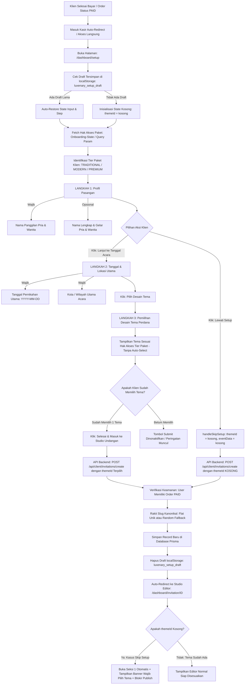

# DOKUMENTASI RESMI: TAHAP DASHBOARD SETUP AWAL
**Luxenary Invite Platform — Panduan Penyiapan Undangan Klien (100% Dinamis & Clean State)**

Dokumen ini memuat spesifikasi teknis dan alur faktual sistem pada tahap **Dashboard Setup Awal (Setup Wizard)**, yaitu gerbang pertama yang dimasuki calon pengantin tepat setelah menyelesaikan pembayaran invoice untuk menginisialisasi undangan digital perdana mereka.

---

## 1. Prinsip Utama Setup Awal

1. **Jembatan Pasca-Bayar:** Tepat setelah transaksi berstatus `PAID` (baik via Webhook QRIS otomatis maupun persetujuan Admin), klien diarahkan ke URL:
   ```
   /dashboard/setup?order={orderId}&plan={planType}
   ```
2. **Setup Bertahap 3 Langkah Ringkas (Zero Friction):** Calon pengantin tidak langsung dibebani ratusan kolom formulir rumit. Penyiapan awal dibagi menjadi 3 langkah terarah:
   - **Langkah 1:** Identitas Pasangan Mempelai (Nama Panggilan & Nama Lengkap).
   - **Langkah 2:** Hari Bahagia & Wilayah Utama (Tanggal Pernikahan & Kota).
   - **Langkah 3:** Pemilihan Desain Tema Perdana (Disesuaikan dengan tier paket yang dibeli).
3. **Prinsip Anti-Hardcode & Zero Fake Data (Clean State):**
   - **Tidak Ada Tema Default:** State awal tema bernilai kosong murni (`themeId = ""`). Tidak ada auto-select ke tema tertentu. Calon pengantin bebas menentukan tema pilihannya sendiri.
   - **Validasi Submit:** Jika klien menyelesaikan setup form 3 langkah, sistem mewajibkan pemilihan salah satu tema sebelum formulir dapat dikirimkan ke server.
4. **Fleksibilitas Penuh (Opsi Lewati Setup Murni Kosong):**
   - Klien memiliki opsi *"Lewati Setup (Atur Nanti)"*.
   - Jika dilewati, backend menyimpan record dengan data murni kosong (`themeId: ""`, `eventData: []`, `loveStory: []`, `bankAccounts: []`).
   - Tidak ada data fiktif / dummy yang disuntikkan secara paksa.
5. **Penanganan Status "Belum Memilih Tema" Pasca Skip:**
   - **Di Dashboard Utama (`/dashboard`):** Menampilkan badge status merah/rose *"Belum Memilih Tema"* pada label tema dan banner perhatian teratas *"Anda belum memilih desain tema undangan"* dengan tombol *"Pilih Tema Sekarang"*.
   - **Di Studio Editor (`/dashboard/invitation/[id]`):**
     - Header editor menampilkan badge *"Belum Memilih Tema"*.
     - Banner tahap wajib pertama muncul di atas canvas editor.
     - Seksi 1 (Tema Desain & Palet Warna) otomatis dibuka (*auto-expanded*) saat editor pertama kali dimuat jika tema belum ditentukan.
     - Jika Seksi 1 diminimalkan, kartu menampilkan alert ramah *"Belum Memilih Tema Undangan"* dengan tombol akses cepat *"Pilih Tema Sekarang"*.
   - **Di Route Pratinjau (`/api/client/invitations/[id]/preview`):** Menampilkan halaman peringatan elegan *"Tema Belum Dipilih"* tanpa memaksakan fallback tema apapun.
   - **Di Syarat Publikasi (`/dashboard/settings` & `lib/staticPublisher.ts`):** Publikasi undangan diblokir (`isPublishable = false`) dan compiler statis menolak proses rendering hingga tema resmi telah dipilih oleh klien.
6. **Anti Kehilangan Data (Local Storage Persistence):** Form otomatis menyimpan draft input setiap kali ada ketikan ke `localStorage` (`luxenary_setup_draft`). Jika browser tertutup, baterai habis, atau halaman ter-refresh, seluruh ketikan klien langsung pulih seketika. Draft dibersihkan saat submit selesai.

---

## 2. Diagram Alur Setup Wizard & Penanganan Dynamic State



---

## 3. Rincian Teknis per Langkah Wizard

### LANGKAH 1: Identitas Pasangan Mempelai
* **Komponen:** [`app/(client)/dashboard/setup/page.tsx`](file:///Users/armansyam/Documents/Project%20AmsDev/Luxenary-Invite/app/(client)/dashboard/setup/page.tsx) (`step === 1`)
* **Tujuan:** Menangkap nama panggilan kedua calon mempelai yang akan digunakan sebagai identitas tautan web, headline sampul undangan, dan sapaan utama.
* **Elemen Formulir:**
  1. **Nama Panggilan Pria (`groomNickname`) — *Wajib*:**
     - Placeholder: *"Masukkan nama panggilan mempelai pria"*.
  2. **Nama Panggilan Wanita (`brideNickname`) — *Wajib*:**
     - Placeholder: *"Masukkan nama panggilan mempelai wanita"*.
  3. **Nama Lengkap & Gelar Pria (`groomName`) — *Opsional*:**
     - Placeholder: *"Masukkan nama lengkap mempelai pria"*.
  4. **Nama Lengkap & Gelar Wanita (`brideName`) — *Opsional*:**
     - Placeholder: *"Masukkan nama lengkap mempelai wanita"*.
* **Validasi Frontend:** Jika tombol *"Lanjut ke Tanggal Acara"* diklik saat nama panggilan masih kosong, muncul pesan inline: *"Harap isi nama panggilan kedua mempelai."*.

---

### LANGKAH 2: Hari Bahagia, Wilayah & Waktu Acara
* **Komponen:** [`app/(client)/dashboard/setup/page.tsx`](file:///Users/armansyam/Documents/Project%20AmsDev/Luxenary-Invite/app/(client)/dashboard/setup/page.tsx) (`step === 2`)
* **Tujuan:** Menentukan patokan tanggal, kota lokasi sentral, zona waktu resmi, serta perkiraan jam akad dan resepsi secara 100% dinamis.
* **Elemen Formulir:**
  1. **Tanggal Pernikahan Utama (`weddingDate`) — *Wajib*:**
     - Format: Input tipe `date` (YYYY-MM-DD).
     - Menjadi dasar perhitungan tanggal DDMMYY untuk slug URL kanonikal serta target jam hitung mundur.
  2. **Kota / Wilayah Utama Acara (`city`) — *Wajib*:**
     - Tipe: Text input.
     - Contoh: `Jakarta`, `Surabaya`, `Makassar`, `Medan`, `Bandung`.
  3. **Zona Waktu Acara (`timeZone`) — *Pilihan Interaktif*:**
     - Opsi tombol chip: `WIB (Barat)`, `WITA (Tengah)`, `WIT (Timur)`.
     - Otomatis mendeteksi zona waktu browser klien saat dimuat (misal Makassar/Bali auto `WITA`, Jakarta/Jawa auto `WIB`, Papua/Maluku auto `WIT`) dan dapat diubah secara bebas oleh klien.
  4. **Perkiraan Jam Akad & Resepsi (`akadTime` & `resepsiTime`) — *Opsional*:**
     - Klien dapat memasukkan jam acara jika sudah memiliki jadwal pasti (contoh: `08:00 - 10:00` atau `09:00 - Selesai`).
     - Sistem secara otomatis menggabungkan waktu dengan zona waktu terpilih (contoh: `08:00 - 10:00 WIB`).
     - Jika dikosongkan, data waktu disimpan murni kosong `""` tanpa ada pemaksaan jam fiktif.
* **Catatan Edukasi Klien di Layar:** Terdapat kotak panduan ramah yang menginformasikan bahwa rincian detail seperti nama gedung, alamat lengkap, peta Google Maps, dan multi-sesi adat dapat ditambahkan dengan leluasa di dalam Studio Editor.

---

### LANGKAH 3: Pemilihan Desain Tema Perdana
* **Komponen:** [`app/(client)/dashboard/setup/page.tsx`](file:///Users/armansyam/Documents/Project%20AmsDev/Luxenary-Invite/app/(client)/dashboard/setup/page.tsx) (`step === 3`)
* **Tujuan:** Memberikan kebebasan visual penuh bagi calon pengantin untuk memilih gaya estetika tema pertama mereka tanpa paksaan bawaan.
* **Logika Hak Akses Tema (Waterfall Tier Mapping):**
  Daftar tema diambil secara dinamis dari database melalui `GET /api/public/themes` dan disaring (*filter*) sesuai paket aktif klien:
  - **Paket PREMIUM:** Mendapatkan akses ke **seluruh tema lengkap** (Traditional, Modern, dan Luxury Premium).
  - **Paket MODERN:** Mendapatkan akses ke tema berkategori **Modern** dan **Traditional**.
  - **Paket TRADITIONAL:** Mendapatkan akses khusus tema berkategori **Traditional**.
* **Clean State Tanpa Default Tema:**
  - Variabel `themeId` diinisialisasi sebagai string kosong `""`.
  - Tidak ada auto-select ke `availableThemes[0]`.
  - Jika klien mengganti paket atau filter berubah, tema hanya dipilih jika klien mengklik kartu secara sadar.
* **Validasi Sebelum Finalisasi:**
  - Jika klien mencoba menekan *"Selesai & Masuk ke Studio Undangan"* sebelum memilih tema, proses dicegah dan muncul pesan: *"Silakan pilih salah satu desain tema terlebih dahulu."*.
* **Kotak Ringkasan (*Summary Box*):**
  - Jika tema sudah dipilih: Menampilkan badge emas dengan nama tema terpilih.
  - Jika tema belum dipilih: Menampilkan badge netral dengan status *"Belum Memilih Tema"*.

---

## 4. Mekanisme "Lewati Setup" & Penanganan Undangan Tanpa Tema

### A. Alur "Lewati Setup" (Clean Null State)
Saat tombol *"Lewati Setup (Atur Nanti)"* diklik:
1. Fungsi `handleSkipSetup()` mengirim payload ke `POST /api/client/invitations/create`:
   ```typescript
   {
     groomNickname: "Mempelai Pria",
     brideNickname: "Mempelai Wanita",
     weddingDate: "",
     city: "",
     themeId: "" // Murni kosong tanpa pemaksaan tema default
   }
   ```
2. Backend tidak menyuntikkan data fiktif apapun. Array `eventData`, `loveStory`, dan `bankAccounts` diinisialisasi sebagai array kosong `[]`.
3. Slug kanonikal dibuat aman dengan format `undangan-{randomId}`.
4. Draft lokal dibersihkan dan klien langsung dialihkan ke Studio Editor `/dashboard/invitation/{id}`.

### B. Indikator Status di Dashboard Utama (`/dashboard`)
1. **Badge Tema di Kartu Status:**
   - Jika `invitation.themeId` ada: Menampilkan nama tema terpilih (misal: *Kalandra*).
   - Jika `invitation.themeId` kosong: Menampilkan badge merah/rose bold `Belum Memilih Tema`.
2. **Banner Edukasi Atas:**
   - Menampilkan alert kuning/amber: *"Anda belum memilih desain tema undangan. Silakan tentukan tema desain pilihan Anda di Studio Editor agar undangan dapat diselesaikan."*.
   - Terdapat tombol call-to-action *"Pilih Tema Sekarang"* yang langsung membawa klien ke Seksi 1 Studio Editor.

### C. Alur Studio Editor (`/dashboard/invitation/[id]`)
1. **Auto-Expand Seksi 1:** Jika `!inv.themeId`, sistem otomatis membuka kartu Seksi 1 (`collapsed.sec1 = false`) agar pandangan klien langsung tertuju pada pemilihan tema.
2. **Banner Tahap Pertama:** Banner peringatan menonjol di atas tab navigasi menginstruksikan bahwa memilih tema adalah langkah nomor satu sebelum kustomisasi lainnya.
3. **Pratinjau Seksi 1 saat Tertutup:** Jika kartu seksi 1 ditutup dalam kondisi belum ada tema, kartu tidak merusak tampilan (no null pointer exception), melainkan menampilkan kotak peringatan *"Belum Memilih Tema Undangan"* disertai tombol aksi cepat *"Pilih Tema Sekarang"*.
4. **Bebas Seleksi Dinamis:** Checkmark "Terpilih" hanya aktif jika `Boolean(invitation.themeId) && invitation.themeId === th.id`.

### D. Keamanan Publikasi & Live Preview
1. **Preview Route (`/api/client/invitations/[id]/preview`):**
   - Jika `themeId` kosong, preview tidak menampilkan tema `kalandra` secara paksa, melainkan menampilkan halaman panduan informatif *"Tema Belum Dipilih"*.
2. **Syarat Publikasi (`/dashboard/settings`):**
   - Aturan `isPublishable` kini mencakup `isThemeValid = !!invitation?.themeId`.
   - Tombol Publikasikan dinonaktifkan (*disabled*) dan daftar syarat menampilkan poin: *"Tema Undangan belum dipilih (silakan pilih desain tema di Studio Editor)."*.
3. **Kompilasi Statis (`lib/staticPublisher.ts`):**
   - Fungsi `publishInvitationToStatic()` memverifikasi keberadaan `themeId`. Jika kosong, proses melempar exception: *"Gagal mempublikasikan undangan: Desain tema belum dipilih."*.
4. **Penanganan Tema Dihapus oleh Admin:**
   - Berkat **Arsitektur Piring Mandiri**, jika klien sudah memiliki piring draft di `data/drafts/{id}.html`, undangan klien tetap aman 100%.
   - Jika piring belum terbentuk saat tema dihapus Admin, preview menampilkan layar informatif *"Tema Tidak Tersedia"* yang memandu klien untuk memilih tema aktif lain di Dashboard tanpa fallback siluman.

---

## 5. Matriks Parameter State & Database

| Komponen Input | Kolom Tabel `Invitation` | Tipe Data | Perilaku Saat Setup Lengkap | Perilaku Saat Lewati Setup |
| :--- | :--- | :--- | :--- | :--- |
| **Nama Panggilan Pria** | `groomNickname` | `String` | Input klien (contoh: `Arman`) | `"Mempelai Pria"` |
| **Nama Panggilan Wanita** | `brideNickname` | `String` | Input klien (contoh: `Siti`) | `"Mempelai Wanita"` |
| **Tanggal Pernikahan** | `eventData` | `String (JSON)` | Disimpan dalam susunan acara | `[]` (Array Kosong) |
| **Kota Utama** | `eventData` | `String (JSON)` | Disimpan dalam lokasi acara | `[]` (Array Kosong) |
| **Tema Pilihan** | `themeId` | `String` | ID tema terpilih (contoh: `kalandra`) | `""` (String Kosong) |
| **Kanonikal Slug** | `invitationSlug` | `String (Unique)` | `{pria}-{wanita}-{DDMMYY}` | `undangan-{randomId}` |
| **Status Publikasi** | `status` | `InvitationStatus` | `DRAFT` | `DRAFT` |
| **Syarat Publish** | `isPublishable` | `Boolean` | `false` (Menunggu biodata & PIN) | `false` (Wajib pilih tema + isi data) |

---

## 6. Kesimpulan
Dengan arsitektur ini, sistem Luxenary Invite telah sepenuhnya bebas dari nilai bawaan yang memaksakan kehendak (*zero hardcoded defaults*). Setiap data awal yang tercipta benar-benar merefleksikan pilihan nyata calon pengantin atau berstatus bersih tanpa data palsu, dengan jaminan panduan antarmuka yang ramah dan konsisten di seluruh dashboard, editor, serta gerbang publikasi.
