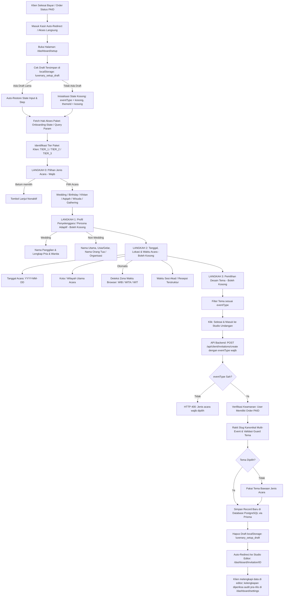

# DOKUMENTASI RESMI: TAHAP DASHBOARD SETUP AWAL
**Luxenary Invite Platform — Panduan Penyiapan Undangan Klien (100% Dinamis & Clean State)**

Dokumen ini memuat spesifikasi teknis dan alur faktual sistem pada tahap **Dashboard Setup Awal (Setup Wizard)**, yaitu gerbang pertama yang dimasuki calon pengantin tepat setelah menyelesaikan pembayaran invoice untuk menginisialisasi undangan digital perdana mereka.

---

## 1. Prinsip Utama Setup Awal

1. **Jembatan Pasca-Bayar:** Tepat setelah transaksi berstatus `PAID` (baik via Webhook QRIS otomatis maupun persetujuan Admin), klien diarahkan ke URL:
   ```
   /dashboard/setup?order={orderId}&plan={planType}
   ```
2. **Setup Bertahap 4 Langkah Adaptif Multi-Event:** Wizard hanya memudahkan pengisian data awal. Satu-satunya isian yang wajib adalah jenis acara; seluruh isian lain boleh dikosongkan dan dilengkapi di Studio Editor. Syarat kelengkapan untuk rilis ada di akhir alur, pada audit pra-rilis di tab Pengaturan (`/dashboard/settings`).
   - **Langkah 0 (wajib):** Pemilihan Jenis Acara (`eventType`: Wedding, Birthday, Khitan, Aqiqah, Wisuda, Gathering). Tidak ada kartu yang terpilih di awal dan tombol lanjut nonaktif sampai klien memilih satu. Jenis acara tidak dapat diubah setelah undangan dibuat (rute `PUT /api/client/invitations/{id}` tidak menerima `eventType`, dan tema dikunci per jenis acara).
   - **Langkah 1 (boleh kosong):** Identitas Penyelenggara / Pasangan (formulir adaptif sesuai jenis acara).
   - **Langkah 2 (boleh kosong):** Hari Bahagia & Wilayah Utama (tanggal, kota, zona waktu otomatis WIB/WITA/WIT, dan waktu sesi terstruktur).
   - **Langkah 3 (boleh kosong):** Pemilihan Desain Tema Perdana, difilter sesuai jenis acara terpilih.
3. **Tema Bawaan per Jenis Acara:** `themes` adalah FK wajib pada `invitations.themeId`, sehingga nilai kosong tidak dapat disimpan. Bila klien tidak memilih tema, `POST /api/client/invitations/create` memakai tema bawaan jenis acara (`kalandra`, `kalandra-birthday`, `al-fariz`, `al-khalid`, `cendekia`, `sinergi`). Tema dapat diganti di Studio Editor selama undangan masih `DRAFT`.
4. **Penegakan di Server:** `POST /api/client/invitations/create` menjawab HTTP 400 ("Jenis acara wajib dipilih.") bila `eventType` kosong atau tidak sah; tidak ada lagi bawaan diam-diam ke `WEDDING`. Tombol "Lewati Setup" sudah dihapus karena membuat undangan dari nol tanpa membawa jenis acara yang dipilih.
5. **Isian Kosong Tidak Menyuntikkan Data Palsu:** Nama kosong menghasilkan `groomName`/`brideName` kosong dan slug kanonikal `undangan-{randomId}`; tanggal kosong berarti kartu acara awal (Akad/Resepsi) tidak dibuat; `eventData` tetap kosong. Kelengkapan ditegakkan oleh audit pra-rilis di `/dashboard/settings` (antara lain subdomain, tema, empat visual sampul, profil utama, foto profil, tanggal acara, lokasi, PIN petugas bila paket mendukung, dan galeri bila aktif; daftar lengkapnya adalah `AUDIT_RULES` di `app/(client)/dashboard/settings/page.tsx`). Slug kanonikal tidak ikut berubah saat nama diisi kemudian, sehingga klien yang mengosongkan nama tetap memiliki jalur kanonikal acak. Untuk pernikahan, subdomain turunan nama (`{pria}-{wanita}`) terisi otomatis saat kedua nama dilengkapi dan subdomain belum diatur.
6. **Anti Kehilangan Data (Local Storage Persistence):** Form otomatis menyimpan draft input setiap kali ada ketikan ke `localStorage` (`luxenary_setup_draft`). Jika browser tertutup, baterai habis, atau halaman ter-refresh, seluruh ketikan klien langsung pulih seketika. Draft dibersihkan saat submit selesai.

---

## 2. Diagram Alur Setup Wizard & Penanganan Dynamic State


```mermaid
flowchart TD
    A[Klien Selesai Bayar / Order Status PAID] --> B[Masuk Kasir Auto-Redirect / Akses Langsung]
    B --> C[Buka Halaman: /dashboard/setup]
    
    C --> D[Cek Draft Tersimpan di localStorage: luxenary_setup_draft]
    D -->|Ada Draft Lama| E[Auto-Restore State Input & Step]
    D -->|Tidak Ada Draft| F[Inisialisasi State Kosong: eventType = kosong, themeId = kosong]
    
    E & F --> G[Fetch Hak Akses Paket: Onboarding-State / Query Param]
    G --> H[Identifikasi Tier Paket Klien: TIER_1 / TIER_2 / TIER_3]
    
    H --> I0[LANGKAH 0: Pilihan Jenis Acara - Wajib]
    I0 -->|Belum memilih| I0X[Tombol Lanjut Nonaktif]
    I0 -->|Pilih Acara| I0A[Wedding / Birthday / Khitan / Aqiqah / Wisuda / Gathering]
    
    I0A --> I[LANGKAH 1: Profil Penyelenggara / Persona Adaptif - Boleh Kosong]
    I -->|Wedding| I1[Nama Panggilan & Lengkap Pria & Wanita]
    I -->|Non-Wedding| I2[Nama Utama, Usia/Gelar, Nama Orang Tua / Organisasi]
    I --> L[LANGKAH 2: Tanggal, Lokasi & Waktu Acara - Boleh Kosong]
    
    L --> L1[Tanggal Acara: YYYY-MM-DD]
    L --> L2[Kota / Wilayah Utama Acara]
    L -->|Otomatis| L3[Deteksi Zona Waktu Browser: WIB / WITA / WIT]
    L --> L4[Waktu Sesi Akad / Resepsi Terstruktur]
    L --> N[LANGKAH 3: Pemilihan Desain Tema - Boleh Kosong]
    
    N --> O[Filter Tema sesuai eventType]
    O --> Q[Klik: Selesai & Masuk ke Studio Undangan]
    
    Q --> R[API Backend: POST /api/client/invitations/create dengan eventType wajib]
    R --> RX{eventType Sah?}
    RX -->|Tidak| RY[HTTP 400: Jenis acara wajib dipilih]
    RX -->|Ya| S[Verifikasi Keamanan: User Memiliki Order PAID]
    S --> T[Rakit Slug Kanonikal Multi-Event & Validasi Guard Tema]
    T --> TT{Tema Dipilih?}
    TT -->|Tidak| TD[Pakai Tema Bawaan Jenis Acara]
    TT -->|Ya| U[Simpan Record Baru di Database PostgreSQL via Prisma]
    TD --> U
    U --> V[Hapus Draft localStorage: luxenary_setup_draft]
    
    V --> W[Auto-Redirect ke Studio Editor: /dashboard/invitation/ID]
    W --> Z[Klien melengkapi data di editor; kelengkapan diperiksa audit pra-rilis di /dashboard/settings]
```

---

## 3. Rincian Teknis per Langkah Wizard

### LANGKAH 0: Pilihan Jenis Acara (Event Type Selector)
* **Komponen:** [`app/(client)/dashboard/setup/page.tsx`](file:///Users/armansyam/Documents/Project%20AmsDev/Luxenary-Invite/app/(client)/dashboard/setup/page.tsx) (`step === 0`)
* **Tujuan:** Menentukan kategori acara digital yang akan dibuat:
  - `WEDDING` (Pernikahan / Walimatul 'Urs)
  - `BIRTHDAY` (Ulang Tahun / Sweet Seventeen / Milad)
  - `KHITAN` (Khitanan / Walimatul Khitan)
  - `AQIQAH` (Aqiqah / Tasyakuran Kelahiran)
  - `WISUDA` (Wisuda / Graduation / Yudisium)
  - `GATHERING` (Reuni / Halal Bihalal / Corporate Gathering)
* **Wajib dipilih:** `eventType` kosong sejak awal; tombol lanjut nonaktif sampai satu kartu diklik. Server menolak pembuatan undangan tanpa `eventType` sah (HTTP 400).
* **Dampak Sistem:** Mengubah skema input pada Langkah 1, format slug kanonikal, serta memfilter tema di Langkah 3. Tidak dapat diubah setelah undangan dibuat.

---

### LANGKAH 1: Identitas Penyelenggara / Pasangan (Adaptif)
* **Komponen:** [`app/(client)/dashboard/setup/page.tsx`](file:///Users/armansyam/Documents/Project%20AmsDev/Luxenary-Invite/app/(client)/dashboard/setup/page.tsx) (`step === 1`)
* **Tujuan:** Menangkap profil utama penyelenggara/tokoh sesuai jenis acara.
* **Elemen Formulir:**
  1. **Wedding:**
     - `groomNickname` & `brideNickname` (*Boleh kosong*): Nama panggilan mempelai.
     - `groomName` & `brideName` (*Boleh kosong*): Nama lengkap & gelar kedua mempelai.
  2. **Non-Wedding (Birthday, Khitan, Aqiqah, Wisuda, Gathering):**
     - `personName` / `eventTitle` (*Boleh kosong*): Nama tokoh utama atau nama agenda acara.
     - `personNickname` / `eventSubtitle` (*Opsional*): Panggilan atau tema pendukung.
     - `fatherName` & `motherName` (*Opsional*): Nama orang tua (khusus Khitan & Aqiqah).
     - `degree`, `major`, `institution` (*Opsional*): Gelar dan almamater (khusus Wisuda).
     - `organizer` (*Opsional*): Nama lembaga/panitia (khusus Gathering).

---

### LANGKAH 2: Hari Bahagia, Wilayah & Waktu Acara Terstruktur
* **Komponen:** [`app/(client)/dashboard/setup/page.tsx`](file:///Users/armansyam/Documents/Project%20AmsDev/Luxenary-Invite/app/(client)/dashboard/setup/page.tsx) (`step === 2`)
* **Tujuan:** Menentukan patokan tanggal, kota lokasi sentral, zona waktu resmi, serta waktu sesi terstruktur.
* **Elemen Formulir:**
  1. **Tanggal Acara Utama (`weddingDate`) — *Boleh kosong*:** Format `YYYY-MM-DD`. Bila terisi, server membuat kartu acara awal (Akad dan Resepsi untuk pernikahan, satu acara utama untuk jenis lain); bila kosong, `eventData` tetap kosong dan tanggal diisi di Studio Editor.
  2. **Kota / Wilayah Utama Acara (`city`) — *Boleh kosong*:** Hanya dipakai sebagai teks lokasi awal pada kartu acara. Autocomplete daftar kota/kabupaten se-Indonesia dengan saran cepat.
  3. **Zona Waktu Acara (`timeZone`) — *Pilihan Interaktif*:** Opsi chip: `WIB`, `WITA`, `WIT`. Otomatis terdeteksi dari zona waktu browser klien.
  4. **Waktu Sesi Terstruktur (Akad & Resepsi) — *Opsional*:** Input jam mulai dan jam selesai terpisah (`akadStart`, `akadEnd`, `resepsiStart`, `resepsiEnd`) untuk menjamin validitas format tanpa free-text rentan error.

---

### LANGKAH 3: Pemilihan Desain Tema Terisolasi
* **Komponen:** [`app/(client)/dashboard/setup/page.tsx`](file:///Users/armansyam/Documents/Project%20AmsDev/Luxenary-Invite/app/(client)/dashboard/setup/page.tsx) (`step === 3`)
* **Tujuan:** Memilih tema perdana yang difilter secara ketat sesuai `eventType` yang dipilih di Langkah 0.
* **Navigasi Kategori Dinamis:** Tab filter kategori gaya (`all`, `minimalist`, `modern`, `traditional`) secara cerdas hanya menampilkan tab kategori yang memang memiliki tema pada jenis acara tersebut.
* **Tanpa Auto-Select di Wizard:** Variabel `themeId` diinisialisasi sebagai string kosong `""`; wizard tidak memilihkan tema.
* **Boleh Dilewati:** Klien dapat menyelesaikan wizard tanpa memilih tema. Label pada ringkasan menampilkan "Tema bawaan jenis acara", dan server memakai tema bawaan jenis acara tersebut (lihat bagian 1 poin 3). Tema dapat diganti di Studio Editor selama undangan masih `DRAFT`.


---

## 4. Pembuatan Undangan dengan Isian Minimal & Penanganan Tema

### A. Payload Minimum
Satu-satunya isian yang wajib adalah `eventType`. Payload berikut diterima `POST /api/client/invitations/create` dan menghasilkan undangan `DRAFT` (diuji untuk keenam jenis acara di `__tests__/integration/registrationFlow.test.ts`):
```typescript
{
  eventType: "WEDDING",
  groomNickname: "", brideNickname: "", groomName: "", brideName: "",
  weddingDate: "", city: "", themeId: "", planType: "TIER_1"
}
```
1. Backend tidak menyuntikkan data fiktif. `eventData` kosong bila tanggal kosong.
2. Slug kanonikal berformat `undangan-{randomId}` bila nama kosong.
3. Tema memakai tema bawaan jenis acara.
4. Draft lokal dibersihkan dan klien dialihkan ke Studio Editor `/dashboard/invitation/{id}`.

### B. Cabang "Tema Kosong" yang Masih Ada di Kode
`invitations.themeId` adalah FK wajib ke `themes`, sehingga undangan baru tidak pernah bertema kosong. Cabang berikut tetap ada sebagai pengaman dan tidak tercapai pada data yang dibuat lewat jalur sekarang:
- `/dashboard`: badge *"Belum Memilih Tema"* dan banner *"Pilih Tema Sekarang"* (`!invitation?.themeId`).
- Studio Editor: auto-expand Seksi 1 dan banner tema bila `!inv.themeId`.
- `/api/client/invitations/[id]/preview`: halaman *"Tema Belum Dipilih"*.
- `lib/staticPublisher.ts`: melempar *"Gagal mempublikasikan undangan: Desain tema belum dipilih."* bila `themeId` kosong.

### C. Syarat Rilis
Kelengkapan data diperiksa saat klien merilis, bukan di wizard: audit pra-rilis `AUDIT_RULES` di `app/(client)/dashboard/settings/page.tsx` menghentikan rilis dan menunjuk bagian yang kurang. Pemeriksaan ini berjalan di klien; rute `PUT /api/client/invitations/{id}` sendiri tidak mengulang syarat kelengkapan.

### D. Penanganan Tema Dihapus oleh Admin
Tema yang dipakai undangan tidak dapat dihapus (`DELETE /api/admin/themes` menjawab 409 dan FK `RESTRICT`). Bila file tema hilang di disk saat sinkronisasi, tema yang masih dipakai dipertahankan.

---

## 5. Matriks Parameter State & Database

| Komponen Input | Kolom Tabel `Invitation` | Tipe Data | Perilaku Saat Diisi Lengkap | Perilaku Saat Dikosongkan |
| :--- | :--- | :--- | :--- | :--- |
| **Jenis Acara** | `eventType` | `EventType` (Enum) | `WEDDING`, `BIRTHDAY`, `KHITAN`, `AQIQAH`, `WISUDA`, `GATHERING` | Tidak boleh kosong: HTTP 400 |
| **Nama Panggilan Pria / Tokoh** | `groomNickname` | `String?` | Input klien (contoh: `Arman`) | `""` |
| **Nama Panggilan Wanita** | `brideNickname` | `String?` | Input klien (contoh: `Siti`) | `""` |
| **Data Persona Non-Wedding** | `participantsJson` | `String? (JSON)` | Disimpan JSON persona (usia, ortu, gelar, dll) | JSON dengan nama kosong (acara non-pernikahan) |
| **Tanggal Acara** | `eventData` | `String (JSON)` | Disimpan dalam susunan acara | Tanpa kartu acara awal |
| **Kota Utama** | `eventData` | `String (JSON)` | Teks lokasi awal pada kartu acara | Lokasi kosong |
| **Tema Pilihan** | `themeId` | `String` (FK ke `themes`) | ID tema terpilih (contoh: `kalandra`) | Tema bawaan jenis acara |
| **Kanonikal Slug** | `invitationSlug` | `String (Unique)` | `{pria}-{wanita}-{DDMMYY}` atau `{tokoh}-{DDMMYY}` | `undangan-{randomId}` untuk pernikahan; non-pernikahan memakai kata bawaan jenis acara |
| **Status Publikasi** | `status` | `InvitationStatus` | `DRAFT` | `DRAFT` |
| **Syarat Rilis** | audit pra-rilis | klien (`AUDIT_RULES`) | Lolos bila seluruh syarat terpenuhi | Rilis dihentikan dan bagian yang kurang ditunjuk |

---

## 6. Kesimpulan
Wizard hanya mempercepat pengisian data awal. Jenis acara adalah satu-satunya keputusan yang wajib dan permanen; nama, tanggal, kota, dan tema dapat dikosongkan dan dilengkapi di Studio Editor. Tidak ada data fiktif yang disuntikkan, dan kelengkapan baru ditegakkan pada audit pra-rilis di tab Pengaturan.
