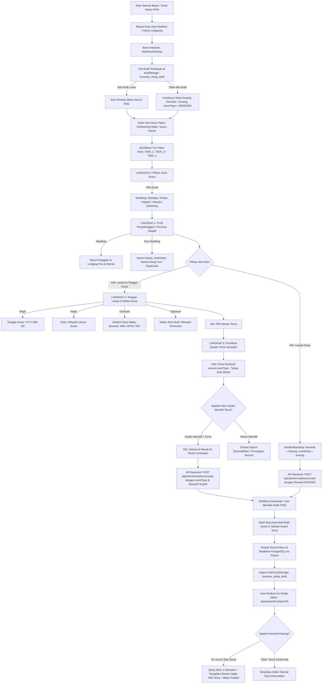

# DOKUMENTASI RESMI: TAHAP DASHBOARD SETUP AWAL
**Luxenary Invite Platform — Panduan Penyiapan Undangan Klien (100% Dinamis & Clean State)**

Dokumen ini memuat spesifikasi teknis dan alur faktual sistem pada tahap **Dashboard Setup Awal (Setup Wizard)**, yaitu gerbang pertama yang dimasuki calon pengantin tepat setelah menyelesaikan pembayaran invoice untuk menginisialisasi undangan digital perdana mereka.

---

## 1. Prinsip Utama Setup Awal

1. **Jembatan Pasca-Bayar:** Tepat setelah transaksi berstatus `PAID` (baik via Webhook QRIS otomatis maupun persetujuan Admin), klien diarahkan ke URL:
   ```
   /dashboard/setup?order={orderId}&plan={planType}
   ```
2. **Setup Bertahap 4 Langkah Adaptif Multi-Event (Zero Friction):** Calon pengantin atau penyelenggara tidak langsung dibebani ratusan kolom formulir rumit. Penyiapan awal dibagi menjadi 4 langkah terarah:
   - **Langkah 0:** Pemilihan Jenis Acara (`eventType`: Wedding, Birthday, Khitan, Aqiqah, Wisuda, Gathering).
   - **Langkah 1:** Identitas Penyelenggara / Pasangan (Formulir adaptif sesuai jenis acara yang dipilih).
   - **Langkah 2:** Hari Bahagia & Wilayah Utama (Tanggal Acara, Kota dengan zona waktu otomatis WIB/WITA/WIT, dan waktu sesi terstruktur).
   - **Langkah 3:** Pemilihan Desain Tema Perdana (Difilter ketat hanya menampilkan tema untuk jenis acara terpilih).
3. **Prinsip Anti-Hardcode & Zero Fake Data (Clean State):**
   - **Tidak Ada Tema Default:** State awal tema bernilai kosong murni (`themeId = ""`). Tidak ada auto-select ke tema tertentu. Klien bebas menentukan tema pilihannya sendiri.
   - **Validasi Submit:** Jika klien menyelesaikan setup form 4 langkah, sistem mewajibkan pemilihan salah satu tema sebelum formulir dapat dikirimkan ke server.
4. **Fleksibilitas Penuh (Opsi Lewati Setup Murni Kosong):**
   - Klien memiliki opsi *"Lewati Setup (Atur Nanti)"*.
   - Jika dilewati, backend menyimpan record dengan data murni kosong (`themeId: ""`, `eventData: []`, `loveStory: []`, `bankAccounts: []`).
   - Tidak ada data fiktif / dummy yang disuntikkan secara paksa.
5. **Penanganan Status "Belum Memilih Tema" Pasca Skip:**
   - **Di Dashboard Utama (`/dashboard`):** Menampilkan badge status merah/rose *"Belum Memilih Tema"* pada label tema dan banner perhatian teratas *"Anda belum memilih desain tema undangan"* dengan tombol *"Pilih Tema Sekarang"*.
   - **Di Studio Editor (`/dashboard/invitation/[id]`):**
     - Header editor menampilkan badge *"Belum Memilih Tema"*.
     - Banner tahap wajib pertama muncul di atas canvas editor.
     - Seksi 1 (Tema Desain & Palet Warna) otomatis dibuka (*auto-expanded*) saat editor pertama kali dimuat jika tema belum ditentukan, dan daftar tema di Seksi 1 difilter ketat sesuai `invitation.eventType`.
     - Jika Seksi 1 diminimalkan, kartu menampilkan alert ramah *"Belum Memilih Tema Undangan"* dengan tombol akses cepat *"Pilih Tema Sekarang"*.
   - **Di Route Pratinjau (`/api/client/invitations/[id]/preview`):** Menampilkan halaman peringatan elegan *"Tema Belum Dipilih"* tanpa memaksakan fallback tema apapun.
   - **Di Syarat Publikasi (`/dashboard/settings` & `lib/staticPublisher.ts`):** Publikasi undangan diblokir (`isPublishable = false`) dan compiler statis menolak proses rendering hingga tema resmi telah dipilih oleh klien.
6. **Anti Kehilangan Data (Local Storage Persistence):** Form otomatis menyimpan draft input setiap kali ada ketikan ke `localStorage` (`luxenary_setup_draft`). Jika browser tertutup, baterai habis, atau halaman ter-refresh, seluruh ketikan klien langsung pulih seketika. Draft dibersihkan saat submit selesai.

---

## 2. Diagram Alur Setup Wizard & Penanganan Dynamic State


```mermaid
flowchart TD
    A[Klien Selesai Bayar / Order Status PAID] --> B[Masuk Kasir Auto-Redirect / Akses Langsung]
    B --> C[Buka Halaman: /dashboard/setup]
    
    C --> D[Cek Draft Tersimpan di localStorage: luxenary_setup_draft]
    D -->|Ada Draft Lama| E[Auto-Restore State Input & Step]
    D -->|Tidak Ada Draft| F[Inisialisasi State Kosong: themeId = kosong, eventType = WEDDING]
    
    E & F --> G[Fetch Hak Akses Paket: Onboarding-State / Query Param]
    G --> H[Identifikasi Tier Paket Klien: TIER_1 / TIER_2 / TIER_3]
    
    H --> I0[LANGKAH 0: Pilihan Jenis Acara]
    I0 -->|Pilih Acara| I0A[Wedding / Birthday / Khitan / Aqiqah / Wisuda / Gathering]
    
    I0A --> I[LANGKAH 1: Profil Penyelenggara / Persona Adaptif]
    I -->|Wedding| I1[Nama Panggilan & Lengkap Pria & Wanita]
    I -->|Non-Wedding| I2[Nama Utama, Usia/Gelar, Nama Orang Tua / Organisasi]
    I --> J{Pilihan Aksi Klien}
    
    J -->|Klik: Lewati Setup| K[handleSkipSetup: themeId = kosong, eventData = kosong]
    J -->|Klik: Lanjut ke Tanggal Acara| L[LANGKAH 2: Tanggal, Lokasi & Waktu Acara]
    
    L -->|Wajib| L1[Tanggal Acara: YYYY-MM-DD]
    L -->|Wajib| L2[Kota / Wilayah Utama Acara]
    L -->|Otomatis| L3[Deteksi Zona Waktu Browser: WIB / WITA / WIT]
    L -->|Opsional| L4[Waktu Sesi Akad / Resepsi Terstruktur]
    L --> M[Klik: Pilih Desain Tema]
    
    M --> N[LANGKAH 3: Pemilihan Desain Tema Terisolasi]
    N --> O[Filter Tema Eksklusif sesuai eventType - Tanpa Auto-Select]
    O --> P{Apakah Klien Sudah Memilih Tema?}
    P -->|Belum Memilih| P1[Tombol Submit Dinonaktifkan / Peringatan Muncul]
    P -->|Sudah Memilih 1 Tema| Q[Klik: Selesai & Masuk ke Studio Undangan]
    
    Q --> R[API Backend: POST /api/client/invitations/create dengan eventType & themeId Terpilih]
    K --> R2[API Backend: POST /api/client/invitations/create dengan themeId KOSONG]
    
    R & R2 --> S[Verifikasi Keamanan: User Memiliki Order PAID]
    S --> T[Rakit Slug Kanonikal Multi-Event & Validasi Guard Tema]
    T --> U[Simpan Record Baru di Database PostgreSQL via Prisma]
    U --> V[Hapus Draft localStorage: luxenary_setup_draft]
    
    V --> W[Auto-Redirect ke Studio Editor: /dashboard/invitation/ID]
    
    W --> X{Apakah themeId Kosong?}
    X -->|Ya: Kasus Skip Setup| Y[Buka Seksi 1 Otomatis + Tampilkan Banner Wajib Pilih Tema + Blokir Publish]
    X -->|Tidak: Tema Sudah Ada| Z[Tampilkan Editor Normal Siap Disesuaikan]
```

---

## 3. Rincian Teknis per Langkah Wizard

### LANGKAH 0: Pilihan Jenis Acara (Event Type Selector)
* **Komponen:** [`app/(client)/dashboard/setup/page.tsx`](file:///Users/armansyam/Documents/Project%20AmsDev/Luxenary-Invite/app/(client)/dashboard/setup/page.tsx) (`step === 0`)
* **Tujuan:** Menentukan kategori acara digital yang akan dibuat:
  - `WEDDING` (Pernikahan / Walimatul 'Urs)
  - `BIRTHDAY` (Ulang Tahun / Sweet Seventeen / Milad)
  - `KHITAN` (Khitanan / Walimatul Khitan)
  - `AQIQAH` (Aqiqah / Tasyakuran Kelahiran)
  - `WISUDA` (Wisuda / Graduation / Yudisium)
  - `GATHERING` (Reuni / Halal Bihalal / Corporate Gathering)
* **Dampak Sistem:** Mengubah skema input pada Langkah 1, format slug kanonikal, serta memfilter tema di Langkah 3.

---

### LANGKAH 1: Identitas Penyelenggara / Pasangan (Adaptif)
* **Komponen:** [`app/(client)/dashboard/setup/page.tsx`](file:///Users/armansyam/Documents/Project%20AmsDev/Luxenary-Invite/app/(client)/dashboard/setup/page.tsx) (`step === 1`)
* **Tujuan:** Menangkap profil utama penyelenggara/tokoh sesuai jenis acara.
* **Elemen Formulir:**
  1. **Wedding:**
     - `groomNickname` & `brideNickname` (*Wajib*): Nama panggilan mempelai.
     - `groomName` & `brideName` (*Opsional*): Nama lengkap & gelar kedua mempelai.
  2. **Non-Wedding (Birthday, Khitan, Aqiqah, Wisuda, Gathering):**
     - `personName` / `eventTitle` (*Wajib*): Nama tokoh utama atau nama agenda acara.
     - `personNickname` / `eventSubtitle` (*Opsional*): Panggilan atau tema pendukung.
     - `fatherName` & `motherName` (*Opsional*): Nama orang tua (khusus Khitan & Aqiqah).
     - `degree`, `major`, `institution` (*Opsional*): Gelar dan almamater (khusus Wisuda).
     - `organizer` (*Opsional*): Nama lembaga/panitia (khusus Gathering).

---

### LANGKAH 2: Hari Bahagia, Wilayah & Waktu Acara Terstruktur
* **Komponen:** [`app/(client)/dashboard/setup/page.tsx`](file:///Users/armansyam/Documents/Project%20AmsDev/Luxenary-Invite/app/(client)/dashboard/setup/page.tsx) (`step === 2`)
* **Tujuan:** Menentukan patokan tanggal, kota lokasi sentral, zona waktu resmi, serta waktu sesi terstruktur.
* **Elemen Formulir:**
  1. **Tanggal Acara Utama (`weddingDate`) — *Wajib*:** Format `YYYY-MM-DD`.
  2. **Kota / Wilayah Utama Acara (`city`) — *Wajib*:** Autocomplete daftar kota/kabupaten se-Indonesia dengan saran cepat.
  3. **Zona Waktu Acara (`timeZone`) — *Pilihan Interaktif*:** Opsi chip: `WIB`, `WITA`, `WIT`. Otomatis terdeteksi dari zona waktu browser klien.
  4. **Waktu Sesi Terstruktur (Akad & Resepsi) — *Opsional*:** Input jam mulai dan jam selesai terpisah (`akadStart`, `akadEnd`, `resepsiStart`, `resepsiEnd`) untuk menjamin validitas format tanpa free-text rentan error.

---

### LANGKAH 3: Pemilihan Desain Tema Terisolasi
* **Komponen:** [`app/(client)/dashboard/setup/page.tsx`](file:///Users/armansyam/Documents/Project%20AmsDev/Luxenary-Invite/app/(client)/dashboard/setup/page.tsx) (`step === 3`)
* **Tujuan:** Memilih tema perdana yang difilter secara ketat sesuai `eventType` yang dipilih di Langkah 0.
* **Navigasi Kategori Dinamis:** Tab filter kategori gaya (`all`, `minimalist`, `modern`, `traditional`) secara cerdas hanya menampilkan tab kategori yang memang memiliki tema pada jenis acara tersebut.
* **Clean State Tanpa Default Tema:** Variabel `themeId` diinisialisasi sebagai string kosong `""`. Tidak ada auto-select sembarangan.
* **Validasi Sebelum Finalisasi:** Klien wajib memilih satu tema sebelum menekan tombol submit (kecuali jika memilih alur lewati setup).


---

## 4. Mekanisme "Lewati Setup" & Penanganan Undangan Tanpa Tema

### A. Alur "Lewati Setup" (Clean Null State)
Saat tombol *"Lewati Setup (Atur Nanti)"* diklik:
1. Fungsi `handleSkipSetup()` mengirim payload ke `POST /api/client/invitations/create`:
   ```typescript
   {
     groomNickname: "Mempelai Pria",
     brideNickname: "Mempelai Wanita",
     weddingDate: "",
     city: "",
     themeId: "" // Murni kosong tanpa pemaksaan tema default
   }
   ```
2. Backend tidak menyuntikkan data fiktif apapun. Array `eventData`, `loveStory`, dan `bankAccounts` diinisialisasi sebagai array kosong `[]`.
3. Slug kanonikal dibuat aman dengan format `undangan-{randomId}`.
4. Draft lokal dibersihkan dan klien langsung dialihkan ke Studio Editor `/dashboard/invitation/{id}`.

### B. Indikator Status di Dashboard Utama (`/dashboard`)
1. **Badge Tema di Kartu Status:**
   - Jika `invitation.themeId` ada: Menampilkan nama tema terpilih (misal: *Kalandra*).
   - Jika `invitation.themeId` kosong: Menampilkan badge merah/rose bold `Belum Memilih Tema`.
2. **Banner Edukasi Atas:**
   - Menampilkan alert kuning/amber: *"Anda belum memilih desain tema undangan. Silakan tentukan tema desain pilihan Anda di Studio Editor agar undangan dapat diselesaikan."*.
   - Terdapat tombol call-to-action *"Pilih Tema Sekarang"* yang langsung membawa klien ke Seksi 1 Studio Editor.

### C. Alur Studio Editor (`/dashboard/invitation/[id]`)
1. **Auto-Expand Seksi 1:** Jika `!inv.themeId`, sistem otomatis membuka kartu Seksi 1 (`collapsed.sec1 = false`) agar pandangan klien langsung tertuju pada pemilihan tema.
2. **Banner Tahap Pertama:** Banner peringatan menonjol di atas tab navigasi menginstruksikan bahwa memilih tema adalah langkah nomor satu sebelum kustomisasi lainnya.
3. **Pratinjau Seksi 1 saat Tertutup:** Jika kartu seksi 1 ditutup dalam kondisi belum ada tema, kartu tidak merusak tampilan (no null pointer exception), melainkan menampilkan kotak peringatan *"Belum Memilih Tema Undangan"* disertai tombol aksi cepat *"Pilih Tema Sekarang"*.
4. **Bebas Seleksi Dinamis:** Checkmark "Terpilih" hanya aktif jika `Boolean(invitation.themeId) && invitation.themeId === th.id`.

### D. Keamanan Publikasi & Live Preview
1. **Preview Route (`/api/client/invitations/[id]/preview`):**
   - Jika `themeId` kosong, preview tidak menampilkan tema `kalandra` secara paksa, melainkan menampilkan halaman panduan informatif *"Tema Belum Dipilih"*.
2. **Syarat Publikasi (`/dashboard/settings`):**
   - Aturan `isPublishable` kini mencakup `isThemeValid = !!invitation?.themeId`.
   - Tombol Publikasikan dinonaktifkan (*disabled*) dan daftar syarat menampilkan poin: *"Tema Undangan belum dipilih (silakan pilih desain tema di Studio Editor)."*.
3. **Kompilasi Statis (`lib/staticPublisher.ts`):**
   - Fungsi `publishInvitationToStatic()` memverifikasi keberadaan `themeId`. Jika kosong, proses melempar exception: *"Gagal mempublikasikan undangan: Desain tema belum dipilih."*.
4. **Penanganan Tema Dihapus oleh Admin:**
   - Berkat **Arsitektur Piring Mandiri**, jika klien sudah memiliki piring draft di `data/drafts/{id}.html`, undangan klien tetap aman 100%.
   - Jika piring belum terbentuk saat tema dihapus Admin, preview menampilkan layar informatif *"Tema Tidak Tersedia"* yang memandu klien untuk memilih tema aktif lain di Dashboard tanpa fallback siluman.

---

## 5. Matriks Parameter State & Database

| Komponen Input | Kolom Tabel `Invitation` | Tipe Data | Perilaku Saat Setup Lengkap | Perilaku Saat Lewati Setup |
| :--- | :--- | :--- | :--- | :--- |
| **Jenis Acara** | `eventType` | `EventType` (Enum) | `WEDDING`, `BIRTHDAY`, `KHITAN`, `AQIQAH`, `WISUDA`, `GATHERING` | Sesuai pilihan step 0 (default: `WEDDING`) |
| **Nama Panggilan Pria / Tokoh** | `groomNickname` | `String?` | Input klien (contoh: `Arman`) | `"Mempelai Pria"` / Nama Persona |
| **Nama Panggilan Wanita** | `brideNickname` | `String?` | Input klien (contoh: `Siti`) | `"Mempelai Wanita"` |
| **Data Persona Non-Wedding** | `participantsJson` | `String? (JSON)` | Disimpan JSON persona (usia, ortu, gelar, dll) | `null` |
| **Tanggal Acara** | `eventData` | `String (JSON)` | Disimpan dalam susunan acara | `[]` (Array Kosong) |
| **Kota Utama** | `eventData` | `String (JSON)` | Disimpan dalam lokasi acara | `[]` (Array Kosong) |
| **Tema Pilihan** | `themeId` | `String` | ID tema terpilih (contoh: `kalandra`) | `""` (String Kosong) |
| **Kanonikal Slug** | `invitationSlug` | `String (Unique)` | `{pria}-{wanita}-{DDMMYY}` atau `{tokoh}-{DDMMYY}` | `undangan-{randomId}` |
| **Status Publikasi** | `status` | `InvitationStatus` | `DRAFT` | `DRAFT` |
| **Syarat Publish** | `isPublishable` | `Boolean` | `false` (Menunggu biodata & PIN) | `false` (Wajib pilih tema + isi data) |

---

## 6. Kesimpulan
Dengan arsitektur ini, sistem Luxenary Invite telah sepenuhnya bebas dari nilai bawaan yang memaksakan kehendak (*zero hardcoded defaults*). Setiap data awal yang tercipta benar-benar merefleksikan pilihan nyata calon pengantin atau berstatus bersih tanpa data palsu, dengan jaminan panduan antarmuka yang ramah dan konsisten di seluruh dashboard, editor, serta gerbang publikasi.
