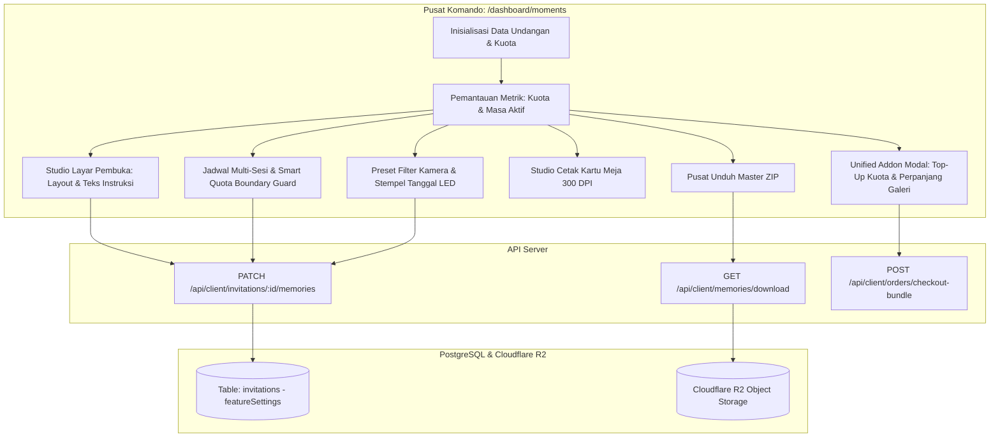

# DOKUMENTASI RESMI: TAHAP GUEST MOMENTS & CLOUD MEMORIES
**Luxenary Invite Platform — Pusat Kendali Kamera Virtual, Multi-Sesi & Kuota Pintar**

Dokumen ini membedah arsitektur, alur kerja operasional, komponen antarmuka, serta kontrak API pada modul **Manajemen Momen Tamu & Galeri Kenangan** (`/dashboard/moments`), ruang kerja khusus tempat calon pengantin mengonfigurasi kamera virtual, mengatur batas kuota multi-sesi, mencetak kartu panduan meja tamu, mengunduh arsip foto beresolusi penuh, dan memperpanjang masa aktif galeri kenangan.

---

## 1. Arsitektur Komando Momen & Alur Data

Halaman `/dashboard/moments` bertindak sebagai *Pusat Kendali Operasional* mandiri yang terpisah dari Studio Editor web undangan, memberikan pengantin instrumen komprehensif untuk mengelola interaksi visual para tamu di hari bahagia.

---

## 2. Pemantauan Metrik Utama (Header Dashboard)

Panel atas halaman menyajikan 4 metrik operasional terpenting:
1. **Total Kuota Foto Acara:**
   Total kuota foto yang dapat diunggah para tamu, dihitung secara dinamis dari kombinasi kuota paket dasar (`memories_total_quota_{plan}`) ditambah kuota add-on top-up yang telah dibayar lunas (`extraMemoriesQuota`).
2. **Foto Terunggah & Sisa Kuota:**
   Jumlah foto yang telah berhasil masuk ke galeri R2 beserta persentase sisa kuota yang masih dapat dimanfaatkan tamu.
3. **Status Kamera Virtual:**
   - `AKTIF`: Kamera terbuka dan siap menerima jepretan tamu sesuai jadwal sesi.
   - `TERKUNCI`: Pengunggahan telah ditutup oleh pengantin atau acara telah berstatus `EVENT_FINISHED`.
4. **Masa Simpan Galeri Digital:**
   Penghitung mundur hari aktif galeri kenangan sebelum pengarsipan otomatis.

---

## 3. Kustomisasi Layar Pembuka Tamu (*Guest Moment Opening*)

Ketika tamu memindai barcode di meja resepsi atau membuka `/sharemoment`, mereka disambut oleh kartu sambutan digital (*Opening Card*) yang ramah tanpa memaksa izin kamera seketika:

- **Pilihan 3 Gaya Tata Letak (`memoriesOpeningLayout`):**
  1. `POLAROID_MINIMAL` (*Vintage Polaroid*): Kertas foto polaroid instan vintage dengan aksen pin jarum, tanggal acara, dan tombol kapsul minimalis.
  2. `VINTAGE_FILM` (*35mm Negative Strip*): Rol film analog Kodak/Fujifilm klasik dengan lubang sprocket film, penghitung frame, dan stempel oranye.
  3. `MODERN_ELEGANT` (*Dark Luxury Gold*): Kanvas *glassmorphism* malam elegan berpadu aksen emas hangat dan tipografi mewah.
- **Teks Petunjuk Tamu Kustom (`memoriesCardInstruction`):**
  Pengantin dapat menuliskan pesan personal bagi para tamu (contoh: *"Abadikan momen candid penuh tawa Anda bersama kami hari ini!"*).
- **Sinkronisasi Dua Arah:**
  Pembaruan pada modal `GuestOpeningSetupModal.tsx` secara otomatis tersinkronisasi dua arah dengan basis data melalui endpoint `/api/client/invitations/[id]/memories`.

---

## 4. Jadwal Multi-Sesi & Pembatas Kuota Otomatis (*Smart Quota Boundary Guard*)

Untuk mencegah seluruh kuota habis di acara pembuka dan menjamin ketersediaan kuota pada resepsi malam atau after party:

### A. Konfigurasi Multi-Sesi (`memoriesSessions`)
Pengantin dapat membuat sesi tanpa batas (misal: Sesi Akad Nikah, Sesi Resepsi Siang, Sesi After Party Malam) dengan rincian:
- Nama sesi.
- Tanggal & rentang jam aktif (jam mulai s/d jam selesai).
- Alokasi kuota foto maksimal untuk sesi tersebut.

### B. Mekanisme Pembatas Kuota Cerdas (*Smart Boundary Guard*)
1. **Pembatasan Ketikan Real-Time (Client-Side Clamping):**
   Saat pengantin mengetik angka alokasi kuota pada salah satu sesi, sistem langsung mengkalkulasi sisa kuota yang belum terpakai oleh sesi-sesi lainnya:
   $$\text{maxAllowed} = \text{totalEventQuota} - \sum \text{alokasi sesi lainnya}$$
   Nilai input dibatasi otomatis secara halus menggunakan `Math.min(input, maxAllowed)`. Pengantin secara fisik tidak akan pernah bisa menginput angka yang melampaui sisa kuota yang tersedia.
2. **Aksi Penyeimbang Cepat (Quick-Balance Tools):**
   - **Tombol "Bagi Rata Kuota":** Membagi total kuota acara ke seluruh sesi yang terdaftar secara proporsional dalam 1 klik.
   - **Tombol "Pakai Sisa (X)":** Tampil di samping tiap kolom input sesi untuk langsung mengisi kuota sesi tersebut dengan sisa kuota yang belum dialokasikan.
   - **Deteksi Anomali & Tombol Perbaiki:** Jika terdapat anomali data riwayat, sistem menampilkan badge peringatan merah beserta tombol *"Perbaiki & Bagi Rata"* yang menyeimbangkan kuota secara instan.
3. **Validasi Sisi Server (Backend Enforcement):**
   Handler `PATCH /api/client/invitations/[id]/memories` memeriksa total kuota seluruh sesi terhadap `maxTotalPhotos`. Jika ditemukan kelebihan alokasi, server secara otomatis memotong (*clamp*) nilai sesi terakhir agar tepat bernilai seimbang, menjamin integritas data di level database.

---

## 5. Pengaturan Roll Film & Jatah Jepretan Tamu

Melalui modal **Atur Jatah Roll**, pengantin dapat menentukan berapa banyak foto yang dapat diambil oleh satu perangkat tamu (1–30 jepretan per tamu).
- **Prinsip Anti-Hangus (Non-Pre-Reservation):** Kuota foto dihitung berdasarkan foto riil yang diunggah. Jika seorang tamu hanya menggunakan 3 dari 10 jatah roll-nya, 7 sisa kuota tersebut tetap berada di pool acara untuk tamu lainnya.
- **Boundary Clamping Tamu Terakhir:** Saat sisa kuota pool acara tinggal sedikit (misal tersisa 4 foto sementara jatah roll disetel 10), sistem secara cerdas menyesuaikan `effectiveShots = Math.min(10, 4)` sehingga kuota dapat habis secara tepat tanpa error.

---

## 6. Studio Cetak Kartu QR Meja & Standing Banner

Komponen `PrintableQRCardModal.tsx` menyediakan generator materi fisik cetak siap pakai untuk diletakkan di venue:
- **4 Ukuran Standar Percetakan:**
  - `A3`: Standing Easel Banner (di pintu masuk ballroom atau samping meja photobooth).
  - `A4`: Table Standee (di meja penerima tamu / meja VIP).
  - `A5`: Tent Card Lipat Segitiga (di setiap meja makan tamu).
  - `4R`: Mini Akrilik (di samping piring tamu atau meja suvenir).
- **Kustomisasi Judul & Deskripsi:**
  Pengantin dapat menyesuaikan judul kartu dan instruksi pemindaian barcode.
- **Ekspor Resolusi Tinggi 300 DPI:**
  Tombol *Unduh Kartu Cetak* menghasilkan berkas grafis beresolusi tinggi 300 DPI siap cetak di percetakan tanpa pecah.

---

## 7. Pusat Pengunduhan Master ZIP Foto Tamu

- **Pengunduhan 1-Klik:**
  Seluruh foto asli yang diunggah tamu dapat diunduh dalam 1 arsip `.zip` melalui endpoint `/api/client/memories/download`.
- **Indikator Progres Bertahap:**
  Proses pengunduhan menampilkan persentase progres nyata (*fetching*, *downloading*, *zipping*, *done*) untuk kenyamanan pengantin.
- **Proteksi Data Berjalan (Early Lock Modal):**
  Jika pengantin mengunduh arsip ZIP saat acara masih berlangsung, sistem menampilkan modal konfirmasi bahwa pengunduhan akan sekaligus menutup izin unggah tamu agar tidak ada foto yang tertinggal pasca-unduh.

---

## 8. Unified Add-on Modal (Top-Up Kuota & Perpanjangan Galeri)

Pengantin dapat memperluas kapabilitas kamera virtual melalui modal terpadu:
1. **Top-Up Kuota Foto Acara:** Tambahan kuota foto (+200, +500 foto) yang langsung aktif dan dapat dialokasikan ke jadwal sesi.
2. **Perpanjangan Masa Simpan Galeri (+30 Hari):** Memperpanjang masa tayang album kenangan digital sebelum pengarsipan permanen.
3. **Pembayaran Instan via QRIS Dinamis:** Transaksi diproses melalui kasir pembayaran terpadu 1-Invoice dengan verifikasi otomatis instan.
