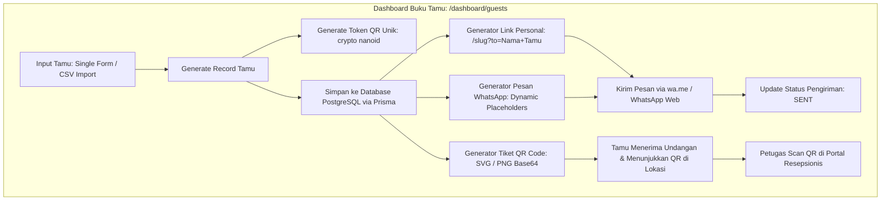

# DOKUMENTASI RESMI: TAHAP MANAJEMEN BUKU TAMU & QR
**Luxenary Invite Platform — Personalisasi Tautan, Generator Tiket QR, & WhatsApp Broadcast**

Dokumen ini membedah spesifikasi teknis modul **Buku Tamu Digital** (`/dashboard/guests`), yang memungkinkan pasangan pengantin mengelola daftar undangan, membagi kategori tamu, menghasilkan tautan personalisasi unik, membuat tiket QR check-in, dan mengirim undangan massal via WhatsApp.

---

## 1. Arsitektur Manajemen Tamu Digital

Modul Tamu dirancang untuk skala ratusan hingga ribuan undangan dengan efisiensi tinggi:



---

## 2. Struktur Data & Model Tamu (`Guest`)

Setiap tamu yang tersimpan di dalam basis data memiliki atribut lengkap:

| Kolom Database | Tipe Data | Keterangan |
|---|---|---|
| `id` | `String (cuid)` | Primary key unik tamu |
| `invitationId` | `String` | Relasi ke model `Invitation` |
| `name` | `String` | Nama lengkap tamu (ditampilkan pada sampul: *"Kepada Yth. Bapak/Ibu..."*) |
| `phone` | `String?` | Nomor WhatsApp tamu (format standar Indonesia: `08...` atau `628...`) |
| `category` | `String?` | Kategori tamu (`VIP`, `KELUARGA`, `TEMAN_KANTOR`, `TEMAN_SEKOLAH`, `UMUM`) |
| `qrToken` | `String (unique)` | Token acak unik terenkripsi untuk validasi check-in meja resepsionis |
| `waStatus` | `String` | Status pengiriman pesan (`PENDING`, `SENT`) |
| `sessionInfo` | `String?` | Penanda sesi kehadiran tamu (misal: "Sesi 1: 10.00 - 12.00" atau "Akad & Resepsi") |
| `guestLimit` | `Int` | Kuota maksimal jumlah orang / pax yang boleh dibawa oleh tamu ini |
| `tableNumber` | `String?` | Nomor atau nama meja yang dialokasikan untuk tamu di venue resepsi |
| `isCheckedIn` | `Boolean` | Penanda apakah tamu sudah hadir dan memindai QR di resepsionis |
| `checkedInAt` | `DateTime?` | Timestamp waktu pemindaian QR saat kedatangan tamu |

---

## 3. Generator Tautan Personalisasi Dinamis

Platform secara otomatis memetakan domain aktif undangan klien untuk menghasilkan URL yang valid:

1. **Resolusi Domain:**
   - Jika klien memasang Custom Domain aktif: `https://wedding-andi-siti.com/?to=Nama+Tamu`
   - Jika klien menggunakan Subdomain: `https://andi-siti.luxenary.com/?to=Nama+Tamu`
   - Jika menggunakan Path Slug standar: `https://luxenary.com/andi-siti?to=Nama+Tamu`
2. **URL Encoding Otomatis:**
   Nama tamu secara otomatis di-encode (`encodeURIComponent`) agar gelar kehormatan, tanda koma, dan spasi dapat diakses secara sempurna oleh browser (misal: `?to=Prof.+Dr.+Bambang%2C+M.Sc.`).
3. **Penyuntikan ke Halaman Undangan:**
   Saat link tersebut dibuka oleh tamu, parameter `?to=` ditangkap oleh rendering engine untuk:
   - Menulis nama tamu di kartu sampul depan.
   - Menghubungkan secara otomatis form RSVP dengan record tamu tersebut tanpa tamu perlu mengetik namanya kembali.
   - Menampilkan kuota pax dan nomor meja tamu secara personal.

---

## 4. Templating & Integrasi WhatsApp Broadcast

Klien disediakan 4 preset pesan WhatsApp siap pakai dan fleksibilitas kustomisasi penuh:

### Preset Teks Bawaan:
1. **Formal & Sakral (Standar):** Bahasa sopan standar adat Indonesia.
2. **Islami Penuh Berkah:** Dimulai dengan salam dan doa berkah pernikahan.
3. **Modern & Santai:** Gaya komunikasi akrab cocok untuk teman sebaya.
4. **Singkat & Elegan:** Langsung menyampaikan inti tautan undangan.

### Variabel Dinamis (Dynamic Placeholders):
Ketika pesan disusun, sistem secara otomatis mengganti token berikut dengan data riil:
- `{nama_tamu}` — Nama lengkap tamu yang bersangkutan.
- `{link_undangan}` — Tautan personal undangan dengan parameter `?to=...`.
- `{nama_mempelai}` — Nama panggilan kedua mempelai (contoh: "Andi & Siti").
- `{kuota_tamu}` — Alokasi jumlah pax tamu.
- `{sesi_acara}` — Informasi sesi atau jam kehadiran yang dialokasikan.

### Proteksi Anti-Prematur & Kebijakan Status DRAFT:
Untuk melindungi pengantin dari risiko pengiriman tautan keliru atau tautan mati sebelum undangan resmi siap:
- **Saat Status DRAFT:** Tombol *Kirim WA* dan *Salin* dikunci (*disabled*) dengan penanda gembok. Tautan `{link_undangan}` tidak merender URL simulasi palsu melainkan berstatus aman hingga undangan dipublikasikan.
- **Saat Status PUBLISHED:** Tombol *Kirim WA* dan *Salin* otomatis aktif dan menyala hijau, siap digunakan untuk distribusi massal ke seluruh tamu.

### Tombol Aksi 1-Klik Kirim:
Ketika tombol WhatsApp ditekan pada baris tamu (saat berstatus PUBLISHED), browser langsung membuka protokol WhatsApp resmi:
```
https://wa.me/6281234567890?text=Kepada%20Yth...
```
Setelah diklik, status tamu di tabel otomatis berubah menjadi `SENT` untuk memudahkan pelacakan progres distribusi undangan.

---

## 5. Generator Tiket QR Code & Validasi Resepsionis

1. **Keunikan Token QR (`qrToken`):**
   Setiap tamu memiliki token unik 12-karakter acak (*nano id/uuid*) yang tidak dapat ditebak.
2. **Download Tiket Individual:**
   Klien dapat mengunduh file gambar QR Code individual tamu untuk dicetak pada kartu fisik atau dikirimkan sebagai lampiran gambar.
3. **Penyematan di Undangan Web:**
   QR Code otomatis muncul di bagian bawah undangan digital tamu jika seksi akses QR diaktifkan pada Studio Editor.
4. **Validasi Meja Resepsionis:**
   Petugas resepsionis hanya perlu memindai kode QR tersebut menggunakan kamera ponsel/laptop pada portal `/s/[subdomain]/receptionist`. Sistem langsung memvalidasi keabsahan tiket dalam hitungan milidetik.

---

## 6. Fitur Import & Export CSV Massal

- **Import Massal CSV:**
  - Mengunggah file `.csv` berisi ratusan data tamu sekaligus.
  - Mendukung header standar: `Nama`, `Nomor WhatsApp`, `Kategori`, `Sesi`, `Jumlah Kuota`, `Nomor Meja`.
  - Sistem melakukan pembersihan otomatis terhadap format nomor HP (mengubah `08...` menjadi `628...`).
- **Export Data ke Spreadsheet:**
  - 1-klik unduh seluruh daftar tamu ke file CSV lengkap dengan status RSVP terkini, kuota, nomor meja, dan riwayat kehadiran check-in.
