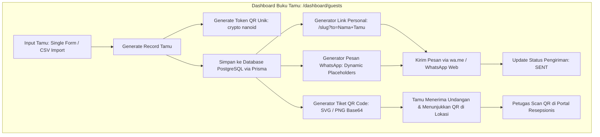

# DOKUMENTASI RESMI: TAHAP MANAJEMEN BUKU TAMU & QR
**Luxenary Invite Platform — Personalisasi Tautan, Generator Tiket QR, & WhatsApp Broadcast**

Dokumen ini membedah spesifikasi teknis modul **Buku Tamu Digital** (`/dashboard/guests`), yang memungkinkan pasangan pengantin mengelola daftar undangan, membagi kategori tamu, menghasilkan tautan personalisasi unik, membuat tiket QR check-in, dan mengirim undangan massal via WhatsApp.

---

## 1. Arsitektur Manajemen Tamu Digital

Modul Tamu dirancang untuk skala ratusan hingga ribuan undangan dengan efisiensi tinggi:


```mermaid
flowchart TD
    subgraph ClientDashboard [Dashboard Buku Tamu: /dashboard/guests]
        A[Input Tamu: Single Form / CSV Import] --> B[Generate Record Tamu]
        B --> C[Generate Token QR Unik: crypto nanoid]
        B --> D[Simpan ke Database PostgreSQL via Prisma]
        
        D --> E[Generator Link Personal: /slug?to=Nama+Tamu]
        D --> F[Generator Pesan WhatsApp: Dynamic Placeholders]
        D --> G[Generator Tiket QR Code: SVG / PNG Base64]
        
        E & F --> H[Kirim Pesan via wa.me / WhatsApp Web]
        H --> I[Update Status Pengiriman: SENT]
        
        G --> J[Tamu Menerima Undangan & Menunjukkan QR di Lokasi]
        J --> K[Petugas Scan QR di Portal Resepsionis]
    end
```

---

## 2. Struktur Data & Model Tamu (`Guest`)

Setiap tamu yang tersimpan di dalam basis data memiliki atribut lengkap:

| Kolom Database | Tipe Data | Keterangan |
|---|---|---|
| `id` | `String (uuid)` | Primary key unik tamu |
| `invitationId` | `String` | Relasi ke model `Invitation` |
| `name` | `String` | Nama lengkap tamu (ditampilkan pada sampul: *"Kepada Yth. Bapak/Ibu..."*) |
| `phone` | `String?` | Nomor WhatsApp tamu (format standar Indonesia: `08...` atau `628...`) |
| `category` | `String?` | Kategori tamu (`VIP`, `KELUARGA`, `TEMAN_KANTOR`, `TEMAN_SEKOLAH`, `UMUM`) |
| `qrToken` | `String? (unique)` | Token acak: UUID untuk tamu yang ditambah satu per satu, 16 karakter heksadesimal untuk impor massal. Dipakai sebagai kunci pencarian saat check-in disinkronkan ke server (lihat bagian 5) |
| `waStatus` | `String` | Status pengiriman pesan (`PENDING`, `SENT`) |
| `sessionInfo` | `String?` | Penanda sesi kehadiran tamu (misal: "Sesi 1: 10.00 - 12.00" atau "Akad & Resepsi") |
| `guestQuota` | `Int` (bawaan `1`) | Kuota maksimal jumlah orang / pax yang boleh dibawa oleh tamu ini |
| `tableNumber` | `String?` | Nomor atau nama meja yang dialokasikan untuk tamu di venue resepsi |
| `isTokenRedeemed` | `Boolean` (bawaan `false`) | Penanda satu arah bahwa tamu sudah check-in di resepsionis. Tidak ada kolom waktu check-in |
| `waSentAt` | `DateTime?` | Waktu pengiriman pesan WhatsApp (bersama `waStatus`) |

---

## 3. Generator Tautan Personalisasi Dinamis

Platform secara otomatis memetakan domain aktif undangan klien untuk menghasilkan URL yang valid:

1. **Resolusi Domain:**
   - Jika klien memasang Custom Domain aktif: `https://wedding-andi-siti.com/?to=Nama+Tamu`
   - Jika klien menggunakan Subdomain: `https://andi-siti.luxvite.id/?to=Nama+Tamu`
   - Jika menggunakan Path Slug standar: `https://luxvite.id/andi-siti?to=Nama+Tamu`
2. **URL Encoding Otomatis:**
   Nama tamu secara otomatis di-encode (`encodeURIComponent`) agar gelar kehormatan, tanda koma, dan spasi dapat diakses secara sempurna oleh browser (misal: `?to=Prof.+Dr.+Bambang%2C+M.Sc.`).
3. **Penyuntikan ke Halaman Undangan:**
   Saat link tersebut dibuka oleh tamu, parameter `?to=` ditangkap oleh rendering engine untuk:
   - Menulis nama tamu di kartu sampul depan.
   - Menghubungkan secara otomatis form RSVP dengan record tamu tersebut tanpa tamu perlu mengetik namanya kembali.
   - Menampilkan kuota pax dan nomor meja tamu secara personal.

---

## 4. Templating & Integrasi WhatsApp Broadcast

Klien disediakan 4 preset pesan WhatsApp siap pakai dan fleksibilitas kustomisasi penuh:

### Preset Teks Bawaan:
1. **Formal & Sakral (Standar):** Bahasa sopan standar adat Indonesia.
2. **Islami Penuh Berkah:** Dimulai dengan salam dan doa berkah pernikahan.
3. **Modern & Santai:** Gaya komunikasi akrab cocok untuk teman sebaya.
4. **Singkat & Elegan:** Langsung menyampaikan inti tautan undangan.

### Variabel Dinamis (Dynamic Placeholders):
Ketika pesan disusun, sistem secara otomatis mengganti token berikut dengan data riil:
- `{nama_tamu}` — Nama lengkap tamu yang bersangkutan.
- `{link_undangan}` — Tautan personal undangan dengan parameter `?to=...`.
- `{nama_mempelai}` — Nama panggilan kedua mempelai (contoh: "Andi & Siti").
- `{kuota_tamu}` — Alokasi jumlah pax tamu.
- `{sesi_acara}` — Informasi sesi atau jam kehadiran yang dialokasikan.

### Proteksi Anti-Prematur & Kebijakan Status DRAFT:
Untuk melindungi pengantin dari risiko pengiriman tautan keliru atau tautan mati sebelum undangan resmi siap:
- **Saat Status DRAFT:** Tombol *Kirim WA* dan *Salin* dikunci (*disabled*) dengan penanda gembok. Tautan `{link_undangan}` tidak merender URL simulasi palsu melainkan berstatus aman hingga undangan dipublikasikan.
- **Saat Status PUBLISHED:** Tombol *Kirim WA* dan *Salin* otomatis aktif dan menyala hijau, siap digunakan untuk distribusi massal ke seluruh tamu.

### Tombol Aksi 1-Klik Kirim:
Ketika tombol WhatsApp ditekan pada baris tamu (saat berstatus PUBLISHED), browser langsung membuka protokol WhatsApp resmi:
```
https://wa.me/6281234567890?text=Kepada%20Yth...
```
Setelah diklik, status tamu di tabel otomatis berubah menjadi `SENT` untuk memudahkan pelacakan progres distribusi undangan.

---

## 5. Generator Tiket QR Code & Validasi Resepsionis

1. **Keunikan Token QR (`qrToken`):**
   Setiap tamu menyimpan `qrToken` acak (UUID, atau 16 heksadesimal pada impor massal), tetapi QR di halaman undangan **tidak memuat `qrToken`**. Isinya `LUX|<id undangan>|<nama tamu>` (kontrak di `lib/checkinQr.ts`), dengan nama dari parameter `?to=`. QR dibuat di server sendiri lewat `GET /api/public/qr` (bukan layanan pihak ketiga, sehingga nama tamu tidak keluar dari server).
   - **Inisial di tengah QR:** `qrInitials` memberi 2 huruf untuk pernikahan (urutan sama dengan tampilan undangan) dan 1 huruf untuk acara tunggal (nama utama; gathering dari judul acara). Level koreksi QR H dengan lingkaran putih seluas 22% lebar QR; maksimal 2 karakter karena ruang tengah hanya cukup untuk itu. Belum ada kolom untuk mengubah inisial secara manual.
   - **Satu-satunya dua penolakan:** (1) QR milik acara lain (id undangan di QR tidak sama dengan id sesi resepsionis) dan (2) QR yang sudah pernah check-in. Nama yang tidak ada di daftar tamu **tidak ditolak**: server membuat tamu baru berkategori `UMUM` dengan token `OTS-<id undangan>-<waktu>-<acak>` dan langsung check-in. Kategori yang terbawa di QR tidak dipercaya, karena QR dapat dibuat siapa pun yang tahu formatnya. Tamu umum muncul di tab Buku Tamu klien dan di filter "Umum".
   - `POST /api/receptionist/scan` juga masih menerima `qrToken` biasa (tamu lama, dibatasi pada undangan yang sama).
   - Hanya perangkat dengan sesi resepsionis yang valid (lolos PIN) yang dapat memanggil rute ini; tanpanya HTTP 401. Batas 30 permintaan per menit per IP.
   - Karena QR hanya berisi id undangan dan nama, QR itu bukan rahasia; siapa pun yang tahu id undangan dan nama dapat membuatnya. Pengaman utamanya adalah penanda "sudah check-in" yang hanya bisa dipakai sekali per nama.
   - Check-in bersifat atomik dan idempoten (`isTokenRedeemed` diubah dengan `updateMany` bersyarat; pemindaian ulang dijawab "sudah pernah check-in"). Dua perangkat yang memindai nama baru yang sama dalam waktu bersamaan memakai satu baris tamu yang sama (ditangani lewat batas unik `P2002`).
2. **Download Tiket Individual:**
   Klien dapat mengunduh file gambar QR Code individual tamu untuk dicetak pada kartu fisik atau dikirimkan sebagai lampiran gambar.
3. **Penyematan di Undangan Web:**
   QR Code otomatis muncul di bagian bawah undangan digital tamu jika seksi akses QR diaktifkan pada Studio Editor.
4. **Validasi Meja Resepsionis:**
   Petugas resepsionis hanya perlu memindai kode QR tersebut menggunakan kamera ponsel/laptop pada portal `/s/[subdomain]/receptionist`. Sistem langsung memvalidasi keabsahan tiket dalam hitungan milidetik.

---

## 6. Fitur Import & Export CSV Massal Cerdas

Modul tamu dilengkapi sistem import CSV canggih yang dirancang tahan terhadap kebiasaan format regional:

- **Parser CSV Cerdas (Koma & Titik-Koma):**
  - Microsoft Excel pada locale Indonesia sering kali mengekspor CSV dengan delimiter titik-koma (`;`), sementara Google Sheets mengekspor dengan koma (`,`).
  - Sistem secara otomatis mendeteksi karakter pemisah di baris pertama dan membedah kolom secara akurat tanpa error.
- **Generator Template CSV Terpadu:**
  - Tombol *"Unduh Template CSV"* di dalam modal import langsung men-generate file CSV siap isi dari browser dengan header:
    `name,phoneNumber,category,guestCount,tableNumber`
  - Dilengkapi 3 baris data contoh realistis (VIP, Rekan Kantor, Keluarga).
- **Mini-Preview Validasi Sebelum Submit:**
  - Sebelum data dikirim ke endpoint `/api/client/guests/bulk`, modal menampilkan tabel tinjauan instan berisi nama, nomor HP, kategori, pax, dan nomor meja yang berhasil dibaca.
- **Sanitasi Nomor Kontak Otomatis:**
  - Menghapus karakter spasi, tanda strip (`-`), dan tanda kurung.
  - Mengonversi awalan lokal `08...` menjadi format internasional `628...` untuk kompatibilitas WhatsApp Web / App.
- **Export Data Lengkap ke Spreadsheet:**
  - 1-klik unduh seluruh daftar tamu ke format CSV lengkap dengan status pengiriman WA (`SENT`/`PENDING`), status kehadiran check-in resepsionis, dan nomor meja.

---

## 7. Integrasi Web Contact Picker API (Pilih dari Kontak HP)

Untuk kenyamanan pengantin yang menggunakan smartphone (khususnya Android Chrome), sistem mengintegrasikan **Web Contact Picker API** (`navigator.contacts.select`):

1. **Progressive Feature Detection:**
   - Sistem secara otomatis memeriksa apakah browser dan perangkat keras mendukung API Kontak:
     `"contacts" in navigator && "ContactsManager" in window`
   - Jika didukung, tombol *"Kontak HP"* aktif dan tampil di bilah alat (*toolbar*) serta di dalam modal *"Tambah Tamu"*. Jika tidak didukung (misal desktop browser), antarmuka tetap menyediakan form manual tanpa error.
2. **Pemilihan Kontak 1-Sentuhan:**
   - Klien cukup mengetuk tombol *"Pilih dari Kontak HP"* untuk membuka buku kontak native perangkat.
   - Klien memilih teman/keluarga, dan sistem otomatis mengisi bidang `Nama` serta `Nomor WhatsApp` secara instan.
3. **Pembersihan Data Kontak Native:**
   - Mengambil nama pertama & nama keluarga dari array data kontak, serta memformat nomor ponsel ke standar internasional yang siap kirim tautan WhatsApp.
