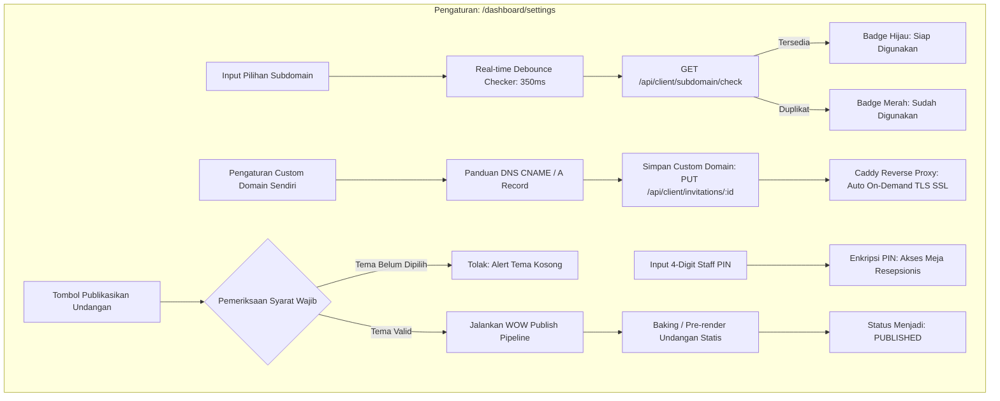

# DOKUMENTASI RESMI: TAHAP PENGATURAN AKUN, CUSTOM DOMAIN & ADD-ON
**Luxenary Invite Platform — Subdomain Real-Time, Pemetaan CNAME, Publikasi, & Siklus Add-on**

Dokumen ini membedah spesifikasi teknis modul **Pengaturan Undangan & Akun** (`/dashboard/settings`), mencakup tata kelola nama domain/subdomain, integrasi on-demand TLS, PIN resepsionis, kontrol status publikasi, serta pemesanan add-on perpanjangan aktif.

---

## 1. Arsitektur Domain & Publikasi Undangan



---

## 2. Manajemen Subdomain & Pemeriksa Ketersediaan Real-Time

1. **Format Subdomain Bawaan:**
   Klien berhak mendapatkan alamat subdomain gratis di bawah domain induk platform:
   ```
   https://[subdomain].luxenary.com
   ```
2. **Debounced Real-Time Checker:**
   - Input dipantau dengan delay debounce 350ms untuk menghemat kuota request ke database.
   - Karakter disaring secara ketat: hanya huruf kecil `a-z`, angka `0-9`, dan tanda hubung `-` (panjang minimal 3 karakter).
   - Endpoint `/api/client/subdomain/check` memverifikasi tabel `Invitation` untuk memastikan subdomain tidak sedang dipakai oleh klien lain.

---

## 3. Integrasi Custom Domain Sendiri (Branded URL)

Pasangan pengantin yang menginginkan kesan mewah eksklusif dapat menggunakan nama domain mereka sendiri (misalnya `www.andi-siti-wedding.com`).

### Panduan Konfigurasi DNS Klien:
Klien diarahkan ke dashboard registrar domain mereka (Niagahoster, Domainesia, Rumahweb, Cloudflare, Namecheap, dll) untuk menambahkan salah satu record berikut:

| Tipe DNS | Host / Name | Nilai Target (Target Value) | Keterangan |
|---|---|---|---|
| **CNAME** | `www` atau subdomain | `cname.luxenary.com` | Direkomendasikan untuk subdomain custom |
| **A Record** | `@` (Apex / Root) | `[IP_SERVER_VPS]` | Wajib jika menggunakan root domain tanpa `www` |

### Otomatisasi Sertifikat SSL (Zero-Config HTTPS):
Platform menggunakan server web **Caddy** dengan fitur *On-Demand TLS*. Begitu klien menyimpan nama domainnya di `/dashboard/settings` dan mengarahkan DNS-nya, Caddy akan secara otomatis menerbitkan sertifikat SSL resmi (Let's Encrypt / ZeroSSL) pada saat pertama kali domain tersebut diakses oleh tamu via HTTPS.

---

## 4. PIN Keamanan Meja Resepsionis (Staff PIN)

- Klien mengatur 4 digit angka rahasia (*Staff PIN*) pada kartu pengaturan.
- PIN ini berfungsi sebagai autentikasi bagi petugas penerima tamu di pintu venue acara untuk masuk ke portal pemindaian tiket QR (`/s/[subdomain]/receptionist`).
- Hal ini mencegah tamu undangan umum atau pihak luar menyalahgunakan portal resepsionis tanpa izin pengantin.

---

## 5. Mesin Rilis Undangan ("Smart Audit & Pre-Flight Review")

Untuk memberikan kepastian kepada pengantin tanpa ada data bolong (*Zero-Hole Policy*), platform menerapkan pipeline rilis resmi dua lapis:

1. **Pemindai Kelayakan Cerdas (*Smart Audit Protocol*):**
   - Pemindaian sekuensial 10 komponen data pada panel pengaturan.
   - **Seksi Bersakelar (`showGallery`, `showStory`, `showGift`, `showMusic`):**
     - Jika sakelar hidup (*toggle ON*): Wajib terisi lengkap. Jika kosong, pemindai langsung terhenti (*HALT*) dan meminta klien melengkapi data atau mematikan sakelar seksi tersebut.
     - Jika sakelar mati (*toggle OFF*): Ditampilkan secara transparan pada radar pemindai dengan status `Nonaktif (Dilewati)` dan otomatis lolos audit.
   - **Peran Data Awal & `placeholder`:** Database awal murni kosong (`null` atau `[]`) tanpa teks dummy buatan. Input form memanfaatkan atribut `placeholder="..."` sebagai pemandu visual tanpa mengotori data asli.
2. **Tinjauan Akhir Instrumen URL (*Pre-Flight Gatekeeper Checklist*):**
   - Setelah audit lolos, sistem menyajikan daftar 5 instrumen URL ekosistem:
     1. Pintu Utama / URL Asli: `https://luxenary.id/{invitationSlug}`
     2. Subdomain Eksklusif: `https://{subdomain}.luxenary.id`
     3. Simulasi Tautan Tamu: `https://{subdomain}.luxenary.id/?to=Nama+Tamu`
     4. Portal Resepsionis & QR: `https://{subdomain}.luxenary.id/receptionist` (PIN Panitia)
     5. Portal Live Momen: `https://{subdomain}.luxenary.id/sharemoment`
   - Tombol **"Rilis Undangan Resmi"** berstatus terkunci (*disabled*) hingga ke-5 instrumen URL terkonfirmasi 100% oleh klien.
3. **Baking Pipeline (Kompilasi & Pre-render):**
   - Saat tombol *"Rilis Undangan Resmi"* ditekan, antarmuka memproses pemanggangan file mandiri dan sinkronisasi CDN global.
   - Server memperbarui status `status = 'PUBLISHED'`, mengunci subdomain serta tema, dan menampilkan Hero Box Tautan Resmi.

---

## 6. Siklus Add-on & Pembaruan Layanan

Klien dapat memperluas kapabilitas undangannya melalui modul add-on:

1. **Perpanjangan Masa Aktif Galeri / Undangan (+30 Hari):**
   - Paket standar memiliki masa aktif tertentu (misal: 6 bulan pasca acara).
   - Klien dapat memperpanjang masa aktif penyimpanan foto & video di Cloudflare R2 dengan membeli voucher perpanjangan bulanan.
2. **Upgrade Tier Paket (Traditional $\rightarrow$ Modern $\rightarrow$ Premium):**
   - Klien dapat meningkatkan paket sewaktu-waktu.
   - Sistem secara otomatis menghitung selisih harga faktual:
     $$\text{Nominal Tagihan} = \text{Harga Paket Baru} - \text{Harga Paket Saat Ini}$$
   - Klien diarahkan ke kasir checkout untuk melunasi selisih tersebut, dan tier undangan langsung naik secara instan pasca pembayaran terkonfirmasi.
