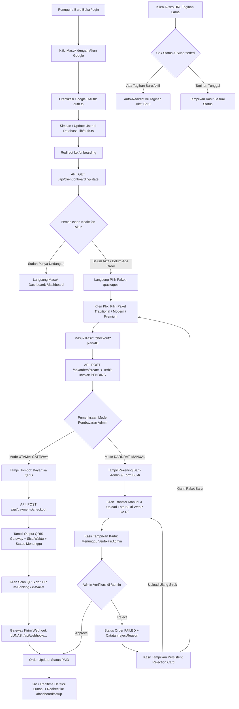

# DOKUMENTASI RESMI: ALUR REGISTRASI DAN PEMBAYARAN
**Luxenary Invite Platform**

Dokumen ini memuat spesifikasi teknis dan alur faktual sistem dari awal pengguna mendaftar dengan Google hingga menyelesaikan pembayaran invoice.

---

## 1. Prinsip Utama Alur Sistem

1. **Google Sign-In Pertama:** Pengguna baru hanya login dengan satu klik tombol Google OAuth.
2. **Auto-Check Keaktifan:** Sistem memeriksa status akun di database:
   - Jika **sudah aktif** (sudah memiliki undangan) ➔ Langsung masuk ke **Dashboard**.
   - Jika **belum aktif** (akun baru / belum punya paket) ➔ **Langsung diarahkan memilih paket (`/packages`)**.
3. **Fokus 1 Metode Pembayaran (Tidak Ada Keduanya):**
   - **Payment Gateway (QRIS) adalah Metode UTAMA:** Menampilkan output murni berupa gambar QRIS dari gateway aktif. Tidak ada pembiayaan lain (tidak ada cicilan, tidak ada kartu kredit, tidak ada VA).
   - **Transfer Bank Manual adalah Metode DARURAT:** Hanya aktif jika admin sengaja mengubah mode saat gateway sedang mengalami gangguan.
   - **Aturan Kasir:** Kasir **HANYA** memunculkan salah satu metode yang sedang aktif di pengaturan admin. Tidak pernah muncul keduanya secara bersamaan.

---

## 2. Diagram Alur (End-to-End Flow)



---

## 3. Rincian Teknis per Tahap

### TAHAP 1: Masuk dengan Akun Google
* **Halaman UI:** [`app/login/page.tsx`](file:///Users/armansyam/Documents/Project%20AmsDev/Luxenary-Invite/app/login/page.tsx)
* **Aksi Pengguna:** Menekan tombol tunggal *"Masuk dengan Akun Google"*.
* **Trigger Kode:**
  ```typescript
  signIn("google", { callbackUrl: "/onboarding" });
  ```
* **Eksekusi Backend ([`auth.ts`](file:///Users/armansyam/Documents/Project%20AmsDev/Luxenary-Invite/auth.ts) & [`lib/auth.ts`](file:///Users/armansyam/Documents/Project%20AmsDev/Luxenary-Invite/lib/auth.ts)):**
  - Mengambil data profil Google: `sub` (Google ID), `email`, `name`, `picture`.
  - Fungsi `upsertGoogleUser()` memeriksa database:
    - Jika user baru, sistem membuat baris baru di tabel `User` dengan `role: "CLIENT"`.
    - Jika user lama, data profil diperbarui.
  - NextAuth membuat cookie sesi JWT (`authjs.session-token`).
  - Browser otomatis diarahkan ke URL callback: `/onboarding`.

---

### TAHAP 2: Pengecekan Keaktifan Akun (Onboarding Hub)
* **Halaman UI:** [`app/onboarding/page.tsx`](file:///Users/armansyam/Documents/Project%20AmsDev/Luxenary-Invite/app/onboarding/page.tsx)
* **API Backend:** `GET /api/client/onboarding-state` ([`app/api/client/onboarding-state/route.ts`](file:///Users/armansyam/Documents/Project%20AmsDev/Luxenary-Invite/app/api/client/onboarding-state/route.ts))
* **Logika Keputusan:**
  1. Cek apakah ada record di tabel `Invitation` untuk user ini:
     - Jika **ADA** ➔ Return `redirectUrl: "/dashboard"`.
  2. Cek apakah ada record transaksi di tabel `Order`:
     - Jika **TIDAK ADA SAMA SEKALI** (Akun belum aktif) ➔ Return **`redirectUrl: "/packages"`**.
     - Jika ada transaksi `PAID` tapi belum isi setup ➔ Return `redirectUrl: "/dashboard/setup?order=ID&plan=PLAN"`.
     - Jika ada transaksi masih `PENDING` ➔ Return `redirectUrl: "/checkout?order=ID"`.
     - Jika ada transaksi `FAILED` karena ditolak admin (`rejectReason`) ➔ Tetap return `redirectUrl: "/checkout?order=ID"` agar klien melihat alasan penolakan dan mengunggah ulang bukti pembayaran pada tagihan yang sama.
     - Jika ada transaksi `EXPIRED` (QRIS kedaluwarsa) ➔ Return `redirectUrl: "/checkout?plan=PLAN&msg=qris_expired"` untuk pembuatan sesi pembayaran baru.

---

### TAHAP 3: Pemilihan Paket Undangan
* **Halaman UI:** [`app/packages/page.tsx`](file:///Users/armansyam/Documents/Project%20AmsDev/Luxenary-Invite/app/packages/page.tsx)
* **Data Dinamis:** Diambil dari endpoint `GET /api/public/settings` (konfigurasi `platform_packages` di `admin_settings`).
* **Pilihan Paket:**
  - **Traditional:** Koleksi tema adat nusantara.
  - **Modern:** Tema editorial modern sinematik.
  - **Premium:** Akses 15 tema lengkap.
* **Fitur & Kapabilitas Paket:**
  - Hanya membatasi resource server yang nyata:
    1. `Galeri Kenangan Tamu (Live Photo Drop)` (Storage Cloudflare R2).
    2. `QR Code Check-in Tamu` (Meja resepsionis hari-H).
  - *Catatan:* Tautan Live Streaming adalah seksi bawaan formulir acara yang bebas digunakan semua paket tanpa batasan checklist.
* **Aksi Pengguna:** Mengklik tombol *"Pilih Paket"* ➔ Mengarahkan ke `/checkout?plan=${packageId}`.

---

### TAHAP 4: Kasir Checkout
* **Halaman UI:** [`app/checkout/page.tsx`](file:///Users/armansyam/Documents/Project%20AmsDev/Luxenary-Invite/app/checkout/page.tsx)
* **Inisialisasi Invoice:**
  - Halaman kasir memanggil `POST /api/orders/create` ([`app/api/orders/create/route.ts`](file:///Users/armansyam/Documents/Project%20AmsDev/Luxenary-Invite/app/api/orders/create/route.ts)).
  - Membuat transaksi baru di tabel `Order` dengan `status: "PENDING"`.
* **Proteksi Siklus Transaksi Pending (Single Active Order per User):**
  - Klien yang bolak-balik antara `/packages` dan `/checkout` untuk mengubah paket (misal dari Traditional ke Premium) **TIDAK AKAN** melipatgandakan invoice di database.
  - Server menggunakan pola *Single Active Pending Order*: mengecek order `PENDING` atau `FAILED` (yang ditolak) yang sudah ada, lalu melakukan **`UPDATE` / Reuse** pada kolom `planType` dan `amount` pada invoice yang sama (`INV-...`), mereset status kembali ke `PENDING`, dan membersihkan penolakan lama.
  - Mencegah timbulan invoice sampah (*zero orphaned invoices*), menjaga database tetap bersih dan terstruktur.
  - **Penguncian Pengubahan Paket:**
    1. Jika barcode QRIS sudah aktif di layar, tombol *"Ubah"* otomatis disembunyikan untuk mencegah selisih pembayaran barcode.
    2. Jika bukti transfer manual sedang diverifikasi admin (`proofImageUrl` ada dan status `PENDING`), pengubahan paket ditolak oleh server agar nominal struk transfer tetap sinkron dengan tagihan invoice.
  - **Proteksi Tagihan Usang (Superseded Order Guard):**
    1. Jika klien membuka tautan riwayat/bookmark invoice lama (`?order=OLD_ID`) padahal sudah memiliki invoice baru yang aktif, kasir dan API `/api/client/orders/[id]/status` mendeteksi `isSuperseded: true` dan **otomatis me-redirect browser seketika** ke invoice aktif terbaru (`/checkout?order=NEW_ID`).
    2. Endpoint `POST /api/client/orders/[id]/upload-proof` menolak keras unggahan bukti bayar ke order lama yang sudah digantikan oleh order baru. Klien tidak akan pernah bisa melakukan pembayaran atau upload ganda ke invoice mati.
* **Logika Tampilan Berdasarkan Pengaturan Admin (`payment_mode`):**
  Kasir membaca setting dari database:
  - **Kondisi Normal (`payment_mode = "GATEWAY"`):**
    - HANYA menampilkan tombol **"Bayar via QRIS / E-Wallet"**.
    - Opsi transfer bank sama sekali tidak ditampilkan.
  - **Kondisi Darurat (`payment_mode = "MANUAL"`):**
    - HANYA menampilkan nomor rekening bank admin & formulir upload bukti transfer.
    - Opsi gateway/QRIS sama sekali tidak ditampilkan.

---

### TAHAP 5: Proses Pembayaran QRIS (Metode Utama)
* **API Checkout:** `POST /api/payments/checkout` ([`app/api/payments/checkout/route.ts`](file:///Users/armansyam/Documents/Project%20AmsDev/Luxenary-Invite/app/api/payments/checkout/route.ts))
* **Alur Eksekusi:**
  1. Klien menekan tombol *"Bayar via QRIS"*.
  2. Server memanggil driver gateway aktif (`midtrans`, `ipaymu`, `xendit`, `tripay`, atau `duitku`).
  3. Gateway menghasilkan **String Data QRIS Dinamis**.
  4. Layar kasir langsung menampilkan **Output Kotak QRIS**:
     - Gambar QR Code (300x300 px).
     - Nominal persis yang harus dibayar.
     - Timer hitung mundur kedaluwarsa QRIS.
     - Indikator: *"Menunggu Pembayaran Otomatis..."*.
  5. Pengguna membuka aplikasi m-Banking (BCA Mobile, Livin Mandiri, BRImo, BNI) atau e-Wallet (GoPay, OVO, Dana, ShopeePay) di HP mereka, lalu memindai kode QRIS tersebut.
  6. **Deteksi Realtime Tanpa Reload (Server-Sent Events):**
     - Browser klien mendengarkan streaming event dari:  
       [`app/api/payments/status-stream/[id]/route.ts`](file:///Users/armansyam/Documents/Project%20AmsDev/Luxenary-Invite/app/api/payments/status-stream/%5Bid%5D/route.ts).
  7. **Konfirmasi Masuk (Webhook Gateway):**
     - Server gateway mengirim sinyal Webhook ke endpoint sistem (`/api/webhook/[provider]`).
     - Sistem memvalidasi signature hash resmi dari gateway.
     - Status transaksi di database diubah menjadi **`status: "PAID"`, `paidAt: new Date()`**.
  8. **Otomatis Masuk ke Setup Wizard:**
     - Kasir mendeteksi perubahan status `PAID` seketika.
     - Browser langsung berpindah halaman ke:  
       `/dashboard/setup?order=${order.id}&plan=${order.planType}`.

#### A. Mekanisme Timer & Sinkronisasi Waktu Server (Anti-Drift)
* **Sumber Kebenaran Waktu:** Hitung mundur QRIS **TIDAK MENGGUNAKAN** jam lokal laptop/HP pengguna, melainkan **Waktu Server & Gateway**.
* **Cara Kerja (*Server-Time Offset*):**
  - Server selalu mengirimkan `serverTime: Date.now()` dan `expiryTimestamp` resmi dari gateway.
  - Browser menghitung selisih jam: `serverTimeOffset = serverTime - Date.now()`.
  - Setiap detik timer berdetak, perhitungan selisih diselaraskan:
    `syncedNow = Date.now() + serverTimeOffset`
    `diff = qrisExpiry - syncedNow`.
  - **Manfaat:** Kebal terhadap manipulasi atau kesalahan jam di device pengguna (waktu hitung mundur selalu akurat 100% dengan gateway).

#### B. Penanganan Kedaluwarsa (Expired Lifecycle)
* **Saat Timer Habis (`00:00`):**
  - Gambar QRIS **seketika dilenyapkan dari layar** untuk mencegah pembayaran ke barcode mati.
  - Kasir memunculkan pesan peringatan: *"QRIS sebelumnya sudah kedaluwarsa. Silakan bayar tagihan baru."*
  - Tombol bayar kembali aktif untuk meminta kode QRIS baru yang segar.
* **Jika Pengguna Membayar QRIS Expired di HP:**
  - Gateway (Midtrans/iPaymu) menolak transaksi di aplikasi m-Banking (*"Kode QRIS tidak berlaku"*). Saldo pengguna tidak akan terpotong.
* **Pencegahan Data Sampah di Database:**
  - Sistem **tidak membuat invoice baru** saat user mencoba bayar ulang paket yang sama.
  - Sistem mendaur ulang (*re-use*) record order yang expired tersebut dan mereset statusnya kembali ke `PENDING`.

#### C. Pembatalan & Proteksi Celah Waktu (Gateway Cancel Sync)
* **Sebelum Klik Bayar:** Pengguna bebas berpindah paket (`Ubah`), tidak ada order yang terkirim ke payment gateway.
* **Saat QRIS Tampil:** Tombol *"Ubah"* otomatis disembunyikan untuk mencegah transaksi ganda.
* **Sinkronisasi Batal ke Gateway:**
  - Pada gateway stateful (Midtrans & Xendit), sistem menembak API cancel resmi (`POST /v2/{orderId}/cancel`) saat order dibatalkan atau di-generate ulang.
  - Gateway mematikan transaksi lama secara permanen sehingga tidak bisa dibayar ganda.
* **Verifikasi Webhook Ketat:**
  - Webhook mencocokkan `gatewayTxId` aktif di database. Transaksi lama yang sudah dibatalkan tidak akan pernah mengaktifkan paket.

#### D. Independensi Browser (Tidak Wajib Standby di Kasir)
* **Tidak Harus Buka Kasir:** Pengguna boleh menutup browser atau mematikan laptop setelah scan QRIS.
* **Webhook Asynchronous:** Server gateway mengirimkan webhook konfirmasi lunas langsung ke server aplikasi secara *server-to-server*.
* **Auto-Resume:** Saat pengguna membuka web dan login kembali, API onboarding (`/api/client/onboarding-state`) langsung mendeteksi order sudah `PAID` dan mengantarkan pengguna langsung ke Setup Wizard (`/dashboard/setup`).

---

### TAHAP ALTERNATIF: Transfer Bank Manual (Hanya untuk Kondisi Darurat)
* **Kapan Digunakan:** Hanya saat Admin mengubah `payment_mode` menjadi `"MANUAL"` di menu Pengaturan Portal Admin karena gateway utama sedang gangguan teknis.
* **Prinsip Bebas Hardcode (Zero Hardcoded Fallback):**
  - Data rekening (`bank_name`, `bank_account_number`, `bank_account_holder`) murni ditarik 100% dari tabel `admin_settings`.
  - Dilarang keras menaruh fallback nama bank dummy (seperti `"BCA"`, `"1234567890"`, atau `"Nama PT / Pemilik"`).
  - Jika data rekening belum diisi di database, UI Admin dan Kasir wajib jujur menampilkan peringatan *"Informasi Rekening Belum Dikonfigurasi"*, bukan menampilkan rekening palsu.
* **Stabilitas Layar Kasir (Anti-Refresh / Anti-Flicker Loop):**
  - Inisialisasi kasir dikunci menggunakan `useRef` guard dan dependensi ID user primitif (`sessionUserId`).
  - Halaman kasir tidak akan pernah berkedip, looping, atau me-refresh sendiri saat menunggu input pengguna.
* **Alur Eksekusi:**
  1. Layar kasir menampilkan detail rekening bank tujuan resmi admin (jika sudah dikonfigurasi) dan nominal transfer.
  2. Klien mentransfer dana melalui ATM / m-Banking.
  3. Klien mengunggah foto struk/bukti transfer via tombol unggah (`POST /api/client/orders/[id]/upload-proof`). File gambar dikompresi otomatis via Sharp ke format WebP (1400px, 82%) dan diunggah ke storage Cloudflare R2 dengan penyajian super cepat melalui **Cloudflare Global Edge CDN Custom Domain** (`https://cdn.luxvite.id`).
  4. Layar kasir berganti menampilkan kartu hijau *"Menunggu Verifikasi Admin"* dengan pratinjau bukti transfer dan tombol WhatsApp langsung.
  5. **Auto-Polling:** Kasir mengecek status ke server setiap 5 detik via `GET /api/client/orders/[id]/status`.
  6. **Aksi Admin di Portal Admin (`/admin`):**
      - **Approve:** Menggunakan mekanisme *Inline Action Confirmation (Switch Button)* bebas popup alert/confirm browser. Tombol konfirmasi bertransisi halus di tempat menjadi `[Ya, Lunas]` dan `[Batal]` (dengan auto-revert 5 detik). Begitu dikonfirmasi, status order berubah menjadi `PAID`, order usang klien otomatis di-purge, dan kasir klien seketika otomatis berpindah ke Setup Wizard (`/dashboard/setup`).
     - **Reject:** Admin memasukkan alasan penolakan (misal: nominal kurang atau bukti buram). Endpoint `POST /api/admin/orders/[id]/reject` mengupdate order menjadi `status: "FAILED"` dengan catatan `rejectReason`. Order tersebut langsung dikelompokkan dan ditampilkan di tab **"Gagal / Dibatalkan"** serta tab **"Semua Transaksi"** pada Portal Admin dengan badge merah *"Ditolak"* dan rincian alasan penolakan.
  7. **Respon Penolakan di Sisi Klien (Persistent Rejection Card):**
     - **Jika klien standby di kasir:** Polling mendeteksi penolakan, memunculkan modal in-app yang elegan, dan seketika menampilkan **Kartu Peringatan Merah Permanen** di atas form upload struk berisi kutipan alasan resmi dari admin.
     - **Jika klien menutup tab / login kembali:** `GET /api/client/onboarding-state` secara pintar mengembalikan klien ke invoice yang sama (`/checkout?order=ID`). Kasir membaca `rejectReason` dari database dan langsung menampilkan kartu peringatan tersebut.
     - **Unggah Ulang (Zero Duplication):** Klien dapat langsung memilih foto struk baru dan mengklik unggah ulang pada invoice yang sama tanpa perlu membuat order baru dari awal. Order otomatis kembali berstatus `PENDING` dan catatan penolakan lama dibersihkan.
  8. **Proteksi Tagihan Usang & Single State Guard:**
      - Jika klien yang ditolak memutuskan beralih paket di katalog (`/packages`), sistem me-reuse record order yang ada dan mereset statusnya kembali ke `PENDING`.
      - **Klien yang Sudah Lunas (`isUserPaid`):** Akses ke halaman checkout manapun langsung dicegat dan dialihkan seketika ke Dashboard/Setup Undangan. Klien lunas dilarang keras membuka halaman kasir checkout lagi.
      - **Order yang Dihapus / Tidak Valid (404 Guard):** Jika klien membuka link order usang yang telah dimusnahkan dari database, kasir menampilkan pesan resmi *"Tagihan tidak ditemukan atau sudah tidak berlaku"* dan tidak akan pernah membuat order baru secara diam-diam.
   9. **Pembersihan Otomatis Bukti & Order Usang (*Auto-Purge Storage & Obsolete Orders*):**
       - Saat klien mengunggah bukti pembayaran baru (`upload-proof`), mengganti paket (`orders/create`), atau saat order disetujui lunas (`PAID` via webhook / admin approval):
         - Sistem memindai seluruh tagihan lama/usang milik klien tersebut yang berstatus non-PAID (`PENDING`, `FAILED`, `EXPIRED`).
         - Seluruh file foto struk lama pada order usang tersebut langsung dihapus permanen dari storage Cloudflare R2 (`deleteFile`), menghemat biaya dan mencegah kepenuhan kuota storage.
         - Record order usang tersebut dimusnahkan dari database PostgreSQL setelah relasi foreign key ke `Invitation` diputuskan (`orderId: null`).
       - Hasilnya: Portal Admin selalu bersih, bebas dari duplikasi invoice sampah, dan setiap klien hanya memiliki tepat 1 transaksi tunggal (*Single State*).

---

### TAHAP 6: Eksekusi Pasca-Bayar & Aktivasi Layanan ([`lib/upgradeHelper.ts`](file:///Users/armansyam/Documents/Project%20AmsDev/Luxenary-Invite/lib/upgradeHelper.ts))

Setiap kali transaksi disetujui lunas (baik otomatis via Webhook QRIS maupun manual via tombol persetujuan Admin), sistem mengeksekusi pipeline pasca-bayar:

1. **Pengiriman Email Invoice Lunas Asinkron (`lib/mailer.ts`):**
   - Mengirimkan rincian bukti transaksi lunas langsung ke alamat Gmail klien secara non-blocking (jika SMTP di Admin Settings sudah dikonfigurasi).
2. **Penegakan Arsitektur Single State (`purgeObsoleteUserOrders`):**
   - Otomatis mencari dan memusnahkan sisa draft/order usang non-PAID milik klien beserta seluruh file struknya di Cloudflare R2.
3. **Pencabangan Tipe Order (`orderType`):**
   - **`NEW`:** Transaksi paket pertama ➔ Mengarahkan klien masuk ke Formulir Setup Undangan ([`app/(client)/dashboard/setup/page.tsx`](file:///Users/armansyam/Documents/Project%20AmsDev/Luxenary-Invite/app/(client)/dashboard/setup/page.tsx)).
   - **`UPGRADE` (`applyUpgradePlan`):** Memperbarui `planType` pada order awal (`linkedOrderId`) ke tier yang lebih tinggi (misal: Modern ➔ Premium).
   - **`GALLERY_EXTENSION` (`applyGalleryExtension`):** Menambahkan **+30 hari** ke `galleryExpiresAt` pada undangan klien dan membuka kembali kunci unggah foto kenangan tamu (`memoriesUploadLocked: false`).
   - **`CUSTOM_DOMAIN_ADDON` (`applyCustomDomainAddon`):** Memasang domain kustom yang diminta (`requestedDomain`) ke undangan klien dan menambahkan masa aktif galeri selama **+365 hari (1 tahun)**.

---

## 4. Matriks File & Endpoint Faktual

| Tahap | Komponen UI | API / Endpoint Backend | Tabel Database Terkait |
| :--- | :--- | :--- | :--- |
| **1. Login Google** | `app/login/page.tsx` | NextAuth Google Provider (`auth.ts`) | `User` |
| **2. Cek Keaktifan** | `app/onboarding/page.tsx` | `GET /api/client/onboarding-state` | `Invitation`, `Order` |
| **3. Pilih Paket** | `app/packages/page.tsx` | `GET /api/public/settings` | `admin_settings` |
| **4. Buat / Reuse Order** | `app/checkout/page.tsx` | `POST /api/orders/create` | `Order` (`status: PENDING` / Single Order Reuse) |
| **5. Bayar QRIS** | `app/checkout/page.tsx` | `POST /api/payments/checkout` | `Order` (`gatewayId`, `snapToken`) |
| **6. Listener Realtime** | Browser Client | `GET /api/payments/status-stream/[id]` | SSE Stream |
| **7. Webhook Lunas** | Payment Gateway Server | `POST /api/webhook/[provider]` | `Order` (`status: PAID`) |
| **8. Upload Bukti Transfer** | `app/checkout/page.tsx` | `POST /api/client/orders/[id]/upload-proof` | `Order` (`proofImageUrl`, `status: PENDING`) |
| **9. Cek Status & Superseded** | `app/checkout/page.tsx` | `GET /api/client/orders/[id]/status` | `Order` (`status`, `isSuperseded`, `rejectReason`) |
| **10. Admin Tolak Bukti** | `app/(admin)/admin/page.tsx` | `POST /api/admin/orders/[orderId]/reject` | `Order` (`status: FAILED`, `rejectReason`) |
| **11. Admin Setujui Bukti** | `app/(admin)/admin/page.tsx` | `POST /api/admin/orders/[orderId]/approve` | `Order` (`status: PAID`, `paidAt`) |
| **12. Masuk Setup Undangan** | `app/(client)/dashboard/setup/page.tsx` | `POST /api/client/invitations/create` | `Invitation` |
