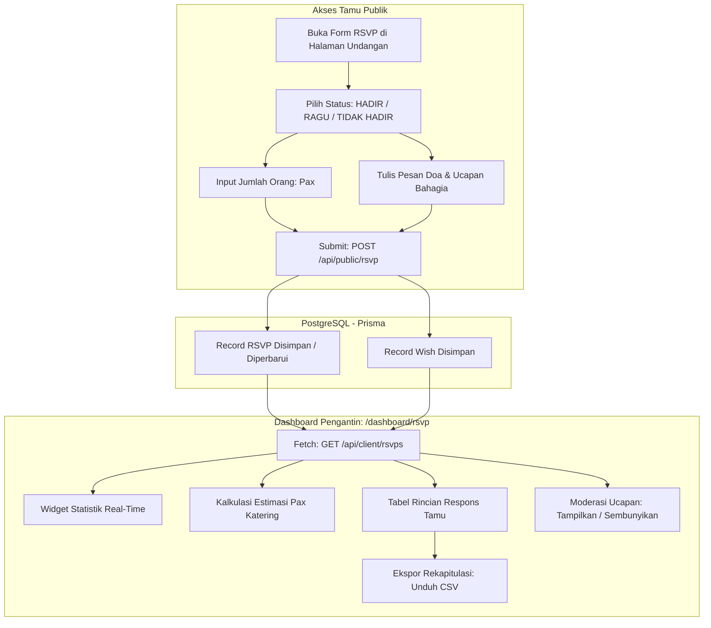

# DOKUMENTASI RESMI: TAHAP RSVP & MODERASI BUKU UCAPAN
**Luxenary Invite Platform — Rekapitulasi Kehadiran, Estimasi Katering, & Feed Doa Tamu**

Dokumen ini membedah arsitektur teknis dan alur operasional modul **RSVP & Moderasi Ucapan** (`/dashboard/rsvp`), instrumen penting bagi pasangan pengantin untuk memantau konfirmasi kehadiran tamu, menghitung kebutuhan porsi katering secara presisi, serta mengelola doa dan ucapan restu yang masuk dari para tamu.

---

## 1. Arsitektur Alur Data RSVP & Doa

---

## 2. Metrik & Analitik Kehadiran Real-Time

Dashboard RSVP menyajikan 5 kartu ringkasan analitik utama di baris teratas:

1. **Total Respons Masuk (`totalResponses`):**
   Jumlah akumulatif tamu yang telah mengisi formulir konfirmasi di halaman undangan.
2. **Konfirmasi Hadir (`attending`):**
   Jumlah tamu yang menyatakan pasti hadir.
3. **Konfirmasi Ragu-Ragu (`uncertain`):**
   Jumlah tamu yang masih mempertimbangkan jadwal atau belum dapat memastikan kehadiran.
4. **Konfirmasi Berhalangan Hadir (`declined`):**
   Jumlah tamu yang menyampaikan permohonan maaf karena tidak dapat hadir secara fisik.
5. **Total Ucapan & Doa (`totalWishes`):**
   Jumlah pesan doa restu yang ditulis oleh para tamu.

---

## 3. Kalkulasi Estimasi Porsi Katering (Pax Counting)

Salah satu tantangan terbesar pernikahan adalah pemborosan atau kekurangan makanan. Modul RSVP Luxenary Invite menyelesaikan masalah ini dengan:
- **Kalkulasi Akumulasi Pax:**
  Sistem menjumlahkan kolom `guestCount` dari seluruh tamu berstatus `ATTENDING`.
  $$\text{Total Pax Estimasi} = \sum (\text{guestCount}_{\text{attending}})$$
- **Penyesuaian Buffer Tamu Ragu-Ragu:**
  Pengantin dapat melihat potensi tambahan pax dari tamu berstatus `UNCERTAIN` untuk memesan kapasitas porsi cadangan (buffer 10–20%).

---

## 4. Moderasi Ucapan & Doa Tamu

Semua pesan yang dikirimkan tamu melalui undangan akan masuk ke dalam feed interaktif:
1. **Penyaringan Pesan (Search & Filter):**
   - Filter cepat berdasarkan status kehadiran (`Semua`, `Hadir`, `Ragu-Ragu`, `Tidak Hadir`).
   - Pencarian real-time berdasarkan kata kunci nama tamu atau potongan kalimat doa.
2. **Moderasi Konten (Hide / Show):**
   - Jika terdapat komentar yang mengandung kata-kata tidak sopan, spam, atau typo fatal, pengantin dapat menyembunyikan komentar tersebut dari halaman publik hanya dengan 1 klik.
   - Pesan yang disembunyikan tetap tersimpan di database internal pengantin namun tidak dirender pada feed publik tema.
3. **Fitur Balas Ucapan:**
   - Pengantin dapat memberikan respon terima kasih atas doa yang diberikan tamu. Balasan ini akan tampil dengan lencana khusus *"Balasan dari Mempelai"* di bawah komentar tamu.

---

## 5. Fitur Ekspor Data ke Spreadsheet (CSV)

Klien dapat mengunduh seluruh data konfirmasi kehadiran kapan saja dengan menekan tombol **"Ekspor CSV"**:
- **Format File:** `Rekap_RSVP_[NamaPlatform]_[Timestamp].csv`
- **Kolom yang Diekspor:**
  1. `Nama Tamu` — Nama pengisi atau nama tamu yang terhubung dengan link personal.
  2. `Status Kehadiran` — HADIR / RAGU-RAGU / TIDAK HADIR.
  3. `Jumlah Pax` — Angka jumlah orang yang akan hadir bersama tamu.
  4. `Pesan / Doa` — Teks lengkap ucapan restu yang ditulis tamu (dengan sanitasi tanda kutip).
  5. `Waktu Respon` — Tanggal dan jam pengisian dalam format waktu lokal Indonesia (`WIB/WITA/WIT`).
- File CSV ini dapat langsung dibuka di Microsoft Excel, Google Sheets, atau diserahkan langsung kepada pihak Wedding Organizer (WO) dan vendor katering.
