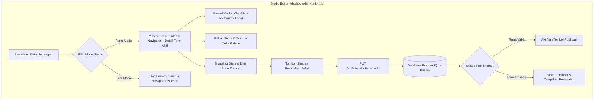

# DOKUMENTASI RESMI: TAHAP STUDIO EDITOR UNDANGAN
**Luxenary Invite Platform — Dual-Native Studio & Kustomisasi 16 Seksi Undangan**

Dokumen ini membedah arsitektur teknis, alur data, komponen UI, serta mekanisme penyimpanan pada tahap **Studio Editor Undangan** (`/dashboard/invitation/[id]`), ruang kerja utama tempat klien merancang, mengunggah media, mengonfigurasi palet warna, dan mempublikasikan undangan digital.

---

## 1. Arsitektur Dual-Native Studio & Master-Detail Navigator

Halaman Studio Editor menerapkan pola **Dual-Native Mode**:
1. **Form Mode (Panel Kustomisasi Master-Detail):** 
   - **Sidebar Navigator (Desktop $\ge$ lg):** Panel navigasi sticky vertikal di sebelah kiri dengan indikator progress `(X / 16)`, badge status revisi belum tersimpan (*dirty pulse indicator*), dan status modul.
   - **Horizontal Pills (Mobile / Tablet < lg):** Baris tombol pill horizontal yang dapat digeser (*scrollable*) di bagian atas layar.
   - **Detail Form Seksi Aktif (Panel Kanan):** Seksi yang dipilih langsung tersaji terbuka penuh (*always expanded*) tanpa akordion tersembunyi. Saat tombol "Simpan" ditekan, formulir tetap terbuka lebar dan tidak menutup sendiri (*zero auto-collapse*).
   - **Mobile UX Overhaul (Edge-to-Edge & Sticky Quick-Save Bar):** Pada layar ponsel, kanvas form membentang *edge-to-edge* untuk memaksimalkan area ketik, dilengkapi bilah melayang *Sticky Quick-Save Bar* di bawah layar sehingga pengantin dapat menyimpan revisi seksi dengan 1 ketukan tanpa perlu scroll ke ujung formulir.
2. **Live Visual Editor (Interactive Canvas Mode):** Tampilan kanvas WYSIWYG berbasis `iframe` yang merender pratinjau langsung secara real-time dengan tombol toggle *Viewport Switcher* (Mobile 390px vs Desktop Responsive).



---

## 2. Rincian 16 Seksi Modular Form Editor

Studio Editor membagi form input menjadi 16 seksi terorganisir untuk kenyamanan pengantin:

### Seksi 1: Tema Desain & Palet Warna (`SEC1`)
- **Akses Tema Penuh (All-Access Themes):**
  - Seluruh 16 tema terbuka penuh untuk semua tier paket (`TIER_1`, `TIER_2`, `TIER_3`).
  - Klien dapat bebas memilih tema sebelum undangan dipublikasikan (`DRAFT`). Pasca publikasi (`PUBLISHED`), pergantian tema dikunci untuk menjaga integritas file HTML statis.
- **Dynamic Color Palettes:**
  - Pemilihan preset palet warna (Default, Romantic Blush, Royal Gold, Emerald Forest, Midnight Navy, Vintage Sepia).
  - Menghasilkan token CSS Variables `--primary`, `--accent`, `--surface`, `--text-main` yang langsung disuntikkan ke rendering engine tema.
- **Validasi Anti-Kosong:**
  - Jika klien belum memilih tema (`themeId = ""`), seksi ini otomatis terbuka (*auto-expanded*) dan menampilkan badge peringatan merah di header editor.

### Seksi 2: Sampul & Visual Utama (`SEC2`)
- **Foto Sampul Pembuka (Cover Gate):** Gambar vertikal yang menjadi wajah pertama undangan sebelum amplop dibuka.
- **Foto Hero / Header Utama:** Foto orientasi horizontal/vertikal pengantin pada awal halaman undangan.
- **Badge / Penanda Tanggal Acara:** Tanggal pendek yang tercantum di badge sampul.

### Seksi 3: Profil Pasangan Mempelai (`SEC3`)
- **Mempelai Pria:**
  - Foto profil pria (Upload R2/Local dengan crop ratio 1:1 / 3:4).
  - Nama panggilan & nama lengkap beserta gelar akademik/adat.
  - Urutan anak dalam keluarga (misal: "Putra pertama dari...").
  - Nama lengkap kedua orang tua / wali.
  - Tautan akun Instagram (opsional).
- **Mempelai Wanita:**
  - Struktur data identik dengan mempelai pria.
- **Penentuan Urutan Nama Tampil:**
  - Saklar penentu siapa yang namanya tampil di awal (Pria dahulu atau Wanita dahulu), sesuai adat istiadat keluarga.

### Seksi 4: Kutipan Pembuka (`SEC4`)
- **Preset Kutipan Lengkap (Lintas Agama & Sastra Populer):**
  - Islam: Q.S. Ar-Rum ayat 21.
  - Kristen / Katolik: 1 Korintus 13:4-7, Kejadian 2:24.
  - Hindu: Rgveda X.85.42.
  - Buddha: Mangala Sutta.
  - Sastra / Puisi Romantis: Sapardi Djoko Damono ("Aku ingin mencintaimu dengan sederhana..."), Kahlil Gibran ("Sang Nabi").
  - Universal: Janji Suci & Harapan.
- **Custom Quote & Attribution:** Field kustomisasi teks kutipan bebas, judul seksi (Kutipan Cinta / Kata Mutiara / Pappaseng / Ayat Suci), beserta sumber/referensi kutipan.

### Seksi 5: Rangkaian Acara (`SEC5`)
- **Daftar Event Dinamis (Multi-Event Support):**
  - Akad Nikah / Pemberkatan / Ijab Qobul.
  - Resepsi Pernikahan / Walimatul 'Urs.
  - Acara Adat (Mappacci, Siraman, Midodareni, Tea Pai, dll).
- **Atribut per Acara:**
  - Nama acara, tanggal, jam mulai s/d selesai (atau "Selesai").
  - Nama gedung / tempat, alamat lengkap.
  - Zona waktu (WIB, WITA, WIT).
  - Link navigasi Google Maps & kode embed iframe maps.
  - Tombol aksi *"Simpan ke Google Calendar"*.

### Seksi 6: Kartu Akses QR & Check-In Meja Tamu (`SEC6`)
- Pengaturan penayangan QR Code tiket masuk di bagian bawah undangan tamu.
- Opsi untuk mengaktifkan teks instruksi: *"Tunjukkan QR Code ini kepada petugas resepsionis saat tiba di lokasi acara."*

### Seksi 7: Kisah Cinta / Love Story Timeline (`SEC7`)
- Saklar aktifkan/nonaktifkan seksi.
- Daftar babak perjalanan cinta:
  - Tahun / Tanggal momen (Contoh: "Pertama Bertemu - 2021", "Lamaran - 2024").
  - Judul momen & paragraf cerita.
  - Foto kenangan momen tersebut.

### Seksi 8: Galeri Foto & Video Prewedding (`SEC8`)
- Galeri foto grid interaktif dengan lightbox full-screen.
- Integrasi video prewedding dari YouTube / Vimeo atau video storage R2.

### Seksi 9: Tanda Kasih & Amplop Digital (`SEC9`)
- **Saklar Fitur Amplop:** Menghidupkan/mematikan seksi tanda kasih secara global.
- **Multi-Rekening Bank & E-Wallet:**
  - Pilihan bank tujuan (BCA, Mandiri, BNI, BRI, BSI, Bank Jago, CIMB, dll) dan e-wallet (GoPay, OVO, Dana, ShopeePay).
  - Nomor rekening & nama pemilik rekening dengan tombol 1-klik salin rekening instan.
- **Unggah QRIS Statis Pembayaran (`slot: QRIS`):**
  - Pengantin dapat mengunggah gambar QRIS statis untuk scan pembayaran langsung dari mobile banking / dompet digital tamu.
  - File fisik otomatis dikompresi ke WebP 800×800 px dan disimpan pada `public/uploads/invitations/[id]/qris.webp`.
- **Alamat Pengiriman Kado Fisik:**
  - Alamat rumah/kantor untuk penerimaan bingkisan kado fisik dari tamu undangan.
- **Aturan Cerdas Penayangan Tab Undangan (*Smart Dynamic Gift Section*):**
  - **Hanya Digital (Rekening / QRIS):** Jika alamat pengiriman kado dikosongkan, tab *"Kirim Kado"* otomatis disembunyikan 100% dan tidak ada teks fallback dummy Makassar yang muncul. Tamu langsung disajikan kartu rekening / scan QRIS tanpa tombol tab.
  - **Hanya QRIS (Tanpa Rekening Bank):** Jika pengantin hanya mengunggah QRIS tanpa mendaftarkan rekening bank, sistem hanya menampilkan kartu QRIS murni tanpa menyisipkan kartu bank tiruan.
  - **Hanya Kado Fisik (Alamat Saja):** Jika pengantin hanya mengisi alamat kado, kartu alamat langsung tampil tanpa tab transfer.
  - **Keduanya Ada (Digital + Fisik):** Jika nomor rekening/QRIS dan alamat kado sama-sama diisi, kedua tab (*Transfer Bank / QRIS* dan *Kirim Kado*) otomatis aktif berdampingan.

### Seksi 10: Panduan Busana / Dress Code (`SEC10`)
- **Dress Code Visual Color Studio**:
  - Bulatan warna interaktif (*Visual Swatches*) dengan *isolated local state* (pembaruan visual instan 0ms tanpa me-render ulang seluruh halaman saat drag warna) & *color picker* langsung di layar tanpa perlu menghafal kode HEX.
  - 8 Preset tren warna pernikahan 1-klik (*Earthy Terracotta, Sage & Champagne, Dusty Rose, dll.*).
  - Tombol pintar `✨ Samakan Tema` untuk menyelaraskan busana dengan tema fisik aktif.
  - Pratinjau instan (*Live Guest Preview*) kartu busana tamu.
  - Mode lanjutan input manual kode hex untuk desainer/WO.
- Catatan tambahan himbauan busana dan etika kehadiran tamu.

### Seksi 11: Live Streaming Pernikahan (`SEC11`)
- Penayangan siaran langsung bagi tamu yang berhalangan hadir.
- URL streaming (YouTube Live, Instagram Live, Zoom Meeting).

### Seksi 12: Filter Instagram Pengantin (`SEC12`)
- Tautan filter AR Instagram kustom milik pengantin agar tamu dapat merekam momen dengan filter bertuliskan nama mempelai.

### Seksi 13: Turut Mengundang (`SEC13`)
- Daftar nama keluarga besar, tokoh adat, kerabat, atau kolega terhormat yang turut mengundang.

### Seksi 14: Galeri Kenangan Tamu / Live Moments (`SEC14`)
- **Pusat Komando Kamera Tamu:**
  - Pengaturan preset filter analog (*Aura '90s*, *Heritage Romance*, *Botanical Mist*, *Cinema Noir*, *Pure Daylight*).
  - Pilihan gaya layar pembuka HP tamu (`memoriesOpeningLayout`): *Editorial Showcase*, *Cinematic Hero*, *Polaroid Nostalgia*.
  - Stempel tanggal retro LED analog (`memoriesDateStamp`) & mode Delayed Reveal kamar gelap.
- **Jadwal Multi-Sesi & Pembatas Kuota Otomatis (*Smart Quota Boundary Guard*):**
  - Klien dapat mengatur multi-sesi kamera (Akad Nikah, Resepsi, After Party) dengan pembagian kuota foto per sesi.
  - **Pembatas Ketikan Real-Time:** Input kuota per sesi secara otomatis dibatasi (*clamped*) maksimal ke sisa kuota yang belum dialokasikan ke sesi lain, sehingga total alokasi tidak akan pernah bisa melebihi kuota total acara.
  - **Tombol Pintasan:** Tombol *"Bagi Rata Kuota"* untuk membagi rata total kuota acara ke seluruh sesi dalam 1 klik, serta tombol *"Pakai Sisa (X)"* di tiap baris sesi.
  - **Validasi Sisi Server (Backend):** Endpoint `/api/client/invitations/[id]/memories` menjamin validasi kuota server-side agar total alokasi sesi tidak pernah melampaui `maxTotalPhotos`.

### Seksi 15: Pengaturan Teks UI & Label (`SEC15`)
- **Kustomisasi Formulir RSVP:**
  - Teks tombol kirim RSVP (`customLabels.rsvpBtnText`) — Contoh: *"Kirim Konfirmasi & Doa"*, *"Kirim RSVP"*.
  - Judul seksi RSVP (`rsvpTitle`), label nama tamu (`rsvpNameLabel`), status kehadiran (`rsvpStatusLabel`), kuota pax (`rsvpCountLabel`), dan pesan ucapan (`rsvpMessageLabel`).
- **Kustomisasi Sampul & Tombol Buka:**
  - Teks tombol buka undangan (`openBtn`) — Contoh: *"Buka Undangan"*, *"Open Invitation"*.
  - Subtitle sampul pembuka (`coverSubtitle`) — Contoh: *"UNDANGAN PERNIKAHAN"*.
- **Kustomisasi Label Hitung Mundur (Countdown Timer):**
  - Penamaan unit waktu: Hari (`cdDays`), Jam (`cdHours`), Menit (`cdMins`), Detik (`cdSecs`).

### Seksi 16: Mitra & Vendor Pernikahan / Wedding Credits (`SEC16`)
- **Penghargaan Karya & Ekosistem Vendor:**
  - Ruang apresiasi resmi bagi seluruh tim profesional di balik kesuksesan hari bahagia pengantin (Wedding Organizer, Fotografer, Videografer, MUA, Busana/Attire, Dekorator, Venue, Katering, Band/Musik, Sound & Lighting, MC, dll).
- **Format Input & Struktur Data:**
  - Setiap entri vendor memuat:
    - **Kategori Vendor:** Dropdown preset terstandarisasi (*Wedding Organizer*, *Photographer*, *Videographer*, *Makeup Artist (MUA)*, *Attire / Busana*, *Decoration*, *Venue*, *Catering*, *Band & Music*, *Sound & Lighting*, *Master of Ceremonies (MC)*, *Souvenir*, *Kue Pengantin / Cake*, *Undangan & Kaligrafi*, *Lainnya*).
    - **Nama Vendor / Brand:** Nama studio atau entitas bisnis vendor (contoh: *"Lentera Fotografi"*).
    - **Tautan Profil / Akun:** Link Instagram (`https://instagram.com/...`) atau website resmi vendor.
    - **Logo / Identitas Visual:** Upload logo resmi vendor yang disimpan aman di storage Cloudflare R2 / lokal.
- **Desain Antarmuka Compact Single-Row Strip UI:**
  - Menghindari kartu blok (*card wrap*) kaku bawaan AI. Menggunakan tata letak baris strip ringkas (*compact horizontal strip*) yang elegan dengan warna autentik logo vendor, pemisahan link yang terisolasi (*visited link color isolation*), dan tombol aksi cepat.
- **Kustomisasi Teks & Eyebrow:**
  - Pengantin dapat menyesuaikan judul seksi (`customLabels.vendorTitle`), subjudul (`customLabels.vendorSubtitle`), dan teks pemanis (*eyebrow*: `customLabels.vendorEyebrow`).
- **Penayangan di Undangan Publik:**
  - Ditayangkan secara presisi di atas bagian penutup (*closing footer*) undangan tanpa merusak tata letak visual tema.

---

## 3. Sistem Audio Player & Kebijakan Autoplay

1. **Pustaka Musik Sistem & Custom Upload:**
   - Klien dapat memilih lagu instrumen romantis berlisensi dari katalog sistem.
   - Opsi upload file MP3 sendiri ke Cloudflare R2 dengan batas ukuran aman (maks 10MB).
2. **Web Audio API Policy Enforcement:**
   - Browser modern memblokir audio autoplay sebelum ada interaksi pengguna (*user gesture*).
   - Audio diinisialisasi dalam keadaan `muted/paused` dan baru dipicu saat tamu menekan tombol **"Buka Undangan"** pada sampul pembuka.
   - Di dalam undangan, tersedia tombol melayang (*floating music disk*) untuk memutar / menjeda lagu kapan saja.

---

## 4. Siklus Penyimpanan & Kontrak API

- **Endpoint Simpan Data:**
  - `PUT /api/client/invitations/[id]`
- **Format Payload:**
  ```json
  {
    "themeId": "kalandra",
    "colorPalette": "midnight-navy",
    "groomName": "Andi Pratama",
    "groomNickname": "Andi",
    "brideName": "Siti Nurhaliza",
    "brideNickname": "Siti",
    "musicUrl": "https://pub-r2.luxvite.id/audio/wedding-song.mp3",
    "events": [
      {
        "title": "Akad Nikah",
        "date": "2026-10-15",
        "startTime": "09:00",
        "endTime": "11:00",
        "location": "Masjid Raya Saoraja",
        "mapsUrl": "https://maps.google.com/..."
      }
    ],
    "stories": [],
    "bankList": [],
    "showVendors": true,
    "vendors": [
      {
        "id": "v1",
        "category": "Photographer",
        "name": "Lentera Story",
        "url": "https://instagram.com/lenterastory",
        "logo": "/uploads/invitations/inv-1/vendor-logo.webp"
      }
    ]
  }
  ```
- **Prinsip Zero-Loss & Visual Header Dirty Tracking:** Setiap seksi form memiliki pemantau perubahan mandiri (`isDirty.secX`). Ketika seksi memiliki perubahan yang belum disimpan (termasuk saat seksi ditutup/dilipat), header seksi langsung menampilkan notifikasi tipografi bersih tanpa card: **"Perubahan belum tersimpan • Simpan"**. Pengantin dapat langsung menyimpan seksi tersebut dengan 1 klik tanpa harus membuka akordion kembali. Begitu data tersimpan, teks otomatis lenyap dan header kembali bersih total.

---

## 5. Proteksi Pasca Publikasi, Mode Darurat, & Atomic Single Deploy

1. **Penguncian Studio Pasca Publikasi (`PUBLISHED`):**
   - Begitu undangan resmi terbit, seluruh formulir di tab Edit Undangan (`/dashboard/invitation/[id]`) otomatis terkunci rapat (`isLocked = true`, `lockReason = "PUBLISHED"`).
   - Menampilkan kartu proteksi minimalis elegan dengan ikon gembok vektor SVG modern, penjelasan pemeliharaan data, dan tombol langsung ke WhatsApp Admin CS.
2. **Mekanisme Buka Kunci Darurat (Admin Emergency Unlock):**
   - Klien yang memerlukan revisi mendesak (ralat jam acara, link Maps gedung, typo nama orang tua) dapat mengajukan pembukaan Kunci Darurat.
   - Administrator membuka akses edit darurat melalui panel `/admin` (`adminUnlockedUntil`, default 24 jam).
3. **Staging Save (Bebas dari Beban Perulangan Bake):**
   - Selama masa darurat terbuka, tombol "Simpan" di masing-masing seksi hanya memperbarui data ke PostgreSQL database.
   - Kompilasi file HTML statis dan upload ke Cloudflare R2 sengaja ditangguhkan (*deferred*) agar server tidak mengalami *rebake storm* berkali-kali.
4. **Atomic Single Deploy & Auto-Lock (`DEPLOY_AND_LOCK`):**
   - Banner darurat di puncak form menyediakan tombol aksi: **"Perbarui Undangan & Kunci Kembali"**.
   - Saat ditekan, sistem menjalankan **1 kali kompilasi tunggal** (`buildAndSavePublishedHtml` dan `syncDraftToR2`) langsung ke live CDN, lalu otomatis menghapus izin darurat (`adminUnlockedUntil = null`).
   - Studio seketika terkunci kembali secara otomatis tanpa perlu menunggu masa 24 jam habis.
5. **Daur Ulang Subdomain:**
   - Jika klien mengganti subdomain saat revisi, nilai lama otomatis terlepas dari basis data Prisma (`@unique`) dan kembali tersedia di pool publik secara instan. Kunjungan ke link lama dialihkan secara aman ke beranda dengan notice `subdomain-available`.
