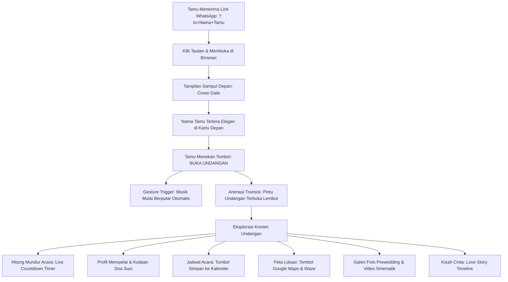

# DOKUMENTASI RESMI: PENGALAMAN TAMU UNDANGAN (USER JOURNEY)
**Luxenary Invite Platform — Interaktivitas Sampul, Kontrol Audio, Agenda, & Navigasi**

Dokumen ini membedah alur perjalanan pengguna (*guest experience journey*) ketika menerima dan membuka undangan digital Luxenary Invite, mencakup interaktivitas sampul, kepatuhan kebijakan audio peramban, penunjuk lokasi, dan navigasi acara.

---

## 1. Alur Perjalanan Tamu (Guest Journey)



---

## 2. Sampul Pembuka Interaktif (Cover Gate)

Untuk memberikan pengalaman emosional layaknya membuka surat undangan fisik mewah:
1. **Layar Penuh Eksklusif (*Full Viewport Gate*):**
   Saat pertama kali dimuat, tamu hanya melihat visual sampul artistik, inisial nama mempelai, dan kartu penerima bertuliskan:
   *"Kepada Yth. Bapak/Ibu/Saudara/i [Nama Tamu]"*.
2. **Scroll Lock:**
   Halaman utama terkunci (*overflow: hidden*) sebelum tamu menekan tombol *"Buka Undangan"*, mencegah tamu melihat konten bagian dalam secara prematur.

---

## 3. Kebijakan Audio Autoplay & Floating Music Controller

1. **Pemenuhan Kebijakan Autoplay Browser Modern:**
   - Peramban modern (Google Chrome, Apple Safari, Mozilla Firefox) memblokir audio yang berputar tanpa interaksi pengguna.
   - Tombol *"Buka Undangan"* berfungsi sebagai **User Gesture Trigger** resmi. Begitu tombol diklik, Web Audio API memulai playback musik latar dengan volume lembut (*fade-in*).
2. **Floating Audio Controller (Piringan Musik Melayang):**
   - Di sudut layar, terdapat widget piringan hitam (*vinyl disc*) yang berputar saat musik aktif.
   - Tamu memiliki kendali penuh untuk menjeda (*pause*) atau melanjutkan (*play*) musik kapan saja jika sedang berada di tempat umum atau situasi hening.

---

## 4. Rangkaian Acara, Countdown Timer, & Kalender

1. **Live Countdown Timer:**
   Menghitung mundur sisa hari, jam, menit, dan detik menuju momentum ijab qobul / resepsi utama secara real-time.
2. **Multi-Event Scheduler:**
   Menampilkan agenda terpisah antara Akad Nikah, Resepsi Siang/Malam, atau Prosesi Adat lengkap dengan alamat dan zona waktu (`WIB`, `WITA`, `WIT`).
3. **1-Klik Simpan ke Google Calendar / iCal:**
   Tamu dapat menekan tombol *"Simpan ke Kalender"*. Sistem menghasilkan tautan kalender dinamis:
   ```
   https://calendar.google.com/calendar/render?action=TEMPLATE&text=Pernikahan+Andi+%26+Siti&dates=20261015T020000Z/20261015T060000Z...
   ```
   Acara otomatis tersimpan di ponsel tamu lengkap dengan alarm pengingat 1 hari sebelumnya.

---

## 5. Peta Lokasi Digital & Navigasi Waze / Google Maps

1. **Peta Interaktif Tersemat (Embedded Map):**
   Peta lokasi gedung/rumah terpasang langsung di dalam halaman sehingga tamu dapat memperbesar (*zoom*) tanpa keluar dari undangan.
2. **Tombol Navigasi Cepat:**
   - **Google Maps:** Membuka rute panduan turn-by-turn navigasi mobil/motor.
   - **Waze:** Opsi rute alternatif untuk menghindari kemacetan kota.
