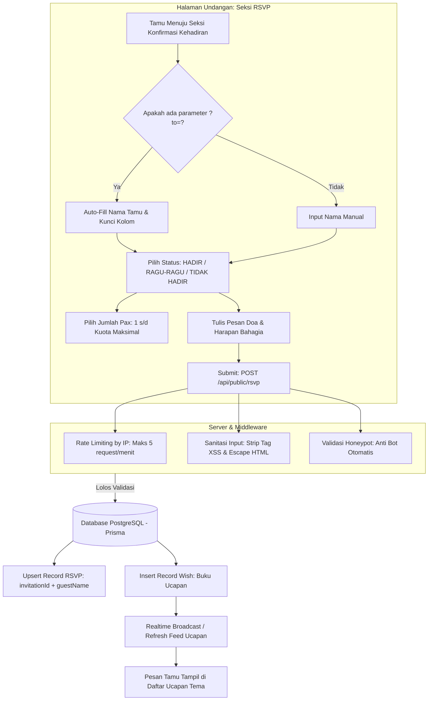

# DOKUMENTASI RESMI: SISTEM RSVP & BUKU UCAPAN PUBLIK
**Luxenary Invite Platform — Formulir Konfirmasi Kehadiran, Keamanan Anti-Spam, & Feed Doa Tamu**

Dokumen ini membedah arsitektur pemrosesan konfirmasi kehadiran (**RSVP**) dan penerimaan pesan doa restu publik (`/api/public/rsvp`), mencakup pengisian otomatis nama tamu, validasi keamanan, serta penyajian feed ucapan interaktif.

---

## 1. Arsitektur Alur RSVP & Pengiriman Doa

---

## 2. Formulir Konfirmasi Kehadiran (RSVP Form)

Formulir dirancang sederhana dan cepat diisi dari smartphone:
- **Nama Tamu:** Otomatis terisi jika tamu membuka undangan melalui link personalisasi WhatsApp (`?to=Nama+Tamu`).
- **Pilihan Status Kehadiran:**
  - `HADIR` — Tamu memastikan akan datang ke acara.
  - `RAGU-RAGU` — Tamu masih menyesuaikan jadwal.
  - `TIDAK HADIR` — Tamu berhalangan hadir namun tetap ingin menyampaikan doa restu.
- **Jumlah Pax (Orang):** Menentukan berapa orang yang akan mendampingi tamu (dibatasi sesuai kuota undangan yang diberikan pengantin).
- **Kolom Doa & Ucapan:** Kotak teks untuk menyampaikan harapan tulus kepada kedua mempelai.

---

## 3. Keamanan Tingkat Tinggi & Pencegahan Spam (Anti-Spam Shield)

Untuk melindungi platform dari serangan bot dan spamming komentar:
1. **IP-Based Rate Limiting:**
   Menggunakan in-memory sliding window limiter yang membatasi maksimal 5 pengiriman RSVP per alamat IP dalam kurun waktu 1 menit.
2. **Honeypot Hidden Field:**
   Sistem menyertakan input tersembunyi (*honeypot*). Jika field ini terisi (indikasi kuat bot otomatis yang mengisi semua input formulir), request langsung dibuang (*silent reject*).
3. **Pembersihan XSS (Cross-Site Scripting):**
   Seluruh input teks doa disanitasi menggunakan `escapeHtml` untuk mencegah penyuntikan script berbahaya (`<script>`, `onerror`, dll).

---

## 4. Feed Buku Ucapan & Balasan Pengantin

1. **Penyajian Real-Time:**
   Setiap doa baru yang berhasil dikirimkan akan langsung muncul pada kartu ucapan di bawah formulir RSVP.
2. **Lencana Balasan Resmi Pengantin:**
   Jika pengantin membalas ucapan tamu dari dashboard mereka, balasan tersebut akan muncul bersarang (*nested card*) di bawah ucapan tamu bersangkutan dengan lencana elegan:
   *"Balasan dari Mempelai"*.
3. **Paginasi & Infinite Scroll:**
   Feed dirancang ringan dengan memuat 10 komentar per batch sehingga tidak memperlambat kinerja browser meskipun ada ratusan ucapan yang masuk.
