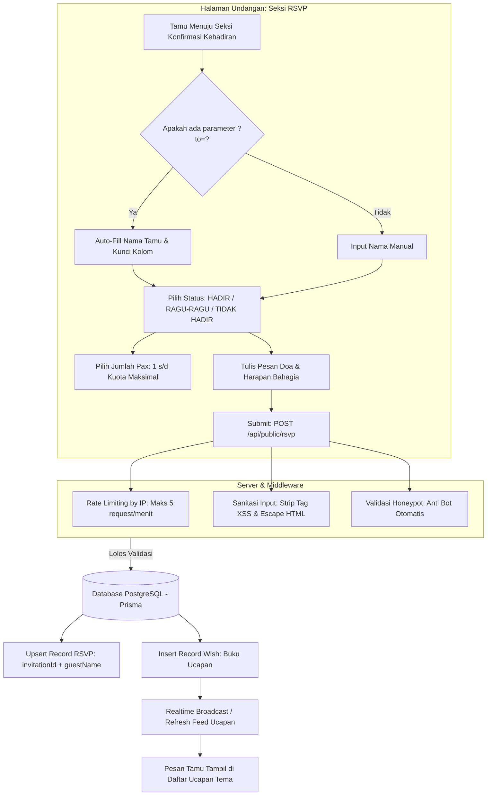

# DOKUMENTASI RESMI: SISTEM RSVP & BUKU UCAPAN PUBLIK
**Luxenary Invite Platform — Formulir Konfirmasi Kehadiran, Keamanan Anti-Spam, & Feed Doa Tamu**

Dokumen ini membedah arsitektur pemrosesan konfirmasi kehadiran (**RSVP**) dan penerimaan pesan doa restu publik (`/api/public/rsvp`), mencakup pengisian otomatis nama tamu, validasi keamanan, serta penyajian feed ucapan interaktif.

---

## 1. Arsitektur Alur RSVP & Pengiriman Doa

```mermaid
flowchart TD
    subgraph BrowserTamu [Halaman Undangan: Seksi RSVP]
        A[Tamu Menuju Seksi Konfirmasi Kehadiran] --> B{Apakah ada parameter ?to=?}
        B -->|Ya| C[Auto-Fill Nama Tamu & Kunci Kolom]
        B -->|Tidak| D[Input Nama Manual]
        
        C & D --> E[Pilih Status: HADIR / RAGU-RAGU / TIDAK HADIR]
        E --> F[Pilih Jumlah Pax: 1 s/d Kuota Maksimal]
        E --> G[Tulis Pesan Doa & Harapan Bahagia]
        
        G --> H[Submit: POST /api/public/rsvp]
    end
    
    subgraph ProteksiServer [Server & Middleware]
        H --> I[Rate Limiting by IP: Maks 5 request/menit]
        H --> J[Sanitasi Input: Strip Tag XSS & Escape HTML]
        H --> K[Validasi Honeypot: Anti Bot Otomatis]
    end
    
    ProteksiServer -->|Lolos Validasi| L[(Database PostgreSQL - Prisma)]
    L --> M[Upsert Record RSVP: invitationId + guestName]
    L --> N[Insert Record Wish: Buku Ucapan]
    
    N --> O[Realtime Broadcast / Refresh Feed Ucapan]
    O --> P[Pesan Tamu Tampil di Daftar Ucapan Tema]
```

---

## 2. Formulir Konfirmasi Kehadiran (RSVP Form)

Formulir dirancang sederhana dan cepat diisi dari smartphone:
- **Nama Tamu:** Otomatis terisi jika tamu membuka undangan melalui link personalisasi WhatsApp (`?to=Nama+Tamu`).
- **Pilihan Status Kehadiran:** Nilai yang dikirim form bergantung pada tema (diukur dari 39 berkas tema): 15 tema mengirim `hadir` / `tidak`; 17 tema mengirim `HADIR` / `TIDAK_HADIR` (14 di antaranya juga `RAGU`); sisanya (enam tema non-wedding dan `vintage-forest`) memakai markup tanpa `<option value>` status yang terukur.
  - Server hanya membedakan "hadir" (tanpa peka huruf besar); hanya status ini yang menyimpan jumlah pax.
  - Status lain, termasuk `RAGU` dan `TIDAK_HADIR`, tersimpan apa adanya dengan pax 0 dan tampil sebagai "Berhalangan" di feed ucapan. Server tidak memvalidasi nilai status terhadap daftar tertentu.
  - **Ketidaksesuaian yang diketahui di dasbor klien:** statistik dan filter (`app/api/client/rsvps/route.ts`, `app/(client)/dashboard/rsvp/page.tsx`) membandingkan `hadir`, `tidak`, dan `ragu` tanpa peka huruf besar. `TIDAK_HADIR` tidak sama dengan `tidak`, sehingga RSVP "tidak hadir" dari tema yang mengirim `TIDAK_HADIR` tidak ikut hitungan "Tidak Hadir" dan tidak muncul di filternya (dibuktikan dengan mengevaluasi logika rute pada status sampel; belum diuji lewat sesi klien nyata). `HADIR` dan `RAGU` terhitung benar.
- **Jumlah Pax (Orang):** Tamu terdaftar (nama cocok dengan buku tamu, tanpa peka huruf besar) dibatasi `guestQuota` yang diatur pengantin; tamu umum yang membuka tautan langsung dibatasi 2 orang. Angka yang lebih besar dipotong tanpa pesan error (diuji: kuota 4, permintaan 9, tersimpan 4).
- **Kirim Ulang:** Nama yang sama (tanpa peka huruf besar) memperbarui baris RSVP yang sudah ada, bukan membuat baris baru (diuji: id baris sama).
- **Kolom Doa & Ucapan:** Kotak teks untuk menyampaikan harapan tulus kepada kedua mempelai.

---

## 3. Keamanan Tingkat Tinggi & Pencegahan Spam (Anti-Spam Shield)

Untuk melindungi platform dari serangan bot dan spamming komentar:
1. **Rate Limiting Berbasis PostgreSQL (berlaku lintas worker PM2 dan restart):**
   - Kirim RSVP (`POST /api/public/rsvp`): maksimal 10 per menit per IP, dan maksimal 200 per menit per undangan (tetap menahan banjir bila IP klien tidak dapat dipercaya).
   - Baca feed ucapan (`GET /api/public/rsvp`): maksimal 30 per menit per IP.
   - Kelebihan batas dijawab HTTP 429 (diuji: permintaan ke-11 dan ke-31 dari IP yang sama).
2. **Tidak ada honeypot maupun CAPTCHA.** Perlindungan spam hanya rate limit di atas; tidak ada field tersembunyi di rute server maupun di tema.
3. **Penanganan XSS:**
   Nama dan pesan disimpan apa adanya. Feed ucapan untuk tamu lain di-escape (`&`, `<`, `>`) saat dirender oleh skrip yang disuntikkan mesin tema, sehingga payload `<script>` atau `` tampil sebagai teks (diuji dengan payload nyata). Sembilan dari 39 tema menampilkan ucapan yang baru saja dikirim pengirimnya lewat `innerHTML` tanpa escape; dampaknya terbatas pada browser pengirim sendiri (self-XSS), bukan tamu lain.
4. **Tidak ada batas panjang input.** Nama, pesan, dan status tidak dibatasi panjangnya di server (diuji: pesan 60 KB diterima, disimpan, dan dikembalikan utuh oleh feed). Batas 10 per menit per IP dan 50 baris per pembacaan feed adalah satu-satunya pembatas.

---

## 4. Feed Buku Ucapan & Balasan Pengantin

1. **Penyajian Real-Time:**
   Setiap doa baru yang berhasil dikirimkan akan langsung muncul pada kartu ucapan di bawah formulir RSVP.
2. **Lencana Balasan Resmi Pengantin:**
   Jika pengantin membalas ucapan tamu dari dashboard mereka, balasan tersebut akan muncul bersarang (*nested card*) di bawah ucapan tamu bersangkutan dengan lencana elegan:
   *"Balasan dari Mempelai"*.
3. **Paginasi & Infinite Scroll:**
   Feed dirancang ringan dengan memuat 10 komentar per batch sehingga tidak memperlambat kinerja browser meskipun ada ratusan ucapan yang masuk.
