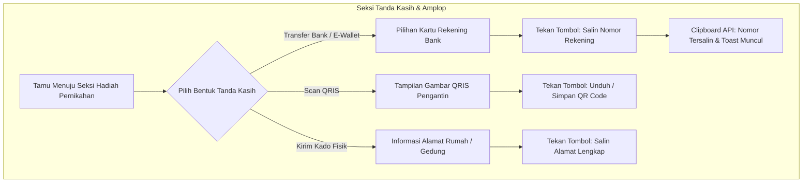

# DOKUMENTASI RESMI: TANDA KASIH & AMPLOP DIGITAL PUBLIK
**Luxenary Invite Platform — Multi-Rekening Bank, QRIS Statis, & Pengiriman Kado Fisik**

Dokumen ini membedah arsitektur dan alur interaksi seksi **Tanda Kasih (Amplop Digital & Kado)** pada undangan publik, memberikan kemudahan bagi para tamu yang ingin menyampaikan tanda kasih dan kado pernikahan secara aman dan tanpa uang tunai (*cashless*).

---

## 1. Arsitektur Tanda Kasih & Hadiah Pengantin

---

## 2. Multi-Rekening Bank & E-Wallet

1. **Pilihan Multi-Kanal:**
   Pengantin dapat menampilkan beberapa rekening bank sekaligus untuk memberikan fleksibilitas kepada tamu (misal: Rekening Mempelai Pria di Bank Mandiri, dan Rekening Mempelai Wanita di BCA atau Bank Syariah Indonesia).
2. **Visual Kartu ATM Eksklusif:**
   Setiap rekening ditampilkan dalam kartu visual bergaya kartu debit elegan dengan logo bank resmi, nama pemilik rekening yang jelas, dan nomor rekening berukuran besar.
3. **1-Klik Salin Nomor Rekening (Clipboard Copy API):**
   - Tamu tidak perlu menghafal atau mencatat nomor rekening secara manual.
   - Menekan tombol *"Salin Nomor"* akan langsung memanggil `navigator.clipboard.writeText()`.
   - Browser menampilkan umpan balik visual (*toast notification*) bertuliskan:
     *"Nomor rekening berhasil disalin!"*.

---

## 3. Fitur QRIS Statis Pengantin

Bagi tamu yang terbiasa menggunakan aplikasi m-banking atau e-wallet (BCA Mobile, Livin' Mandiri, GoPay, OVO, Dana):
- Undangan menampilkan gambar QRIS statis milik pengantin.
- Tamu dapat langsung memindai QRIS tersebut menggunakan ponsel kedua, atau menekan tombol **"Simpan QRIS"** untuk menyimpan gambar ke galeri smartphone lalu mengunggahnya pada aplikasi pembayaran (*scan via gallery*).

---

## 4. Pengiriman Hadiah Fisik (Kado Pernikahan)

Bagi tamu yang ingin mengirimkan kado fisik (peralatan rumah tangga, cinderamata, dll):
- Tertera alamat tujuan pengiriman lengkap beserta kode pos.
- Nama penerima dan nomor kontak WhatsApp kurir/penerima.
- Tombol aksi **"Salin Alamat Lengkap"** untuk memudahkan tamu menempelkan (*paste*) alamat tersebut ke aplikasi e-commerce atau ekspedisi pengiriman (JNE, SiCepat, GoSend, GrabExpress).
