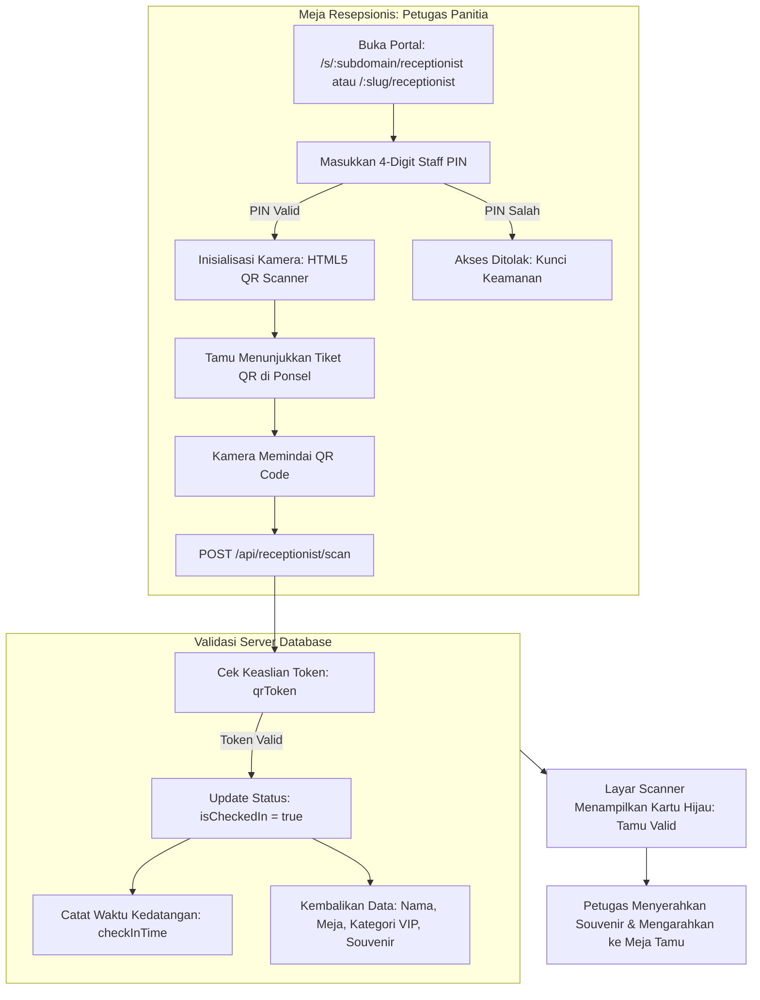

# DOKUMENTASI RESMI: SISTEM RESEPSIONIS & CHECK-IN MEJA TAMU
**Luxenary Invite Platform — Scanner Tiket QR, Kunci Staff PIN, & Manajemen Souvenir**

Dokumen ini membedah arsitektur teknis dan alur kerja operasional portal **Resepsionis Meja Tamu** (`/s/[subdomain]/receptionist`, `/[slug]/receptionist`, atau `https://domainklien.com/receptionist`), instrumen digital di pintu masuk venue pernikahan untuk memverifikasi kehadiran tamu secara instan, mengelola alokasi meja VIP, dan mencatat pembagian souvenir.

---

## 1. Arsitektur Alur Kerja Meja Resepsionis

---

## 2. Lapisan Keamanan Staff Lock Screen (`Staff PIN`)

Untuk mencegah pengunjung sembarangan mengakses data buku tamu di meja resepsionis:
1. **Proteksi PIN 4-Digit:**
   Portal resepsionis diwajibkan memasukkan PIN yang telah ditentukan oleh pengantin di `/dashboard/settings`.
2. **Session Persistence (HMAC Signature):**
   Setelah PIN berhasil diverifikasi via `/api/receptionist/verify-pin`, token sesi bertanda tangan kriptografis disimpan di `localStorage` peramban petugas sehingga tidak perlu memasukkan PIN berulang-ulang saat reload.

---

## 3. Pemindai Kamera QR Code Bawaan (HTML5 QR Scanner)

Petugas tidak perlu mengunduh aplikasi tambahan dari Play Store atau App Store:
- Menggunakan pustaka `html5-qrcode` yang berjalan langsung di peramban (Chrome, Safari).
- Mendukung kamera depan/belakang smartphone, tablet, webcam laptop, maupun **Barcode Scanner Tembak (USB/Bluetooth Hardware Scanner)**.
- Kecepatan pemindaian ultra-cepat (< 300 milidetik per tamu) untuk mencegah antrean panjang di pintu masuk venue.

---

## 4. Informasi yang Muncul Saat Scan Berhasil

Begitu kode QR terbaca:
- **Nama Tamu:** Nama lengkap tamu undangan.
- **Kategori Khusus:** Lencana penanda (misal: `VIP`, `VVIP`, `KELUARGA INTI`, `TEMAN KANTOR`).
- **Alokasi Meja:** Nomor atau nama meja yang telah disiapkan (contoh: *Meja Mawar 04*).
- **Kuota Pax Tamu:** Jumlah pendamping yang diizinkan masuk.
- **Status Check-In:** Indikator apakah ini kedatangan pertama atau QR sudah pernah dipindai sebelumnya (*mencegah pemakaian ganda tiket QR*).
- **Status Souvenir:** Kotak centang penanda bahwa cinderamata pernikahan telah diserahkan kepada tamu.

---

## 5. Mode Pencarian Manual (Fallback Search Mode)

Jika tamu lupa membawa ponsel, baterai ponsel habis, atau tiket QR tidak terbaca:
- Petugas dapat beralih ke tab **"Pencarian Manual"**.
- Mengetikkan 2–3 huruf nama tamu pada kotak pencarian.
- Petugas menekan tombol **"Check-In Manual"** pada baris tamu yang sesuai untuk mencatat kehadiran mereka ke sistem secara sah.

---

## 6. Arsitektur Single-Screen Zero-Scroll Kiosk

Antarmuka resepsionis dirancang khusus dengan standar **Zero-Scroll Fullscreen Kiosk**:
1. **Viewport Terkunci (`h-screen overflow-hidden`):**
   - Mengeliminasi distorsi *elastic bounce*, pergeseran layout, dan scrollbar vertikal pada tablet (iPad) maupun layar monitor resepsionis.
2. **Layout Kolom Dinamis Simetris (`h-full min-h-0`):**
   - Kolom Kiri: Kartu display status siaga dan konfirmasi check-in tamu yang berpusat vertikal presisi (`my-auto`).
   - Kolom Kanan: Kartu scanner pemindai (Kamera Live vs Mode Tembak) dengan batas maksimal ketinggian video 380px agar bebas scroll di seluruh resolusi layar laptop 13-inch.
3. **Ambient Standby Screensaver & Hardware Shutdown:**
   - Otomatis aktif saat layar idle 2 menit. Menampilkan inisial monogram pasangan mempelai (*Live*) atau logo platform (*Demo*) dengan jam digital.
   - **Hemat Daya & Privasi:** Perangkat keras kamera dimatikan total (lampu webcam padam) saat screensaver aktif, dan menyala seketika dalam ~400ms saat layar disentuh (*Tap to Wake*).
4. **Auto-Dismiss 15 Detik & Proteksi Jeda Kamera (Scan Pause):**
   - Kartu check-in tamu otomatis ditutup kembali ke status *"Siaga"* setelah 15 detik.
   - Selama kartu notifikasi aktif, pemindaian kamera dijeda sementara untuk mencegah looping scan barcode yang masih berada di depan lensa.
