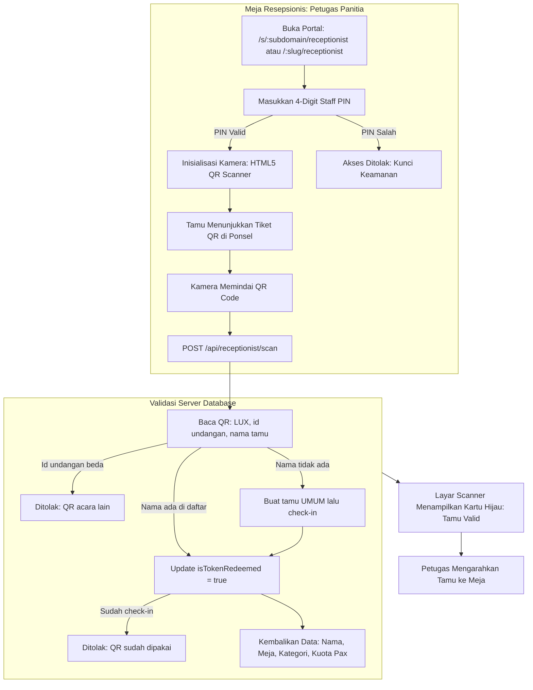

# DOKUMENTASI RESMI: SISTEM RESEPSIONIS & CHECK-IN MEJA TAMU
**Luxenary Invite Platform — Scanner Tiket QR, Kunci Staff PIN, & Check-In Tamu Umum**

Dokumen ini membedah arsitektur teknis dan alur kerja operasional portal **Resepsionis Meja Tamu** (`/s/[subdomain]/receptionist`, `/[slug]/receptionist`, atau `https://domainklien.com/receptionist`), instrumen digital di pintu masuk venue untuk memverifikasi kehadiran tamu secara instan, menampilkan alokasi meja dan kuota pax, serta mencatat tamu umum yang datang tanpa terdaftar.

---

## 1. Arsitektur Alur Kerja Meja Resepsionis

```mermaid
flowchart TD
    subgraph PintuMasukVenue [Meja Resepsionis: Petugas Panitia]
        A[Buka Portal: /s/:subdomain/receptionist atau /:slug/receptionist] --> B[Masukkan 4-Digit Staff PIN]
        B -->|PIN Valid| C[Inisialisasi Kamera: HTML5 QR Scanner]
        B -->|PIN Salah| D[Akses Ditolak: Kunci Keamanan]
        
        C --> E[Tamu Menunjukkan Tiket QR di Ponsel]
        E --> F[Kamera Memindai QR Code]
        F --> G[POST /api/receptionist/scan]
    end
    
    subgraph ServerValidation [Validasi Server Database]
        G --> H[Baca QR: LUX, id undangan, nama tamu]
        H -->|Id undangan beda| X[Ditolak: QR acara lain]
        H -->|Nama ada di daftar| I[Update isTokenRedeemed = true]
        H -->|Nama tidak ada| W[Buat tamu UMUM lalu check-in]
        W --> I
        I -->|Sudah check-in| Y[Ditolak: QR sudah dipakai]
        I --> K[Kembalikan Data: Nama, Meja, Kategori, Kuota Pax]
    end
    
    ServerValidation --> L[Layar Scanner Menampilkan Kartu Hijau: Tamu Valid]
    L --> M[Petugas Mengarahkan Tamu ke Meja]
```

---

### Isi QR dan aturan penolakan

- Isi QR tamu: `LUX|<id undangan>|<nama tamu>`. Id undangan memastikan QR acara lain tidak lolos; nama tamu dicocokkan tanpa membedakan huruf besar/kecil. Di tengah QR ada inisial acara (2 huruf untuk pernikahan, 1 huruf untuk acara tunggal).
- Hanya dua kondisi yang ditolak: **QR milik acara lain** dan **QR yang sudah pernah check-in**. Nama yang tidak ada di daftar (tautan `?to=Nama` yang dibuat manual) tetap diterima dan dicatat sebagai tamu `UMUM` (kuota bawaan 1 pax), kategori dari QR tidak dipercaya.
- Pemindai bekerja offline-first: daftar tamu dan antrean check-in disimpan di perangkat, tamu umum yang dibuat saat offline tetap tampil. Antrean dikirim ke server otomatis setiap ada check-in, saat sinyal kembali, dan dicoba ulang tiap 30 detik; badge angka di header hanya untuk kirim manual. Pemindai dapat dipakai di tablet/laptop (horizontal) maupun HP, dengan kamera perangkat atau alat scan barcode fisik (Bluetooth/USB). Kode: `lib/receptionistScan.ts` (keputusan di perangkat), `lib/walkInGuest.ts` (pembuatan tamu umum di server), `lib/checkinQr.ts` (kontrak QR).

---

## 2. Lapisan Keamanan Staff Lock Screen (`Staff PIN`)

Untuk mencegah pengunjung sembarangan mengakses data buku tamu di meja resepsionis:
1. **Proteksi PIN 4-Digit:**
   Portal resepsionis diwajibkan memasukkan PIN yang telah ditentukan oleh pengantin di `/dashboard/settings`.
2. **Session Persistence (HMAC Signature):**
   Setelah PIN berhasil diverifikasi via `/api/receptionist/verify-pin`, token sesi bertanda tangan kriptografis disimpan di `localStorage` peramban petugas sehingga tidak perlu memasukkan PIN berulang-ulang saat reload.

---

## 3. Pemindai Kamera QR Code Bawaan (HTML5 QR Scanner)

Petugas tidak perlu mengunduh aplikasi tambahan dari Play Store atau App Store:
- Menggunakan pustaka `html5-qrcode` yang berjalan langsung di peramban (Chrome, Safari).
- Mendukung kamera depan/belakang smartphone, tablet, webcam laptop, maupun **Barcode Scanner Tembak (USB/Bluetooth Hardware Scanner)**.
- Kecepatan pemindaian ultra-cepat (< 300 milidetik per tamu) untuk mencegah antrean panjang di pintu masuk venue.

---

## 4. Informasi yang Muncul Saat Scan Berhasil

Begitu kode QR terbaca:
- **Nama Tamu:** Nama lengkap tamu undangan.
- **Kategori:** Lencana kategori tamu sesuai buku tamu klien (misalnya `VIP`, `KELUARGA`, `TEMAN`, atau `UMUM`).
- **Alokasi Meja:** `Meja <nomor>` bila klien mengisi nomor meja, atau "Bebas / Tanpa Meja".
- **Kuota Pax Tamu:** Jumlah orang yang diizinkan masuk (`guestQuota`; tamu umum bernilai 1).
- **Status Check-In:** Indikator apakah ini kedatangan pertama atau QR sudah pernah dipindai sebelumnya (*mencegah pemakaian ganda tiket QR*). Server hanya menyimpan penanda sudah/belum check-in (`isTokenRedeemed`); jam kedatangan dan pembagian souvenir tidak dicatat.

---

## 5. Mode Manual (Scanner Tembak dan Daftar Tamu)

Jika tamu lupa membawa ponsel, baterai ponsel habis, atau tiket QR tidak terbaca:
- Petugas beralih ke mode **Scanner Fisik**: kolom "Scan QR / Ketik Nama..." menerima hasil scanner tembak USB/Bluetooth maupun nama yang diketik, lalu tombol **CARI** memprosesnya dengan aturan yang sama seperti pemindaian kamera (nama tak terdaftar menjadi tamu umum).
- Tombol **"Daftar Tamu"** membuka daftar seluruh tamu (nama, kategori, meja) dengan filter **Semua** dan **Tamu Umum**. Mengetik di kolom di atas menyaring daftar berdasarkan nama.
- Tombol **Check-in** pada baris tamu yang sesuai mencatat kehadiran; tamu yang sudah hadir tampil dengan penanda **Hadir**.

---

## 6. Arsitektur Single-Screen Zero-Scroll Kiosk

Antarmuka resepsionis dirancang khusus dengan standar **Zero-Scroll Fullscreen Kiosk**:
1. **Viewport Terkunci (`h-screen overflow-hidden`):**
   - Mengeliminasi distorsi *elastic bounce*, pergeseran layout, dan scrollbar vertikal pada tablet (iPad) maupun layar monitor resepsionis.
2. **Layout Kolom Dinamis Simetris (`h-full min-h-0`):**
   - Kolom Kiri: Kartu display status siaga dan konfirmasi check-in tamu yang berpusat vertikal presisi (`my-auto`).
   - Kolom Kanan: Kartu scanner pemindai (Kamera Live vs Mode Tembak) dengan batas maksimal ketinggian video 380px agar bebas scroll di seluruh resolusi layar laptop 13-inch.
3. **Ambient Standby Screensaver & Hardware Shutdown:**
   - Otomatis aktif saat layar idle 2 menit. Menampilkan inisial monogram pasangan mempelai (*Live*) atau logo platform (*Demo*) dengan jam digital.
   - **Hemat Daya & Privasi:** Perangkat keras kamera dimatikan total (lampu webcam padam) saat screensaver aktif, dan menyala seketika dalam ~400ms saat layar disentuh (*Tap to Wake*).
4. **Auto-Dismiss 15 Detik & Proteksi Jeda Kamera (Scan Pause):**
   - Kartu check-in tamu otomatis ditutup kembali ke status *"Siaga"* setelah 15 detik.
   - Selama kartu notifikasi aktif, pemindaian kamera dijeda sementara untuk mencegah looping scan barcode yang masih berada di depan lensa.
